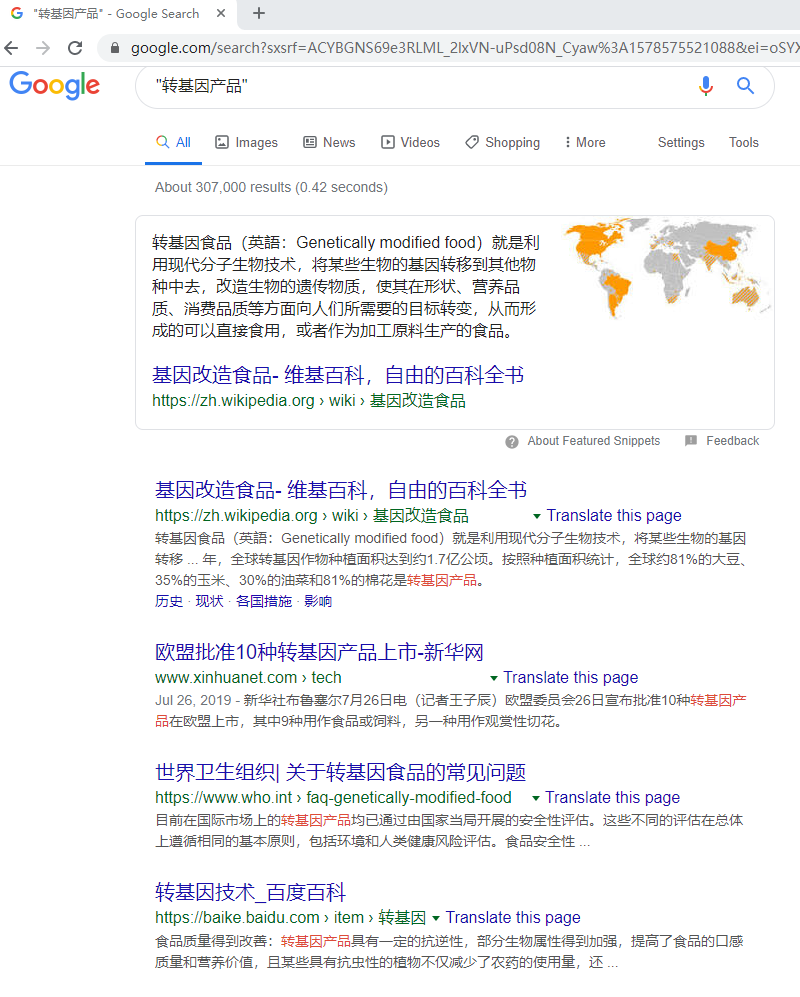
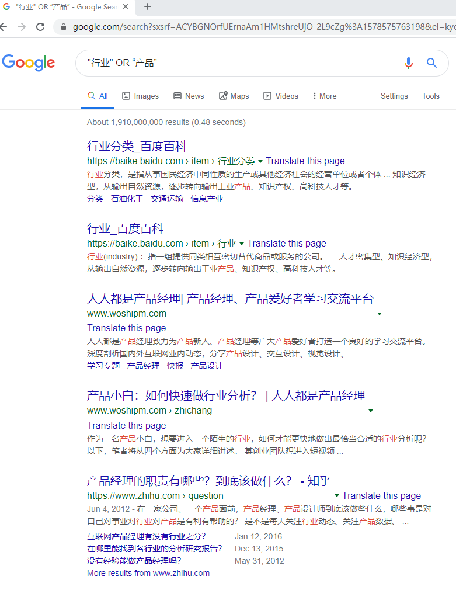
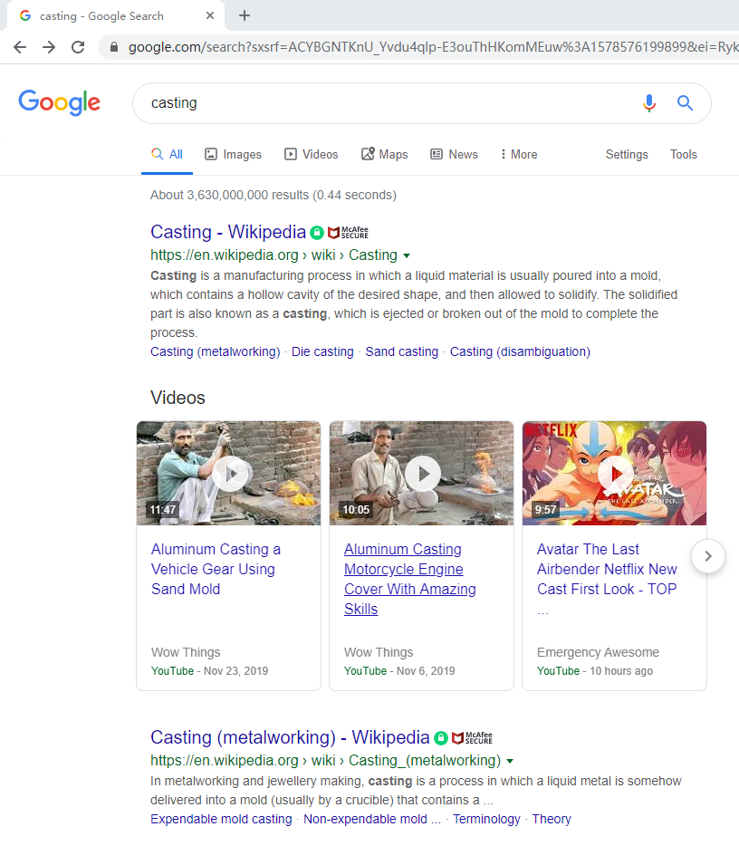
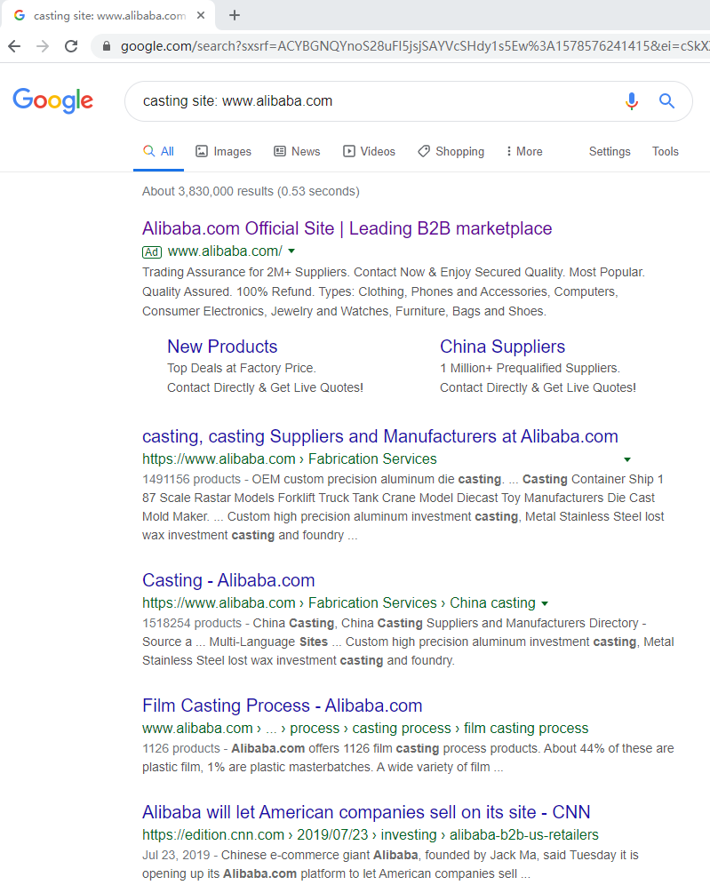
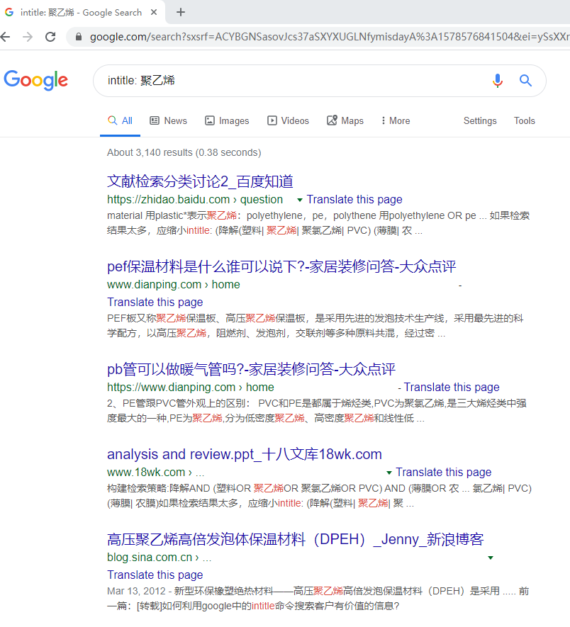
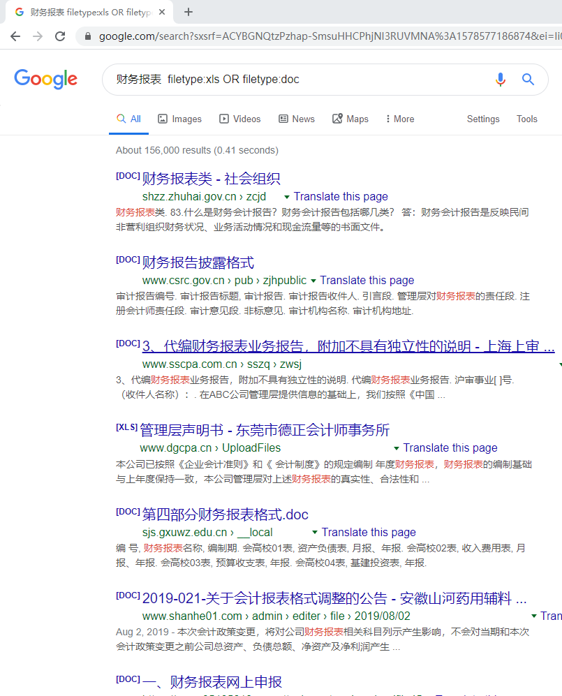
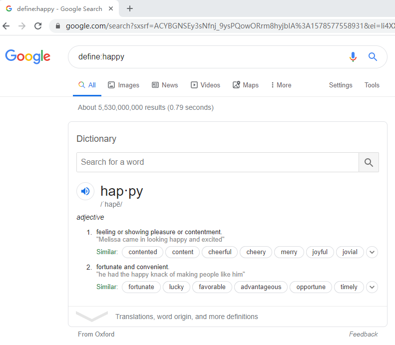

谷歌确实是个好东西，搜索的精确度比某度强的不是一点半点。如果从某度赚到谷歌，工作也学习效率提高不知一两倍。
我们普通使用谷歌基本都是遇到问题或者关键词直接在搜索框搜索，其实谷歌还有很多搜索语法。今天MIKA分享整理的一些Google的基本语法。帮助大家提高如何使用这款工具。

#### 一、精确查找（“”）

通常我们谷歌搜索关键词或者问题精确匹配朝朝都是进行模糊查询（搜索结果总村啊在搜索的部分关键词即可查询出）。为了实现搜索的管家此是**紧挨着**的，所以我们只需要在关键词两边加上一个双引号“”即可进行精确关键词查找，这样更能快速的进行关键词匹配。

#### 二、逻辑关系（与/或）

搜索引擎中也是可以使用逻辑关系来进行匹配搜索的。谷歌默认的就是与的逻辑搜索，当你进行搜索时，你的关键词都会出现在页面搜索结果中。

对于或（OR）的使用，输入多个搜索关键词，页面的匹配结果至少时某一个关键词的搜索结果。

#### 三、如果我们想在搜索的网页中不包含一些关键词，我们可以用非（减号）来进行搜索。

#### 四、限定网站域名搜索（site)

如果纸箱在某一个网站搜索相关内容，我们可以使用site语法。

>搜索内容 site: www.xxx.com

除此之外，还可以限定域名的范围。

**限定顶级域名：**

>搜索内容 site: .com

#### 五、搜索的关键词包含在网页标题中（intitle)

使用intitle可以完成对关键词包含在title中的搜索，也就是Html的title部分。

>intitle: 搜索内容

比如查找聚乙烯。

#### 六、限定文件格式（filetype)

很多朋友在谷歌上搜索一些文件，但是会出来很多其他搜索结果。那么我们该如何做？

>搜索内容  filetype:pdf

同样我们举个例子，搜索财务报表。

#### 七、同义词（~）
上面我们用逻辑运算符太麻烦，我们想搜索到同义词，谷歌内置了优化方法，他知道哪些是你想要的同义词，直接使用~来进行搜索。

>~水果

#### 八、单词翻译(define)

