### 文章大纲

- 利用Google My Business 开发客户
- 利用谷歌地图开发客户
- 利用Google+开发客户 （含挖掘客户邮箱实战演练！）**(注：已不适用)**
- 利用谷歌图片搜索来开发客户
- 利用Google搜索引擎+搜索指令来开发客户（内含15种具体方法！）

>>>找客户之前，大家务必要对自己的行业、市场和产品做到十分的熟悉：
>>>- 市场分为哪些区域 ？每个客户需要有什么不同？客户群分类？
>>>- 客户为什么要买我的产品，而不是买别人的产品 ？产品的特色？卖点？
>>>- 都有哪些竞争对手？他们的情况？价格水平？
>>>- 公司产量如何？对质量的控制？证书 ？
>>>另外，还要整理出全面的客户群体关键词（各种说法多种语言），行业关键词，产品分类名关键词，产品关键词等。

#### 利用Google My Business 开发客户

Google my business是一个集Google搜索、Google地图 、Google+、Insights、Hangouts于一体的免费平台。

商家在注册和完善资料后，Google My Business 会将企业的信息添加到 Google Search、Google Maps 和 Google+上，
让客户可以使用各种设备和服务找到这些企业完成购买。

另外，企业还可以在这个平台上添加图片和企业介绍，阅读和反馈收到的评论，也可以添加或修改企业的信息，包括地址、联系电话和营业时间等。

但是很遗憾…由于google在中国被禁，所以Google My Business在中国尚未开放，即位于中国的企业地点我们无法添加到它上面。

**BUT!!!**

客户利用它没法找我们，但我们可以利用它来找精准客户啊，正所谓山不过来我就过去！！

**HOW?**

以菏泽一个出口玻璃酒瓶的客户为例：他们的客户群中有很大一部分是酿酒厂，怎么找到这些酿酒厂？

** 1. 首先，你需要知道Google my business支持哪些区域：**

查看链接：[https://support.google.com/business/answer/6270107?hl=en&ref_topic=4540086](查看链接：https://support.google.com/business/answer/6270107?hl=en&ref_topic=4540086)

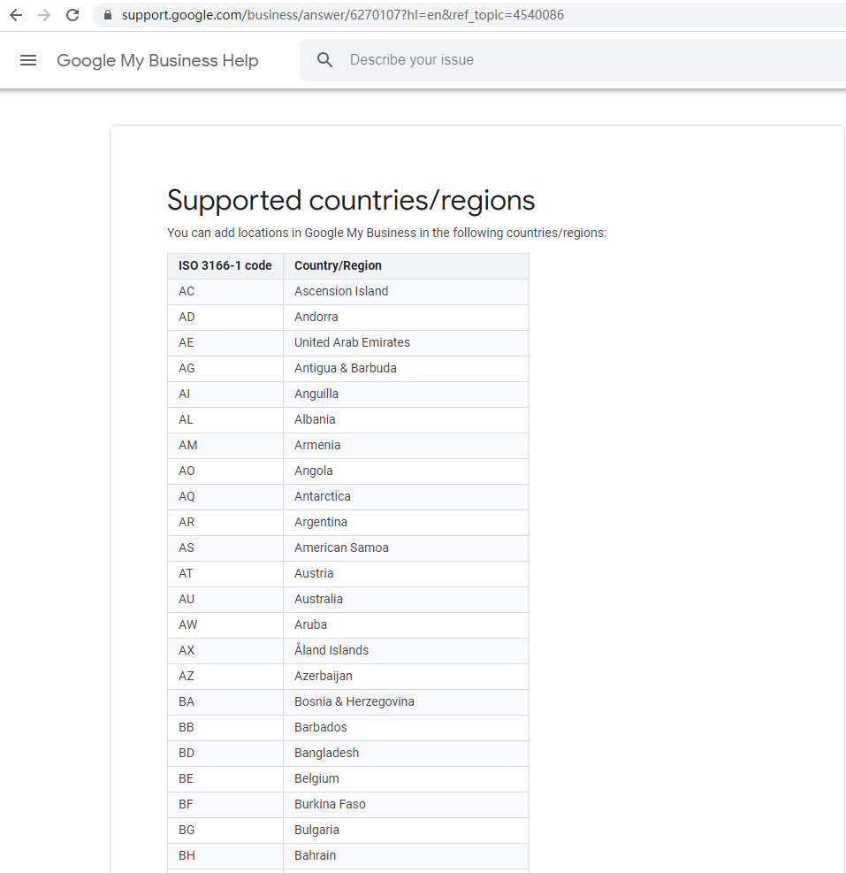

** 2. 列出酿酒厂的通用叫法**

最通用的英文叫法：winery，distillery，....

** 3. 列出Google for business所支持并且是你目标客户所在区域的地区叫法：**

- 意大利的叫法：fabbrica di birra,…
- 日本的叫法：醸造所，…
- 马来西亚的叫法：brewery ,…

这个，其实我们利用google翻译来就很简单了~

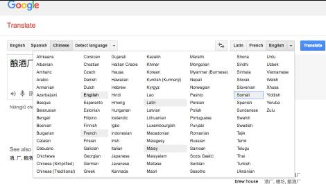

** 4. 谷歌搜索框中进行搜索**

**首先，利用“酿酒厂”的通用叫法在各个支持地区进行搜索：**

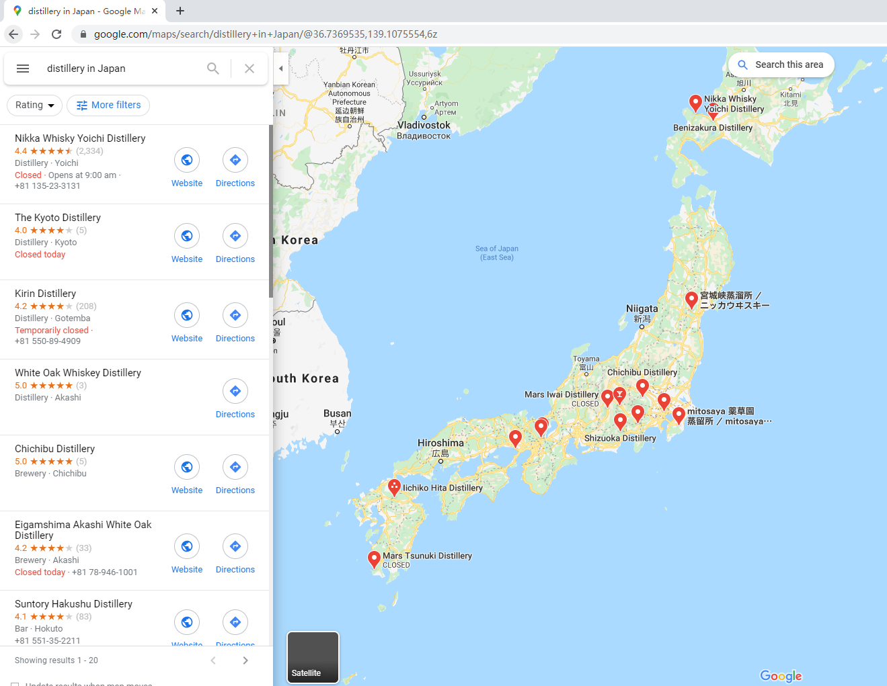

然后点击任何一个商家（我点的第二个商家），进入：

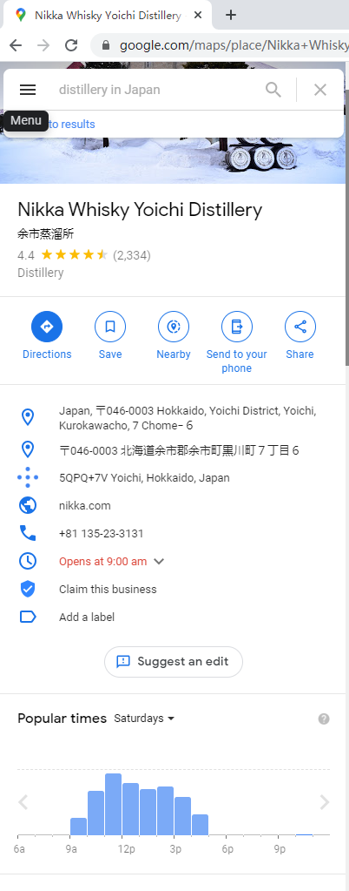

**最左侧：**

是搜索出的商家结果。注意：点击其上方的“评级（英文译作Rating）”，可以对这些结果进行排序，
比如你想找评分4、5星以上的商家，你就点击第一条。

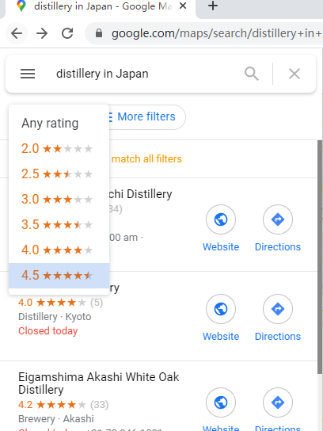

**中间部分：**

是你选择查看的商家信息，包括：

地址，联系电话，官网地址，营业时间等，往下拉还会出现“评价摘要”、“用户评价”、“用户还搜索了
（注意：这里的结果通常是一些其他的类似商家！好好把握！！）”以及web results。

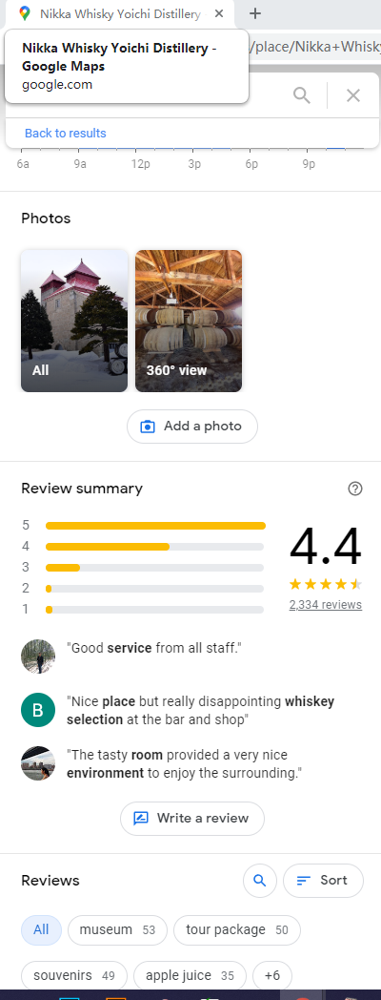
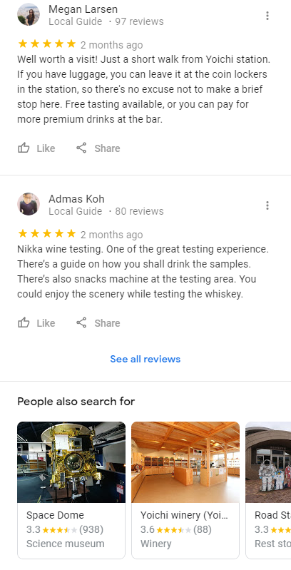

当然，这部分其实我们不需要了解太多，进入官网看看它是不是目标客户，是的话就找记下邮箱等联系方式，然后再看看“用户还搜索了”就差不多ok了。

**最右侧:**

是谷歌地图，注意，这是个很神奇的地方~~

神奇？

能清楚看到商家的店铺门面和街景 这算不算神奇？？！

**步骤：**

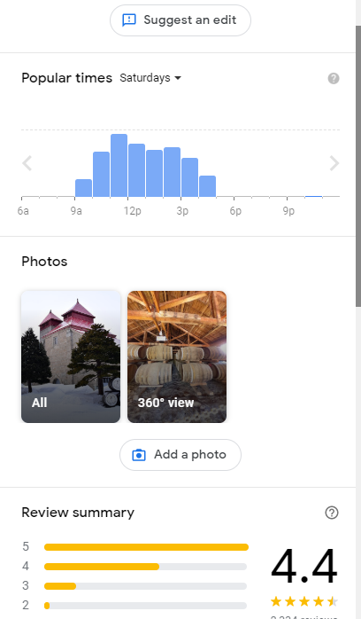

点击 360° view

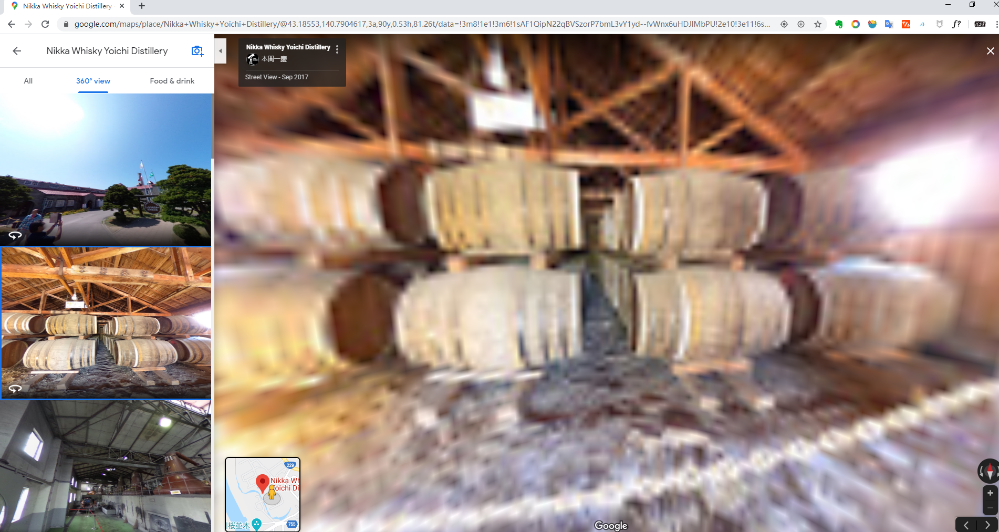

我们可以看到中间左下角有个小黄人和一个定位点，小黄人就是我们所处的位置，定位点就是我们要找的店家的位置。

鼠标点击景色或者拖动，移动它，只要是有人曾经提供过照片，或者Google街景车扫过，你都可以以小黄人的视角看到一切，包括
商家的店铺，内部，和附近的街景。

大家可以试试，很有趣，街景你甚至可以将其360度旋转！！

我们通过看它的街景和商家门面，可以确定下这个客户的情况，比如它是不是一个真的企业啊，规模怎么样等等。

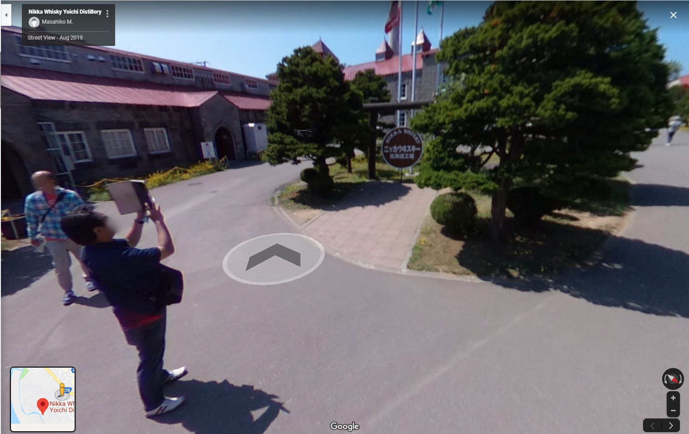

**利用整理出来的 “酿酒厂的地区叫法 + in+ 它对应的地区名 ”来进行搜索：**

如下图，我搜的是 “fabbrica di birra in Italy”，结果中就出现了意大利的酿酒厂。

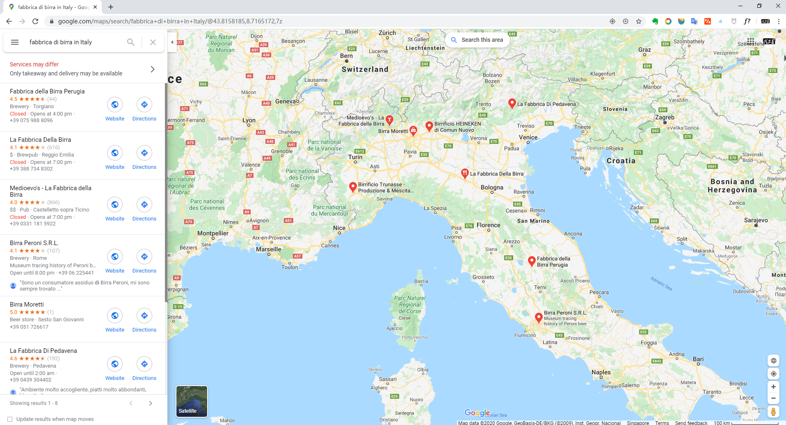

其它步骤与上面讲的一样。

**注意：**

- 相应商家能被我们搜到的前提是他们注册并使用了Google my business。（MIKA备注：这句话不对，目前我公司就可以在谷歌网站上搜索得到）

- 在用不同语言的关键词搜时，可以切换到相应的谷歌，比如用日语的关键词搜时就用日本的谷歌：[https://www.google.co.jp/](https://www.google.co.jp/)

- 如果哪天Google my business允许在中国开放了，大家一定要去注册开通，便于客户找到你！（MIKA备注：这句话不对，目前我公司就可以在谷歌网站上搜索得到）

#### 利用 Google 地图开发客户 （MIKA备注：和第一种没任何区别，不知道为何用两种说法）

掠过

#### 利用Google+来开发客户 （MIKA备注：Google已经取消此类功能，不再讲解）

掠过

#### 利用谷歌图片搜索来开发客户

在www.google.com里点击 Images或者直接输入[image.google.com](https://image.google.com)，然后输入关键词

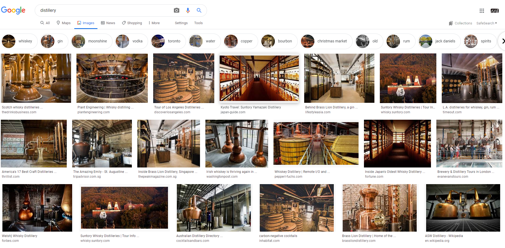

搜出来的结果都是一些酒厂的图片，过滤掉不相关的图片，然后直接点击图片或者找到下面的网址再重新搜索下就能找到潜在客户的网站！！

#### 利用Google搜索引擎 来开发客户

补充1：过滤不相关网站的公式：

-B2B -Marketplace -leads -platform -directory -connecting -"Find Suppliers" -"Find Manufacturers" -member -buyers -China -Chinese -.cn -forum -"yellow pages" -yellowpages -online -shop -store -blog -wikipeadia -youtube -.edu -.gov 

注意公式的后半部分：-就是逻辑非运算符，即英文输入下的减号，对于两个单词的，加上双引号，如 "Find Suppliers" 和”Find Manufacturers" ，双引号也需要在英文状态下输入。

下面我们不妨把这个长公式简记作“过滤公式”吧！

补充2：谷歌常用的指令解析：

具体使用方法请参考

[谷歌在外贸中基本用法](https://wangxfei.com/archives/2020-01-09-01/)

---------------

#### 用搜索命令搜索目标客户的常用方法：(没有验证过，仅仅搬运）

**1、利用 潜在客户的网站+搜索指令 挖邮箱**

步骤：

1）已知和确定目标网站（前提）

2）去网站的”Company Profile“,” About Us”或”Contact Us” 页面看看有没有公司创始人或主要负责人或采购经理等的名字。

Contact us 里若有info前缀的邮箱，那也跟没有一样，他们是接收询盘的，我们发过去也被当垃圾拦截了，我们应该找公司CEO，采购经理等能决定进口事宜的人的邮箱，而这些人的邮箱又一般不放在网站上！

3）在Google上利用搜索指令：公司名+CEO/President/Director/Purchasing Manager/Owner/Marketing Manager/Marketing Director/ Sales Manager 等去获取相关负责人的名字。

还可以搜索 whois + 网站域名，可以查网站域名的注册人和联系邮箱，但主要是针对小公司。

如果谷歌找不到的话，也可以通过去facebook或领英等，输入公司名找到公司主页去看看成员，或者直接用公司名加职称来搜相关人

4）获取相关负责人的姓名后，在谷歌利用以下几种搜索指令来获取邮箱：

姓名+email 或email address

姓名+contact 或 contact information 或 contact me

网站域名 CEO 或 Director 或 President mail

site:公司网站 姓名 email  如：site: http://www.sdwebseo.com/ Li Heng mail

**2、直接找我们产品的进口商和分销商**

搜索命令：

intext:"行业或产品"+"distributor" + 过滤公式

intext:”行业或产品”+"dealer"+过滤公式

intext:”行业或产品”+"wholesaler"+过滤公式

intext:”行业或产品"+"trader"+过滤公式

intext:”行业或产品”+”importer”+过滤公式

**3、找目标客户的网站：**

一般考虑到网站的SEO和推广，很多网站的域名中会包含关键词，而且title中也会放关键词，利用这一点，我们可以挖掘出很大一部分客户的网站：

在Google搜索框内输入 intitle:关键词，如intitle:distillery ，找到的就是页面title 中包含关键词distillery的网站

在Google搜索框中输入 inurl:关键词，如inurl:distillery ，返回的结果就是一些域名中含有distillery的网站

当然，你也可以利用Allintitle:关键词1 关键词2 和Allinurl:关键词1 关键词2 指令，可以搜索出title或者url中包含多个关键词的网站，这样搜索出来的内容相关性和准确性会大大提高。

找到网站后，进去看看他们的介绍和产品，是目标客户的话就记录下来，准备下一步的开发，比如前面讲的方法四利用网址和搜索指令来挖客户的邮箱。

**4、用已知潜在客户的网站拓展更多：**

如果你已经整理了几个潜在目标客户的网址。则可以利用下面的指令得到更多同类网站：

related:目标客户的网站

比如你的一个目标客户的网站是*****.com  ,那么你就可以去Google搜索框中输入：

related:***.com ，得到的结果中也会有很多你的目标客户。

注意related:与网址之前无空格！

**5、利用link指令寻找有链接到大客户网站的网页**

link:大客户网址 

我们都知道企业黄页，我们的大客户网站肯定会被很多企业黄页（名录）收录，那些收录网站都是按类型来的，所以里面肯定会含有其他更多的潜在客户！所以，只要找到这样的一个网页我们就能得到一大把的潜在客户。

link指令就是查链接到某网站的网页，也就是外链，但是这个指令只能查出部分外链，想全部查出来的话，大家可以用ahrefs这个工具，可以把目标客户网站的外链信息全部导出来。

得到外链后，我们就需要去筛选检查了，这肯定是个很繁琐的过程，因为大网站的外链会有很多很多，但若真的找到一个，也算是意义非凡啊！

**6、Price +产品关键词：**

通过这种方法得到的信息，其中一部分往往能让你找到很多的在网上销售产品的零售商和经销商，还有一部分搜索结果是一些市场报告、谈论产品行情的文章。如果是比较新的资料可以作为参考。

**7、名牌企业（尤其五百强的）名称+ Distributor或Dealer：**

一般五百强或是名牌企业都会把他们的世界的分销商写在自己的网站上。这时我们就可以坐享其成了

**8、关联产品法：**

产品名称+关联产品名称。这样的搜索结果往往是一些目标客户网站和行业网站。

**9、著名买家法：**

产品名称+你的行业里面著名买家的公司简称或者全称。这种方法可以帮助我们找到行业市场的情况，并能在相关的网站中找到其他买家的名字。

**10、Market research方法：**

产品名称+ Market research。这种方法用以搜索某种产品的市场研究报告。一般在这种报告的提要或者内容中，可能会提到很多著名的行业内的公司，包括制造商和分销商。

**11、多语言方法：**

搜索关键词的其他语言写法。这种方法对非英语的国家比较有用，如东欧、南美国家等到。因为这种方法很少有人使用，所以非常值得我们尝试一下。

**12、专业文档方法：**

主要是PDF EXCEL WORD格式的文档，一般互联网上这种文档数量比网页数量要少得多。而且这种文档一般都是专业的资料，绝对值得研究。

步骤如下：

①进入谷歌高级搜索：[https://www.google.com/advanced_search](https://www.google.com/advanced_search) ，也就是Advance Search。

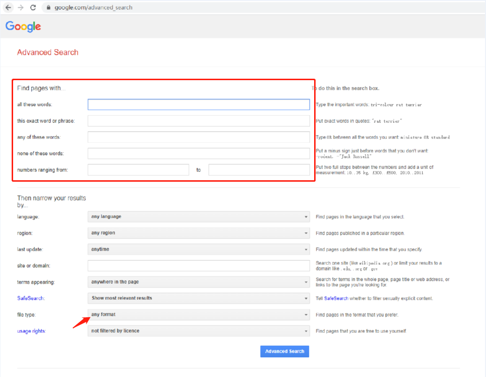

②在红色方框你区域内对关键字进行相应设定，然后在文件类型里面选择文件格式。

③ 然后，点击页面最下方的“高级搜索”进行搜索。

这样搜索出来的本来都是PDF格式的文件，我们直接如果打开看到的就是客户公司产品的PDF目录，可以利用空余时间下载下PDF目录 供自己学习产品知识。 一般来讲，里面带.com com.ru. com.de. com.br .com.ca这样的多是我们的潜在客户。

**13、Market research 方法：**

产品名称+ Market research。

这种方法用以搜索某种产品的市场研究报告。一般在这种报告的提要或者内容中，可能会提到很多著名的行业内的公司，包括制造商和分销商。

**14、公共邮箱系统法：**

大家都知道的：很多国家的买家都用一些公共邮箱系统，如印度的rediff.com，所以我们可以利用关键词和公共邮箱后缀来找邮箱。

以关键字bottles为例，那么搜索的方法就是： 在谷歌搜索框中输入：

@gmail.com bottles

@yahoo.com bottles

@hotmail.com bottles

要是想精确点可以限定一些条件：

比如加个distributor, @gmail.com bottles distributor

@aol.com bottles distributor

其他公共邮箱如：	

美国:  @netzere.net @twcny.rr.com @comcast.net @warwick.net

印度： @rediffmail.com @vsnl.com @cal3.vsnl.net.in

日本:  @yahoo.co.jp @candel.co.jp

新西兰： @xtra.co.nz

俄罗斯： @mail.ru @yandex.ru

还有很多，在这里我就不一一列举了，大家要是想针对性的开发某个国家就要百度下 “公共邮箱后缀 ”，然后就可以找到所有的邮箱了~

**15、进口商与分销商名录网站方法**

可以通过在谷歌中搜索importers directory和distributorsdirectory来查找、进口商与分销商名录。

