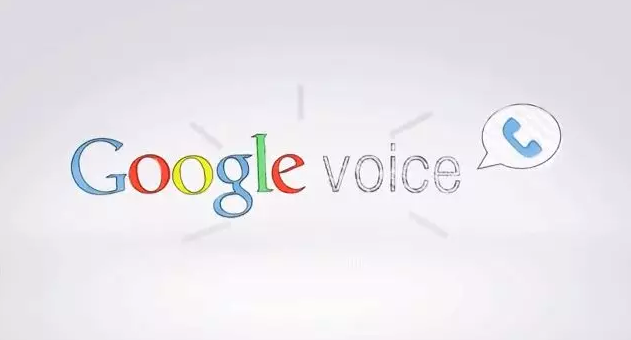
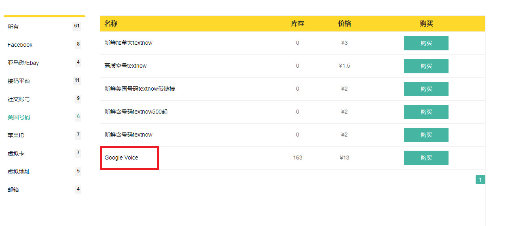

大家在做跨境电商的时候，有时候会碰到一个问题，就是接收短信，或者电话比较麻烦。

比如你注册一个论坛，或者一些网站，有时候不会让你用+86的来接受。或者你有时候不想暴露自己的手机号，因为互联网上有很多的垃圾消息，你怕会收到很多的骚扰信息。

这个时候，其实挺需要一个在线虚拟电话，可以用来做一下的事：

- 接打电话
- 呼叫转移
- 语音留言
- 接发短信

这个呢，其实大家可以用Google Voice来做。

记得几年前可以免费申请Google Voice号，但当时因为没有Visa卡作罢。现在在国内已经无法直接申请Google Voice了。

**今天主要讲几点**
- Google Voice是什么？
- Google Voice的作用
- Google Voice如何申请？
- Google Voice 如何使用？
- Google Voice 永久号

接下来开始了！

### Google Voice是什么？

Google Voice 是 Google 于 2009 年推出的 VOIP 服务，能够将个人所用的众多电话号码集中成一个美国号码，同时提供许多增值服务。

Google Voice 号可以当做电话号码一样使用，比如接打电话，呼叫转移，语音留言，接发短信等等。

**也就是说，拥有一个 Google Voice 号就相当于拥有一个美国国内的电话号码。**

### Google Voice 作用？

Google Voice有什么作用呢？

- 使用境外网站或者服务时，用 GV 号码来接收验证码（例如使用 Twitter、Telegram 我都会用 GV 号来注册绑定）；
- 无需月租；
- 更强的匿名性，保护隐私；
- 美加电话短信均免费，打国际长途电话非常便宜；
- 使用一个号码管理你所有的电话号码；
- 拦截你不想接听的电话，让它直接进语音信箱；
- 可以在线录音及保存通话；

### Google Voice 如何申请？

由于一些政策原因，在国内已无法直接申请 Google Voice，但在某宝你还是可以购买到心仪的号码，几十元到上百不等。

这里推荐一个网站： [www.hoocs.com](https://www.hoocs.com)

上面可以买到很多实用的资源，而且价格也非常便宜，比如这个Google Voice，我也不清楚他们是怎么赚钱的，这个价位基本就是白送了。

大家可以在上面看看。

### Google Voice 如何申请？

购买了 GV 号码后，接着在手机上安装  Google Hangouts「环聊」 App。需科学上网才能正常使用环聊。

Ps：也可以不用在手机上安装，直接登录网页版来接收消息就可以了。

地址：[https://voice.google.com/](https://voice.google.com/)

打开「环聊」，登录与 Google Voice 绑定的 Google 账号后，进入主界面，点击左上角，选择「设置」- 「电话号码」，勾选「接到来电」与「消息」选项。

至此，你 Google Voice 号码的所有来电、短信与语音信箱都会通过「环聊」App 进行推送接收。同时，你也可以通过 Gmail 邮箱接收语言信箱内容和短信等。

Google Voice 永久号

>注意：根据谷歌协议，如果你6个月内不使用 Google Voice（无主叫、被叫、短信、语音邮箱），那么你的号码将会被 Google 收回。
>
>Google may reclaim your Google Voice number (if you have one) if you have not placed or received calls, sent or received text messages for a period of 6 months. We will not 
>reclaim numbers that have been ported in to Google Voice or made permanent.
>
>https://www.google.com/intl/us-EN/googlevoice/program-policies.html

之前的许多做法都是通过 IFTTT 上的服务，定期自动给你的 Google Voice 号码拨打电话，这样你的号码一直有活动，就不会被收回了。

>**但：Google 不会收回已转至 Google 语音服务或申请了永久使用权的号码。**
>
>We will not reclaim numbers that have been ported in to Google Voice or made permanent.

现在，只要花 30 美元，将 Google Voice 购买为永久（permanent）号，就不用担心被回收了。下面就开始看看如何操作：

### Google Voice 如何申请？

购买 Google Voice 永久号分为两个步骤

**1、先花 10 美元换号**
进入 [https://voice.google.com](https://voice.google.com)，并登录自己的谷歌账号，如图：

进入 旧版 Google Voice：

切换到旧版页面后，点 Google Voice 进入换号界面：

选择 Change / Port 进行换号

选择 I want a new number：

换号 10 美元，购买永久 20 美元，点 Continue 继续：

选择一个你喜欢的号点 Continue 继续（注意：需要挂美国代理才可以选新号）

点 Purchase number 继续：

绑定 Visa/MasterCard 卡组织的信用卡，然后点 BUY 换号（**名字用卡的真实名字，IP、地址、邮编都用美国的**）：

支付成功后，换号成功，点Done：

此时，返回网站查看，账号上已经有两个 Google Voice 号了，但旧 Google Voice 号后面有过期时间：

2、再花20美元将旧号购买为永久

点击旧号码后的 Make permanent 购买永久：

因为先前已经绑了卡，所以点 BUY 继续：

购买永久完成，点 Done 继续：

旧 Google Voice 号后面已经没有过期时间了：

你可以在两个号可以随时切换为主号，点 Make primary 切换主号即可：

至此，购买 GV 永久号就操作完成了，你终于可以享受真正匿名的虚拟号码，用超低的通话费率实现全球拨号，而无需考虑月租、实名、通话限制等问题。

**注意：**旧 Google Voice 号是永久的，新Google Voice 号是普通的，新 GV 号 6 个月不使用依然被会回收。

比如大家看我自己的Google Voice，大家可以看下面的图片，基本就是每天来接受信息什么的（当然也可以用来接听电话什么的），所以非常方便。

