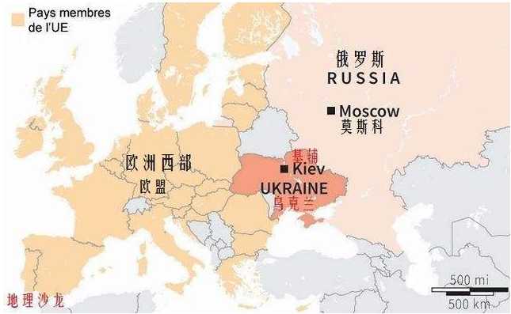

乌克兰位于欧洲东部，自然条件良好。乌克兰是世界上第三大粮食出口国，有着“欧洲粮仓”的美誉，工农业较为发达，重工业在工业中占据主要地位

### 国家概况

**货币**：乌克兰格里夫纳Ukraine Hryvnia（货币代码UAH）

**国家代码**：UKR

**官方语言**：乌克兰语（Ukrainian）

**国际电话区号**：+380

**公司名称后缀**：TOV

**专属域名后缀**： .com.ua

**人口**：4,400万（2019年）

**人均GDP**：3,760美元（2019年）

**时差**： 乌克兰比中国晚5个小时

**道路形势方向**： 靠右行驶

### 主要网站

- **搜索引擎** [www.google.com.ua](https://www.google.com.ua/)（第1名）

- **新闻资讯** [www.ukrinform.ua](https://www.ukrinform.ua/)（第10名）

- **视频网站** [www.youtube.com](https://www.youtube.com/)（第3名）

- **电子商务平台** [www.aliexpress.com](https://www.aliexpress.com)（第12名）

- **门户网站** [www.bigmir.net](https://www.bigmir.net/)（第17名）

**注：以上排名为本过网站浏览量排名**

### 社交平台

- [Instagram](https://www.instagram.com/)（第15名）

- [Facebook](https://www.facebook.com/)（第32名）

- [Twitter](https://www.twitter.com/)（第49名）

- [Linkedin](https://www.linkedin.com/)（第52名）

**注：以上排名为本过网站浏览量排名**

### 沟通工具

- Skype

- Messenger(Facebook)

### 网络工具

- [乌克兰企业信息查询工具](https://portal.kyckr.com/companySearch.aspx/)

- [乌克兰货币汇率走势查询](https://www.xe.com/currencyconverter/)

- [乌克兰进口关税信息查询](http://sfs.gov.ua/en/custom-clearance/subjects-of-foreign-economic-activity/rate-of-import-and-export-duty/import-duty/)

### 主要展会

- 乌克兰敖德萨海事展览会（ODESSA)：每年一届，每年10越在敖德萨市举办，乌克兰敖德萨国际海事展会ODESSA是乌克兰唯一的国际性海事展会，也是整个东欧的第二大海事展会，参展产品主要是基础化工原料、石油化工、塑料加工、催化剂等

- 乌克兰基辅家具及木业机械展览会（LISDEREVMASH)：每年一届，每年9越在基辅市举办，该展会为乌克兰林业、木材和家具业规模最大，最富盛名的国际贸易博览会，参展产品主要是木工机械、附件及工具、木材加工机械标准件及材料等

- 乌克兰基辅铁路轨道展览会（Roadtech Expo）：每年一届，每年11越在基辅市举办，参展产品主要是公路照明灯具、公路灯控装置、防护网、井盖等

- 乌克兰扎波罗热矿业展览会（Mining world Ukraine）：每年一届，每年10越在基辅市举办，该展会是乌克兰唯一的国际性矿业设备，特殊技术和提取、浓缩和运输技术展览会，参展产品主要是矿产勘探技术、矿藏加工、矿产冶炼技术等

- 乌克兰基辅电力展览会（E了com）：每年一届，每年5越在基辅市举办，乌克兰基辅电力展览会Elcom是乌克兰大型的电力及提单能源展会，参展产品主要是电磁线、接线端子、绝缘材料、电工合金等

- 乌克兰基辅家具装饰展览会（Design Living Tendency）： 每年一届，每年9越在基辅市举办，该展会是乌克兰大型家居家纺博览会，展会是以各类家用纺织品，装饰性纺织统品及各类装饰性布料为主，参展产品主要是床单、被套、被褥、床垫等

- 乌克兰基辅建材展览会（KyivBuild)：每年一届，每年2越在基辅市举办，该展会在乌克兰建材行业具有主导的地位，是该行业的风向标，参展产品主要是油漆、门窗材料、顶棚材料、建筑设备等

- 乌克兰基辅农业展览会（Agro）：每年一届，每年6越在基辅市举办，参展产品主要是牛舍建造、家畜育种、家畜养殖场设备等

### 主要港口

- 敖德萨港（Odessa）：是乌克兰重要商港，并且优势黑海北岸的最大港口，港口距离机场大约18km，有定期航班飞往世界各地，主要进口货物有原油、煤炭、棉花及机械等，出口货物主要有粮谷、糖、木材、羊毛及杂货等

- 伊利乔夫斯克港（Illchevsk)：是乌克兰主要海港之一，主要进出口货物有散装货、液体货机杂货等。在节假日中，如果需要可以安排作业，但应付加班费

- 尼姑拉耶夫港（Nikolayev）：是乌克兰南部港口，位于乌克兰乌斯尼布格河的东侧

### 市场特点

乌克兰主要工业部门有航空、航天、冶金、机械制造、造船、化工等

乌克兰生产谷物，有着“欧洲粮仓”的美誉，是世界第三大粮食出口国、第一大葵花油出口国

乌克兰劳动力素质较高，其中IT专业人才总数排名世界第五

乌克兰交通便利，拥有4条通往欧洲的交通走廊及黑海周边优良海港

乌克兰自然资源丰富，铁矿、煤炭等储量居世界前列

### 参观拜访

- [出行前的重要事项检查清单](https://wangxfei.com/archives/2020-02-27-02/)

- [天气查询](https://guowaitianqi.com/ua.html)

- 安全防范：乌克兰社会治安相对较号，但是乌克兰政府在东部顿涅茨克和卢甘斯克地区实行反恐行动，当地局势仍不稳定，基础设施损毁严重，尽量避免前往上述地区

- 签证办理：乌克兰签证种类分为3中，过境签证（B）、短期签证（C）和长期签证（D），其中，短期签证入境最长停留时间为90天，且180天之内在乌克兰累计停留时间不能超过90天。长期签证一般有效期为45天，需在入境45天之内去移民局办理居留手续，具体申请网址：[http://evisa/mfa.gov.ua/](http://evisa/mfa.gov.ua/)

- 航班选择：乌克兰国际航空公司已开通基辅--->北京直航航班。此外，北京--->基辅还可以选择由伊斯坦布尔、迪拜等地转基。基辅鲍里斯波尔国际机场 [http://kbp.aero](http://kbp.aero) 距离基辅市中心约35km，可以乘坐公交车或者出租车往返

- 入境注意事项：出入乌克兰没人可以携带不超过1万欧元（或其他等值货币）的现金，超过1万欧元必须申报

- 铁路：铁路运输在乌克兰各种交通方式占据首位，在乌克兰国内和国际交通中发乎重要作用。重要的铁路枢纽城市有：基辅、利沃夫、哈尔科夫、第聂伯罗彼得罗斯克、扎波罗热

- 火车：乌克兰目前订购火车票最便捷的方式是在乌克兰铁路票务中心官网购买。购买网址[www.vokzal.kiev.ua](https://www.vokzal.kiev.ua)

- 租车：中国驾照不能再乌克兰直接使用，乌克兰车辆右行，出行需要遵守交通规则

- [酒店预定](https://www.booking.com)

- 插头要求：两脚圆插头，标准电压110V

- 中国驻乌克兰大使馆网站：[http://ua.china-embassy.org/chn/](http://ua.china-embassy.org/chn/)

- 大使馆紧急联系电话：+38-044-2534688

