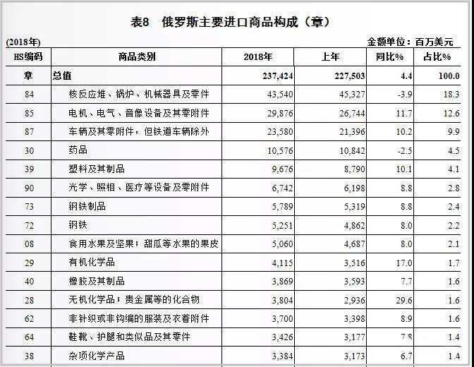

#### 2013年-2016年进出口总额呈下降趋势，近两年回暖

据俄罗斯海关统计，从2009年~2018年俄罗斯货物进出口总额情况来看，俄罗斯外贸市场波动性较大，2013年~2016年呈下降趋势，不过再2016年后，随着全球贸易环境回暖，俄罗斯对外贸易市场也逐步回暖。

2018年俄罗斯货物进出总额为6871.2亿美元，比上年同期增长17.4%。其中，出口4496.9亿美元，增长25.7%；进口2374.2亿美元，增长4.4%。贸易顺差2122.7亿美元，增长62.9%。

2019年1月~3月，俄罗斯货物进出口总额为1558.7亿美元，比上面同期下降1.2%。其中，出口1030.2亿美元，增长0.1%；进口528.5亿美元，下降3.4%。贸易顺差501.6亿美元，增长4.0%。

#### 2019~2018年始终保持贸易顺差，近两年出口增速加快

从2009年~2018年，俄罗斯货物毛i额的进出口额来看，出口额与进口额基本保持同步波动，且出口额始终大于进口额，俄罗斯贸易结构始终保持顺差状态。

2013年~2016年，出口额与进口额均呈现下降趋势，2016年后开始回升，但明显出口回升快于进口，因此顺差也在不断变大。

2018年，俄罗斯货物出口4496.9亿美元，增长25.7%；进口2374.2亿美元，增长4.4%；贸易顺差2122.7亿美元，增长62.9%。

分别从逆差和顺差的来源国看。

2018年俄罗斯前五大贸易逆差来源地一次是法国、越南、泰国、西班牙和厄瓜多尔，逆差额分别为19.4亿美元、11.6亿美元、11.0亿美元和9.3亿美元。俄罗斯贸易顺差主要来自荷兰、土耳其、波兰、韩国和白俄罗斯，顺差额分别为398.2亿美元、172.4亿美元、109.0亿美元和98.9亿美元。

2019年1月~3月，俄罗斯前五大逆差来源地依次是越南、美国、印度尼西亚、爱尔兰和厄瓜多尔，逆差额分别为7.3亿美元、6.1亿美元、2.5亿美元、2.5亿美元和2.3亿美元。俄罗斯的贸易顺差主要来自荷兰、土耳其、德国、韩国和白俄罗斯，1月~3月顺差额分别为114.1亿美元、39.4亿美元、38.3亿美元、23.5亿美元和20.4亿美元。

#### 俄罗斯主要出口目的国分析，中国为第一大出口市场

分国别（地区）看：

2018年中国是俄罗斯的第一大出口市场，出口额为560.8亿美元，增长44.1%，占俄罗斯出口总额的12.5%。

荷兰是俄罗斯的第二大出口市场，出口额为435.2亿美元，增长22.2%，占俄罗斯出口总额的9.7%。

德国排名第三，出口额为341.0亿美元，增长32.5%，占俄罗斯出口总额的7.6%。

此外，从区域组织的依赖性来看，俄罗斯的出口市场对经合祖师依赖性比较高，出口额占比57.5%。

2019年1月~3月俄罗斯对中国、荷兰和德国的出口额为129.0亿美元、121.8亿美元、和88.7亿美元，分别增长5.4%、13.6%和4.9%，占俄罗斯出口总额的12.3%、11.6和8.5%。

#### 俄罗斯主要进口来源国分析，中国为第一大进口国

分国别（地区）看：

2018年中国同样也是俄罗斯的第一大进口国，自中国进口额为522.0亿美元，增长8.6%，占俄罗斯进口总额的22%。

德国是俄罗斯第二大进口国，进口额为255.1亿美元，增长5.3%，占俄罗斯进口总额的10.7%。

美国排名第三，进口额为125.3亿美元，其中自美国进口下降0.4%，占俄罗斯进口总额的5.3%。

此外，从区域组织的依赖性来看，俄罗斯的进口市场同样对经合组织依赖性比较高，出口额占比合计52.9%。

2019年1月~3月，俄罗斯自中国、德国和美国的进口额为120.8亿美元、50.3亿美元和32.9亿美元，其中自中国和美国进口增长1.7%和29.4%，自德国进口下降15.5%，三国合计占俄罗斯进口总额的38.3%。

#### 俄罗斯主要出口产品分析，矿产品为主要出口商品

分商品看，矿产品是俄罗斯的主要出口商品。

2018年出口额为2419.6亿美元，增长36.3%，占俄罗斯出口总额的62.7%。

2019年1月~3月出口额为566.9亿美元，增长2.8%，占俄罗斯出口总额的64.4%。

其中，出口的矿产品主要是矿物燃料、矿物油及其产品和沥青等，出口2371.6亿美元，占俄罗斯出口总额的52.7%，同比增长36.8%。其中，2018年俄罗斯出口的矿产品有427.13亿美元（占比17.7%）是出口到中国。

#### 俄罗斯主要进口的产品分析，机电产品为主要进口商品

分商品来看，机电产品、化工产品和运输设备是俄罗斯的前三大进口商品。

2018年进口734.2亿美元、298.1亿美元和256.3亿美元，分别增长31.9%、12.9%和11.1%，三类商品合计占俄罗斯进口总额的55.9%。

其中，进口的机电产品主要是核反应堆、锅炉、机械及机器零件，进口435.4亿美元，占俄罗斯进口总额的18.3%，同比下降3.9%，其中2018年俄罗斯进口的机电产品264.5亿美元（36%）是来自于中国。

2019年1月~3月进口额为149.7亿美元、70.5亿美元和60.4亿美元，其中机电产品进口下降8.4%，化工产品和运输设备进口分别增长0.9%和2.5%，三大类商品合计占俄罗斯进口总额的54.4%。

（PS:  本文部分数据参考商务部、tradingeconomics等，由外跨研究中心综合整理，转载请务必标明出处。）