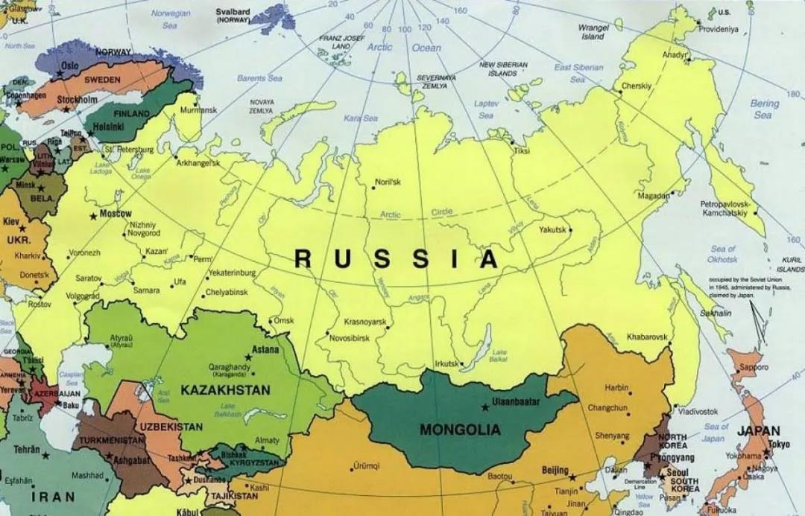
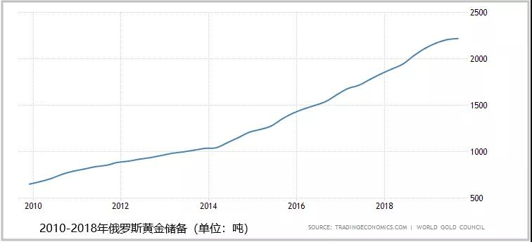

### 基本情况

俄罗斯联邦（俄：Российская Федерация，英：Russian Federation），又称俄罗斯（俄：Россия，英：Russia），简称俄联邦、俄国。

是由22个自治共和国、46个州、9个边疆区、4个自治区、1个自治州、3个联邦直辖市组成的联邦共和立宪制国家。

**语言** 俄语。术语斯拉夫语族东斯拉夫语支。

**时区** UTC/GMT +3小时（东三区）。比中国晚5个小时

**国家代码** RUS

**国家区号** +7

**货币** 卢布（货币代码：RUB)

**公司名称后缀** OOO、AO

**域名后缀** .ru

位置：俄罗斯位于欧亚大陆北部，地跨欧亚两大洲（历来被公认为欧洲国家），国土面积为1709.82万平方公里。俄罗斯是世界上面积最大，东西距离最长，跨经度最广的国家。

**首都** 莫斯科。俄罗斯最大的城市。

#### 其他主要城市

**圣彼得堡** 位于俄罗斯西北部，芬兰湾沿岸，俄罗斯最大海港城市和第二大城市。

**叶卡捷琳堡** 位于乌拉尔山东麓，处于欧洲与亚洲的分界线上。

**伏尔加格勒** 位于东欧伏尔加河沿岸，是链接欧亚两洲的分界线上。

**新西伯利亚** 位于鄂毕河畔，俄罗斯人口第三大城市，也是俄罗斯著名的科学城。

#### 人口情况

俄罗斯总人口1.445亿（截止2017年），共有民族194个，其中俄罗斯族所占比例为77.7%。

人口最多的城市为莫斯科，2010年普查约有1150万人，其次为圣彼得堡，人口大约为488万人，第三为新西伯利亚，人口大约为147万人。

俄罗斯是世界上人口减少速度最快的国家之一。人口普查初步结果现实，2002年至2010年俄罗斯人口下降至1.429亿，与2002年的1.452亿相比减少了230万人，降幅约1.6%。

俄罗斯社会男女性别比率失调。2010年的全俄罗斯人口普查结果现实，俄罗斯男女人口比例是1000:1163。

#### 主要网站

**搜索引擎** <https://www.yandex.ru/>

**新闻资讯** <https://www.rambler.ru/>

**视频网站** <https://www.youtube.com/>

**电子商务平台** <https://www.ulmart.ru/>

**门户网站** <https://www.mail.ru/>

#### 社交平台

**VK** <https://vk.com>

**Ok.ru** <https://ok.ru>

**Intagram** <https://www.instagram.com>

**Facebook** <https://www.facebook.com>

#### 沟通工具

**WhatsApp**

**Skype**

**Messenger(Facebook)**

#### 网络工具

**货币汇率走势查询** <https://www.xe.com/currencycharts/>

**俄罗斯进口关税信息查询** <http://customs.ru/documents-projects>

**俄语翻译工具** <https://translate.yandex.ru/>

#### 主要展会

**俄罗斯家具用品展（Russia House Hold Expo）** 一年两届，每年3月和9月在莫斯科市举办，
参展产品主要是各类家电、吸尘、节能、取暖器、加湿器等。

**俄罗斯国际医疗展览会（Zdravookhraneiye）** 每年一届，12月再莫斯科市举办，参展产品主要是各类医疗器械、
仪器及设备、牙科设备、各类药物等。

**圣彼得堡工业展（Petersburg Technical Fair）** 每年一届，每年3月再圣彼得堡市举办，市当地极具影响力的规模
最大的工业博览会之一，参展产品主要是金属加工、机床及工具、冶金、铸锻件、铸造、机械工业、高科技等。

**俄罗斯国际机床展览会（Metalloobrabotka）** 每年一届，每年5月再圣彼得堡市举办，是当地极具影响力的规模最大的工业博览会，
参展产品主要是金属切削机床、金属成型机床、铸造设备、焊接设备、热处理及表面处理设备等。

**俄罗斯电子设备展览会（Expo Electronica）** 每年一届，每年4月在莫斯科市举办，是俄罗斯最具权威的电子基础产品展会，
参展产品主要是LED专区、电源专区、PCB专区及电子产品等。

**俄罗斯矿业机械展览会（Mining World）** 每年一届，每年4月再莫斯科市举办，参展产品主要市重型设备、采矿业技术和IT技术
自动化、矿产勘探机械设备等。

**俄罗斯莫斯科化工展览会（KHIMIA）** 每年一届，每年10月再莫斯科市举办，市目前俄罗斯及全球化工界钟的佼佼者，参展
产品主要市基础化工原料、石油化工、农用化学品、食品添加剂等。

#### 主要港口

**海参威（VLADIVOSTOK）又称符拉迪沃斯托克**

**圣彼得堡（ST.PETERSBURG）**

**东方港（VOSTOCHNY）**

#### 主要节日

**新年/元旦（1月1日~10日）**

俄罗斯新年是一年中最为隆重，最具有民族特色的俄罗斯传统节日。

**圣诞节（俄历1月7日）**

根据东正教的历法，圣诞节要比欧洲圣诞节晚两个礼拜。也就是说，1月7日才是真正的俄罗斯圣诞节。对于东正教来说，“圣诞节”是仅次于复活节之后的第二大教会节日。

1月6日晚间至7日，俄罗斯所有东正教教堂和许多海外教区（全世界共有超过2.9万个俄罗斯东正教教堂）将在这一天举行节日。夜间节日礼拜持续几个小时，于7日结束。

**祖国保卫者日/男人节（2月23日）**

每年2月底3月初俄罗斯都要举行隆重的松动迎春仪式，这就是俄罗斯的“谢肉节”又称“送冬节”。此周过后即进入长达40天的东正教大斋期，期间禁止人民娱乐、吃肉，故名“谢肉节”。

**复活节**

复活节的庆祝日期是按照俄历来确定的。因此时间总是不一样的。通常这个节日是在4月份，但有的年份也会在5月初，不过复活节总是发生在周末。复活节的象征之一便是鲜艳的彩蛋，他们被放置在特意栽培的嫩草上。另一个不可或缺的点缀是为节日烤制的圆柱形面包。

**妇女节（3月8日）**

俄罗斯人非常重视三八妇女节，在俄罗斯人的眼里，三八妇女节不是侠义的女性节日，可以是情人节，也可以是母亲节，更可以是儿童节。同时，俄罗斯人也把三八妇女节理解成“开春节”，寓意是春天的开始。

**俄罗斯胜利日（5月9日）**

苏联确定5月9日为战胜德国法西斯纪念日，也称之胜利日。每逢胜利日来临。俄罗斯都要举行阅兵式，鸣放礼炮，人们还会以各种方式纪念那个历史性时刻。

**俄罗斯日/独立日（6月12日）**

每年6月12日是俄罗斯日，又称“独立日”。这个节日为俄罗斯人带来了法定的假期。虽然这一天官方的活动较少，大师人民大联欢、广场演出、体育比赛、音乐与娱乐活动、烟花汇演等民间节日增多。

**情人节（2月14日/7月8日）**

除了西方的”2月14情人节“，7月8日这一天，也被俄罗斯定为传统的”情人节“，就像我么中国的”七夕节“。7月8日，是全俄罗斯一起为家庭、爱情和忠诚庆祝的日子---全俄家庭、爱情和忠诚日。

**人民团结日（11月4日）**

11月4日是喀山圣母玛丽亚圣像日，从2005年起作为”人民团结日“庆祝。根据传统，节日当天国家元首将向红场的米宁和波扎尔斯基纪念碑敬献鲜花。

#### 产业分布

俄罗斯自然资源种类齐全，储量丰富，是世界上少数几个资源能够自给的大国之一。据悉，俄罗斯的总资源价格为75.7万亿美金。该国的石油储量价值为7.08万亿美金，而天然气储量价值不低于19万亿美金，木材储备价值为28.4万亿美金。

矿产分布特点是分布于亚洲大多数地区；石油和煤炭主要分布于平原地区；铁矿和其他金属矿主要分布于山地、高原。

**俄罗斯的能源、军火、矿产等重工业极其发达，但服装、极爱但、通讯、汽车等轻工业相对较弱。**

**工业主要分布在欧洲地区，接近矿产资源分布地区。**

**四大工业区：**

（1）莫斯科工业区：俄罗斯工业最发达的地区，以汽车、飞机、火箭、钢铁、电子为主。

（2）圣彼得堡工业区：以石油化工、造纸造船、航空航天、电子为主，是俄罗斯视频和纺织工业最发达的地区。

（3）乌拉尔工业区：以石油、钢铁、机械为主。

（4）新西伯利亚工业区：以煤炭、石油、天然气、钢铁、电力为主。

### 经济情况

俄罗斯的国内生产总值（GDP）在2018年为16576.0亿美元。俄罗斯的GDP值占全世界经历的2.67%。

从1988年到2018年，俄罗斯国内生产总值平均为9336.2亿美元，1999年达到历史最低点195.90亿美元，2013年达到历史最高点2297.10亿美元。2013~2016年GDP呈大幅度下降状态，在2016年达到近九年来的最低点，近两年呈小幅增长趋势。

俄罗斯的人均国内生产总值2012~2015年所有下降，近几年来呈上升趋势，最新记录为2018年的11729.10美元俄罗斯的人均GDP相当于世界平均水平的93%。

**GDP增长率：近两年总体GDP增长不高，在地位徘徊**

初步数据显示，俄罗斯在2019年第三季度的国内生产总值（GDP）同比增长1.7%，此前一个时期增长了0.9%，超过了市场与其的1.6%。增长主要收到农业、工业和批发贸易的支持。从1996年到2019年，俄罗斯的GDP年均增长率为2.94%，2012-2015年GDP增长率不断下降，跌入负值，近几年虽然有所上升，但增速不高，依旧在低位徘徊。

**卢布依旧维持在较高贬值位**

俄罗斯的经济自从2008年后有一次遇到了巨大的危机，俄罗斯卢布2014年因为美国和欧盟的制裁而大幅贬值，在几个月内贬值60%多，尽2015年上半年基本上恢复了30%~40%，不过2015年下半年再次遭遇滑铁卢，而2016年第一季度再次遭遇单日跌幅超过8%的历史地位，知道现在依旧保持在60以上的较高位。

**外汇、黄金储备持续保持增长**

俄罗斯的存款利率在2010年~2018年波动较大，2011年7月达到低位5%，在2014年底至近年来高位，之后总体呈下降趋势。

俄罗斯的外汇储备在2010年~2018年同存款利率变化呈相反状态，2014年底降到近年来地位，之后总体呈上升趋势。从1992年到2019年，俄罗斯的外汇储备平均为258496.70百万美元。

俄罗斯的黄金储备从2010年~2018年呈上升趋势。
从2000年到2019年，俄罗斯的黄金储备平均为883.26吨，在2019年第四季度达到历史最高的2241.86吨在2000年第二季度创下343.41吨的历史新低。

**就业情况：近两年失业率保持在较低位**

俄罗斯的就业人数从2010年~2018年总体呈上升趋势。从1991年到2019年，俄罗斯的就是人数平均为6906万。

俄罗斯的失业率从2010年~2018年总体呈下降趋势，保持在较低位置。

2019年8月的历史低位4.3%升至2019年9月的4.5%，而市场此前预计它将保持稳定。失业人数从上一个月的325.8万增加了11.3万，指337.1万。

从1992年到2019年，俄罗斯的失业率平均为7.45%，在1999年2月达到历史最高14.10%，在2019年8月达到历史最低的4.30%。

**生活水平：物价不断上升，民众生活质量改善不佳**

俄罗斯的平均月工资从2010年~2018年总体呈波动上升趋势。

从1990年到2019年，俄罗斯的平均工资为13981.61卢布/月，在2018年12月达到了历史最高的55569卢布/月。

俄罗斯的物价指数从2010年~2018年呈上升趋势。
从1992年到2019年，俄罗斯的居民价格指数CPI平均为238.70，在2019年7月达到历史最高点590.10.

俄罗斯的通货膨胀率从2010年~2018年波动相对较大，在2015年达到自2008年以来的高位12.9%，从2015年之后开始逐步下降。
从1991年到2019年，俄罗斯的通货膨胀率平均为119.57%，在2018年1月达到历史最低点2.20%。
从2019年8月4.3%降至2019年9月的4%，低于市场预期的4.1%，这是自2018年11月以来的最低通货膨胀率。

**企业、个人所得税率保持不变**

俄罗斯的企业所得税率和个人所得税率在2009年~22018年均保持不变，分别为20%和13%。

（PS:  本文部分数据参考商务部、tradingeconomics等，由外跨研究中心综合整理，转载请务必标明出处。）