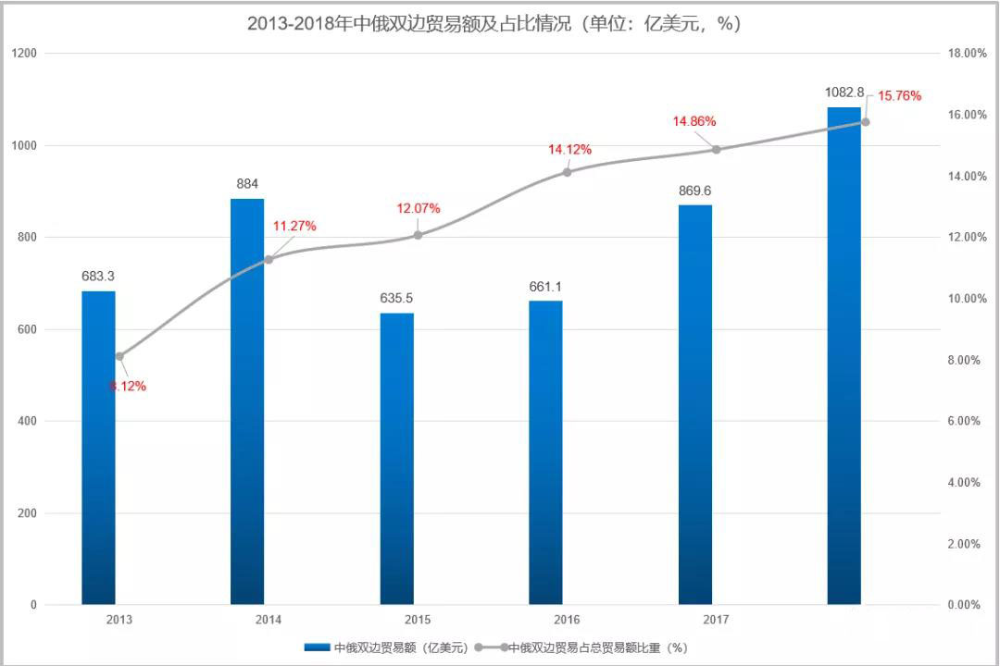
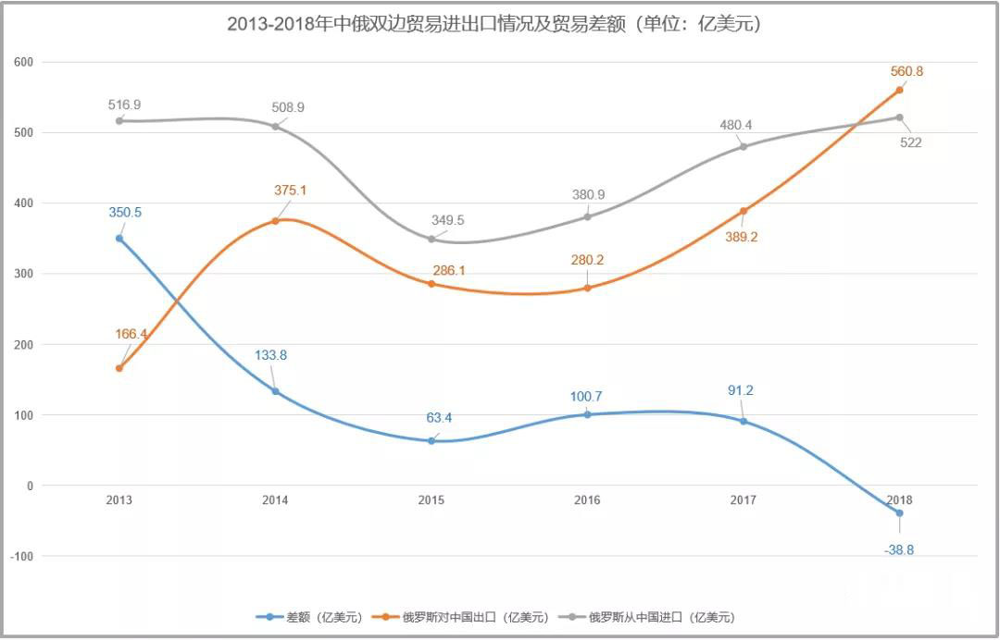
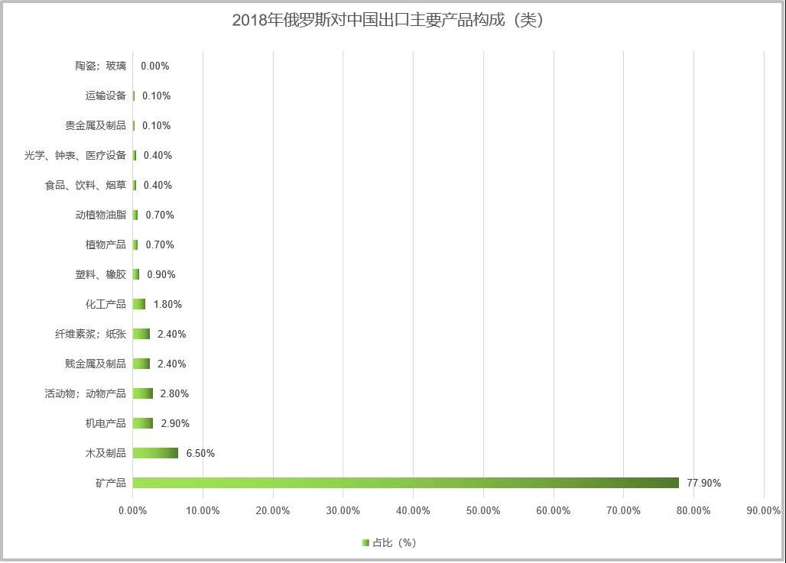
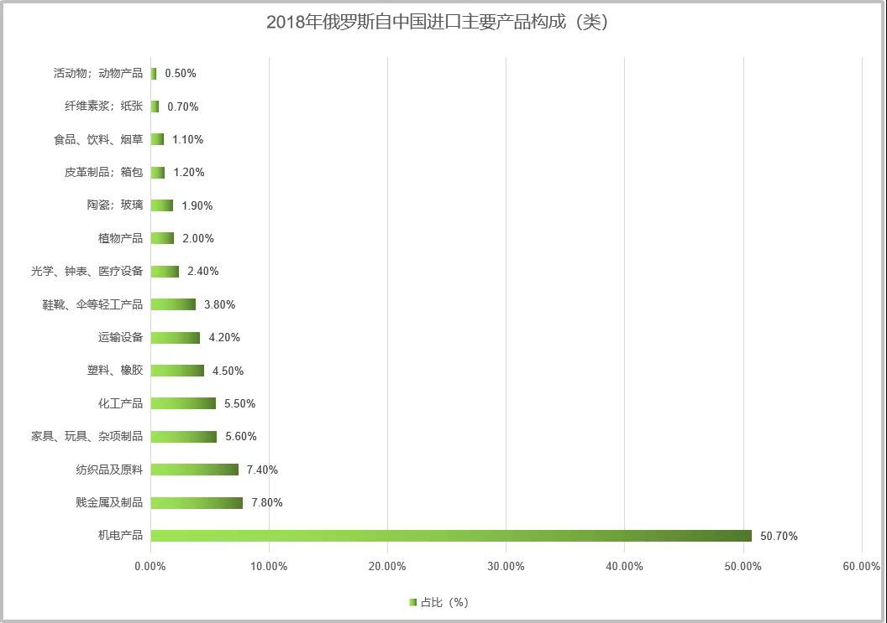
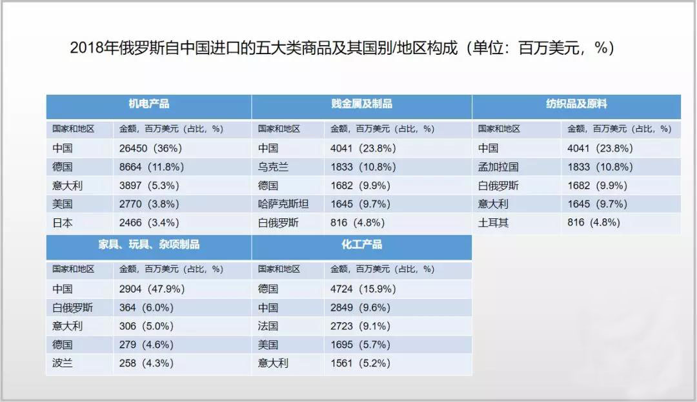

### 中国连续九年成为俄罗斯最大贸易伙伴

据俄罗斯海关数据，2018年俄罗斯与中国的双边货物贸易额为1082.8亿美元，增长24.5%。其中，俄罗斯对中国出口560.8亿美元，增长44.1%，占其出口总额的12.5%，提高1.6个百分点；俄罗斯自总过进口522.0亿美元，增长8.6%，占其进口总额的22.0%，提高0.9个百分点。

到2018年，中国已经连续第九年成为俄罗斯的最大贸易伙伴。

2019年1月-3月俄罗斯与中国的双边贸易额为249.2亿美元，增长3.3%。其中，俄罗斯对中国出口129.1亿美元，增长5.5%，占其进口总额的12.5%，提高0.6个百分点；俄罗斯自中国进口120.1亿美元，增长1.1%，占其进口总额的22.7%，提高1.0个百分点。

>中俄两国一直是政治经济大国，两国的关系总体态度持续着良好的伙伴关系。中俄经贸史可以分为以下三个阶段：

>**（1）1991年-1993年，中俄贸易的快速发展阶段**

苏联解体带来的政治上的变化时的俄罗斯工业生产的产量大幅下降，国内人民的购买力严重不足，而此时，中国价格低廉的轻工业产品进入俄罗斯市场，收到俄罗斯人民的喜爱，中国的轻工业产品瞬间成为俄罗斯人民的消费主流。

>**（2）1994年-1998年，中俄贸易的波动调整阶段**

俄罗斯的政治经济不稳定、1998年的亚洲金融危机、俄罗斯对贸易采取管制的政策等诸多因素导致两国之间的贸易额停留在50亿-70亿美元，两国的贸易方式也逐渐向现汇贸易过渡。

>**（3）1999年-至今，中俄贸易的稳定发展阶段**

普京执政并制定了适合俄罗斯发展的政治经济政策，与此同时，国际市场能源和原料商品的价格大幅上涨，带动了俄罗斯经济的恢复性增长，加之中国对俄罗斯燃料和原料的需求不断增加，推动了中俄双边的经贸合作，这一时期的中俄双边贸易在贸易活动、贸易数额、增长速度都处于高速发展时期。

### 2018年俄罗斯首次成为中俄贸易顺差方

从2013年-2018年俄罗斯与中国的贸易进出口额来看，进口额和出口额均有大幅波动。

2013年-2015年进口额呈下降趋势，2015年-2018年进口额上升。
2014年-2016年出口额呈下降趋势，2016年-2018年出口额上升。

贸易差额总体呈收缩趋势，从201年的逆差额350.5亿美元，到2018年的顺差额38.8亿美元。

2019年1月-3月，俄罗斯对中国贸易继续保持顺差，差额为9.0亿美元。

### 俄罗斯对中国出口主要产品为矿产品

俄罗斯对中国的出口产品格局与对全球的出口产品格局基本一致，矿产品的楚克比重都超过60%。

**矿产品是俄罗斯对中国出口的主要产品**

### 俄罗斯自中国进口主要产品为机电产品

**俄罗斯自中国进口的主要产品为机电产品**
**德国是中国向俄罗斯出口轻工产品、塑料橡胶、光学仪表、医疗设备的最大竞争对手。**

### 中俄双边贸易程度有望进一步加深

总的来说，中俄两国作为世界上政治经济大国，其关系的稳定不仅仅促进两国区域的发展，对于世界的发展也起到了一定的助力作用，两国应抓住当前世界经济的发展，在维护双方利益的同时，进一步推动世界经济的发展。

在“一带一路”的倡议下，中俄两国积极寻求新的思路及方法，推动两国贸易向更高的层次发展。

两国的商品结构一直处于不合理的状态，在未来的经贸发展中，两国将更加注重商品贸易结构，以经济结构带动两国的贸易结构转型及优化，取长补短，同时也通过贸易结构促进经济结构，使得两者相辅相成。

目前，中俄东线天然气管道正式投产通气。俄总统普京表示，东线天然气管道投产通气，对于中俄两国和世界能源市场来说，都是具有重要历史意义的大事。落实这一项有助于完成20204年中俄双边贸易额达2000亿美元的任务。同时，他表示，在中俄建交70周年之际，东线天然气管道开始供气，此举将中俄在能源领域的战略协作提升至全新水平。

**未来，中俄双边贸易程度有望进一步加深。**

（PS:  本文部分数据参考商务部、tradingeconomics等，由外跨研究中心综合整理，转载请务必标明出处。）