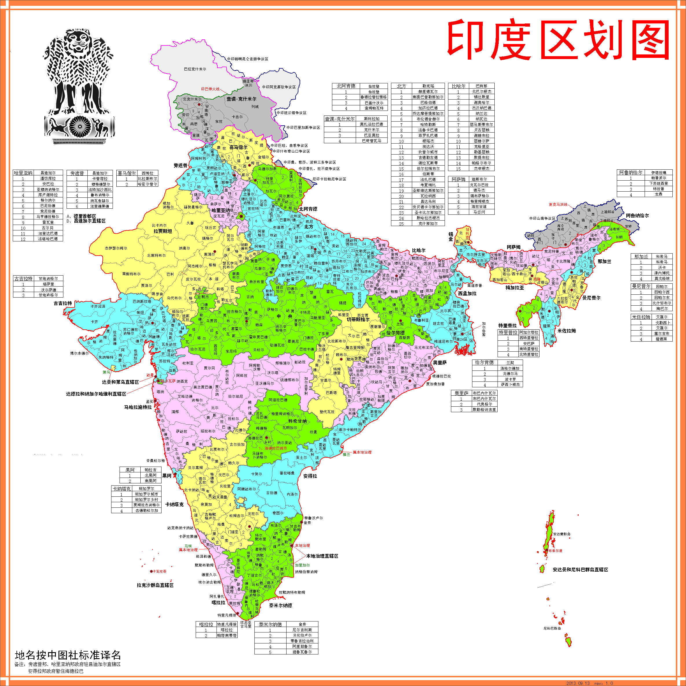
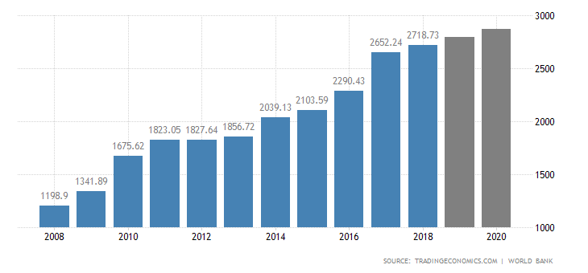

### 基本概述

#### 简介

印度共和国，英语：Republic of India，统称印度（India)。位于南亚，是南亚次大陆最大的国家，也是一个由100多个民族
构成的统一多民族国家。

#### 位置
领土东北部同孟加拉国、尼泊尔、不丹和中国接壤，东部与缅甸为邻，东南部与斯里兰卡隔海相望，西北部与巴基斯坦交界。
东临孟加拉湾，西邻阿拉伯海，海岸线长5560千米。

**首都** 新德里

**主要城市** 孟买、加尔各答、金奈、班加罗尔、海得拉巴、昌迪加尔

#### 语言

印度的官方语言是印地语，英语未第二附加官方语言。印度的语系主要由印欧语系、汉藏语系、南亚语系、德拉维达语系，语言复杂

#### 印度最大城市排名

|**排名**|**城市名称**|**邦/中央直辖区**|**人口**|
|:-----|:----|:----|:----|
|1|新德里|德里国家首都辖区|16,753,235|
|2|孟买|马哈拉施特拉邦|12,478,447|
|3|班加罗尔|卡纳塔克邦|8,425,970|
|4|金奈|泰米尔纳德邦|7,088,000|
|5|海得拉巴|特伦甘纳邦|6,809,970|
|6|艾哈迈达巴德|古吉拉特邦|5,577,976|
|7|加尔各答|西孟加拉邦|4,486,679|
|8|苏拉特|古吉拉特邦|4,486,679|
|9|浦那|马哈拉施特拉邦|3,115,431|
|10|斋浦尔|拉贾斯坦邦|3,073,350|

**人口** 印度2018年人口大约为13.54亿人。其中男性占比51.81%，女性占比48.19%，人口密度为311.87人/平方公里，人口数世界排名第二

**民族** 印度有10个大民族和许多小民族，其中印度斯坦族占46.3%，泰卢固族占8.6%，孟加拉族占7.7%，泰米尔族占7.4%，还有其他民族

### 主要节日

- 共和国日（1月26日），即国庆节，各邦首都均有庆祝盛会及巡行，以首都新德里的巡行最为壮观

- 独立日（8月15日），在这一天，印度总理要在新德里的红堡上升起三色国旗，发表讲话，总统要向全国人民致辞祝贺独立节

- 洒红节（每年公历3、4月间），印度四大节日之一，代表着色彩单调的冬天终于结束，并预示着春天土地的丰饶。洒红节来临时，人民不管相识与否，
都可以向对方泼红水，或是用各种颜色的粉泼撒对方，用各色颜料把对对方涂成大花脸和大红袍

- 十胜节（公历9月、10月间），印度教节日，也是全国性的重大节日。十胜节的前9天，各地搭台演戏，从罗摩降生开始，一直演到罗摩最后彻底战胜罗波那。
这种活动被称之为“罗摩里拉”。一般都是在露天举行

- 排灯节（公历10月、11月间），印度教徒最大的节日，全国庆祝3天。在此期间，各公园、庙宇、商业中心，广场布置的像仙境一般，文艺节目业丰富多彩。

- 元旦，从每年10月31日起为新年共5天，第四天为元旦。新年第一天，谁也不许对人生气，更不准发脾气。有些地区的人们以禁食一天一夜来迎接新的一天，
由元旦凌晨开始知道午夜为止。由于这种怪异的习俗，印度的元旦被人成为“痛哭元旦”、“禁食元旦”

### 宗教

83%的居民信奉印度教，其次为伊斯兰教、基督教、锡克教、佛教和耆那教等

### 种族制度

印度教与佛教和基督教等其他宗教最大的不同是，印度教直接宣扬世袭等级制度，把种族制度作为核心教义，要求教徒严格遵守种姓制度。种姓制度是最典型、
最森严的等级制度。四个等级在地位、权力、职业、义务等方面有严格的规定。

- 以僧侣贵族为主的第一等级婆罗门，拥有着解释宗教经典和祭神的特权

- 以军事贵族和行政贵族为主的第二等级刹帝利，拥有征收各种赋税的特权

- 以雅利安人自由平民为第三等级吠舍，从事农、牧、渔、猎等，必须以布施和纳税的形势来供奉前两个等级

- 被征服的土著居民是第四等级首陀罗，只能从事农、牧、渔、猎等以及其他低贱的职业

### 自然资源及工业分布

**自然资源** 印度矿产资源丰富，铝土储量和煤产量均占世界第五，云母出口量占世界出口量的60%。此外，还有石膏、钻石及钛、钍、铀等矿藏。森林覆盖率为21.9%

**工业分布** 印度的三大传统工业区都分布在原料地附近。三大传统工业区分别是：德干高原东北部，主要为钢铁工业，周边煤、铁、锰丰富；西北部孟买，
主要为棉纺工业，靠近最主要的棉产区和对外贸易港；东北部加尔各答，主要为麻纺工业，地处黄麻产地和港口

### GDP

2008年-2020年间，印度的GDP总体呈增长趋势，2018年印度的GDP为27263.2亿美元。印度的GDP值占世界经济的4.40%

从1960年到2018年，印度的GDP平均为5879.3亿美元，在2018年创历史新高的27263.2亿美元

2008年-2019年，印度GDP增长率波动较大，近两年来增速放缓，主要愿意是工厂产出和出口下降，投资放缓

从1951年到2019年，印度的GDP年增长率平均为6.18%，在2010年第一季度达到了11.40%的历史最高水平

### 外汇和黄金

2008年-2019年，印度外汇储备呈不断增长趋势

从1998年到2020年，印度的外汇储备平均为22898.93万美元，在2020年1月达到历史最高的461160万美元

2008年到2019年，印度黄金储备变化不大，2010年-2018年储量持平，2019年储量增长

2000年-2019年，印度黄金储量平均为464.24吨，2019年第二季度为618.16吨的历史最高水平，2001年第二季度为357.75吨的历史最低水平

### 就业率

印度国家抽样调查办公室的定期劳动力调差显示，2017年-2018年，印度就业人口比例为46.8%

从2012年到2018年，印度的平均就业率为48.76%，2012年为50.80%的历史最高水平，2018年为46.80%的历史最低水平

### 平均工资

从1965年到2014年，印度平均工资为146.00印度卢比/天，在2014年达到历史最高水平272.19卢比/天

2017年-2019年，印度的最低工资维持在176卢比/天。从2014年到2019年，印度的最低工资平均为164.17卢比/天

2011年-2019年，印度物价指数不断升高

从2011年到2019年印度消费者价格指数平均为120.39个指数点，在2019年11月达到历史最高的148.60个指数点，在2011年2月达到历史最低的
86.81个指数点

2012年-2019年，印度通过膨胀率波动较大

从2012年到2019年，印度的平均通胀率为5.98%，2013年11月达到历史最高水平12.17%，2017年6月达到历史最低水平1.54%

### 所得税

#### 企业所得税

印度国内公司的实际企业税率为25.17%，包括所有此类国内公司的附加费和企业所得税

从1997年到2019年，印度的企业税率平均为34.52%，2001年达到38.95%的历史最高水平，2019年达到25.17%的历史最低水平

#### 个人所得税

印度的个人所得税税率为35.88%

从2004年到2018年，印度的个人所得税平均税率为32.05%，2018年达到35.88%的历史最高水平

（PS:  本文部分数据参考商务部、tradingeconomics等，由外跨研究中心综合整理，转载请务必标明出处。）