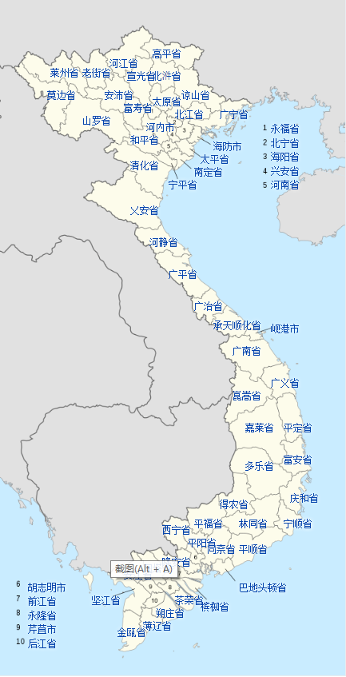
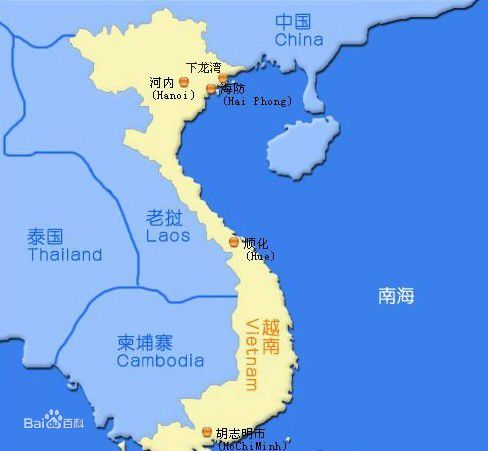

### 基本情况

越南社会主义共和国（越南语：Cộng hòa Xã hội Chủ nghĩa Việt Nam，英语：Socialist Republic of Vietnam，Vietnam），简称“越南”，是亚洲的一个社会主义国家。

**位置：** 位于东南亚的中南半岛东部，北与中国广西、云南接壤，西与老挝、柬埔寨交界，国土狭长，面积约33万平方公里，紧邻南海，海岸线长3260多公里，是以京族为主体的多民族国家。

**首都** 河内市

**最大城市** 胡志明市

**所属时区** UTC/GMT +7小时（东七区）。比北京时间晚一个小时。

**国家区号** +84（越南）

**货币** 越南盾（货币代码：VND）

**国家代码** VNM

**公司名称后缀** Ltd. Limited

**专属域名后缀** .vn

#### 行政规划

1992年宪法规定越南行政区域划分如下：

- 全国分为省、中央直辖市
- 各省分为县、省辖市、市社；各中央直辖市分为郡、县、市社
- 各县分为社、市镇；各省直辖市、市社分为坊、社；各郡分为坊

越南国会的第十次会议将全国区分为58各省（越南语：Tỉnh／省）及5各直辖市（越南语：Thành phố trực thuộc trung ương／城庯直屬中央）

|**中文名称**|**越南文名称**|**省会**|**人口**|**面积**|
|:-----|:----|:----|:----|:----|
|安江省|Tỉnh An Giang|龙川市|2,099,400|3,406平方公里|
|安沛省|Tỉnh Yên Bái|安沛市|699,900|6,883平方公里|
|巴地头顿省|Tỉnh Bà Rịa – Vũng Tàu|巴地市|839,000|1,975平方公里|
|薄辽省|Tỉnh Bạc Liêu|薄辽市|756,800|2,521平方公里|
|北江省|Tỉnh Bắc Giang|北江市|1,522,000|3,822平方公里|
|北宁省|Tỉnh Bắc Ninh|北宁市|957,700|804平方公里|
|北𣴓省|Tỉnh Bắc Kạn|北𣴓市|283,000|4,795平方公里|
|槟椥省|Tỉnh Bến Tre|槟椥市|1,308,200|2,287平方公里|
|茶荣省|Tỉnh Trà Vinh|茶荣市|989,000|2,226平方公里|
|承天顺化省|Tỉnh Thừa Thiên – Huế|顺化市|1,078,900|5,009平方公里|
|得农省|Tỉnh Đắk Nông|嘉义市|363,000|6,514平方公里|
|奠边省|Tỉnh Điện Biên|奠边府市|440,300|8,544平方公里|
|多乐省|Tỉnh Đắk Lắk|邦美蜀市|1,667,000|13,062平方公里|
|富安省|Tỉnh Phú Yên|绥和市|811,400|5,045平方公里|
|富寿省|Tỉnh Phú Thọ|越池市|1,288,400|3,519平方公里|
|高平省|Tỉnh Cao Bằng|高平市|501,800|6,691平方公里|
|广南省|Tỉnh Quảng Nam|三岐市|1,402,700|10,408平方公里|
|广宁省|Tỉnh Quảng Ninh|下龙市|1,029,900|5,899平方公里|
|广平省|Tỉnh Quảng Bình|洞海市|812,600|8,025平方公里|
|广义省|Tỉnh Quảng Ngãi|广义市|1,206,400|5,135平方公里|
|广治省|Tỉnh Quảng Trị|东河市|588,600|4,746平方公里|
|海防市（直辖市）|Thành phố Hải Phòng|	|1,711,100|1,503平方公里|
|海阳省|Tỉnh Hải Dương|海阳市|1,670,800|1,648平方公里|
|和平省|Tỉnh Hoà Bình|和平市|774,100|4,663平方公里|
|河江省|Tỉnh Hà Giang|河江市|625,700|7,884平方公里|
|河静省|Tỉnh Hà Tĩnh|河静市|1,284,900|6,056平方公里|
|河南省|Tỉnh Hà Nam|府里市|800,400|849平方公里|
|河内市（直辖市、首都）|Thủ đô Hà Nội|	|6,448,837|3,324.92平方公里|
|后江省|Tỉnh Hậu Giang|渭清市|766,000|1,608平方公里|
|胡志明市（直辖市）|Thành phố Hồ Chí Minh|  |5,378,100|2,095平方公里|
|嘉莱省|Tỉnh Gia Lai|波来古市|1,048,000|15,496平方公里|
|坚江省|Tỉnh Kiên Giang|迪石市|1,542,800|6,269平方公里|
|金瓯省|Tỉnh Cà Mau|金瓯市|1,158,000|5,192平方公里|
|崑嵩省|Tỉnh Kon Tum|崑嵩市|330,700|9,615平方公里|
|莱州省|Tỉnh Lai Châu|莱州市|227,600|7,365平方公里|
|老街省|Tỉnh Lào Cai|老街市|616,500|8,057平方公里|
|谅山省|Tỉnh Lạng Sơn|谅山市|715,300|8,305平方公里|
|林同省|Tỉnh Lâm Đồng|大叻市|1,049,900|9,765平方公里|
|隆安省|Tỉnh Long An|新安市|1,384,000|4,492平方公里|
|南定省|Tỉnh Nam Định|南定市|1,916,400|1,637平方公里|
|宁平省|Tỉnh Ninh Bình|宁平市|891,800|1,382平方公里|
|宁顺省|Tỉnh Ninh Thuận|潘郎-塔占市|531,700|3,360平方公里|
|平定省|Tỉnh Bình Định|	归仁市|1,481,000|6,076平方公里|
|平福省|Tỉnh Bình Phước|同帅市|708,100|6,856平方公里|
|平顺省|Tỉnh Bình Thuận|潘切市|1,079,700|7,828平方公里|
|平阳省|Tỉnh Bình Dương|土龙木市|768,100|2,696平方公里|
|前江省|Tỉnh Tiền Giang|美湫市|1,635,700|2,367平方公里|
|芹苴市（直辖市）|Thành phố Cần Thơ|	|1,112,000|1,390平方公里|
|清化省|Tỉnh Thanh Hoá|清化市|3,509,600|11,106平方公里|
|庆和省|Tỉnh Khánh Hoà|芽庄市|1,066,300|5,197平方公里|
|山罗省|Tỉnh Sơn La|山罗市|922,200|14,055平方公里|
|朔庄省|Tỉnh Sóc Trăng|朔庄市|1,213,400|3,223平方公里|
|太平省|Tỉnh Thái Bình|太平市|1,814,700|1,542平方公里|
|太原省|Tỉnh Thái Nguyên|太原市|1,046,000|3,563平方公里|
|同奈省|Tỉnh Đồng Nai|边和市|2,067,200|5,895平方公里|
|同塔省|Tỉnh Đồng Tháp|高岭市|1,592,600|3,238平方公里|
|西宁省|Tỉnh Tây Ninh|西宁市|989,800|4,028平方公里|
|岘港市（直辖市）|Thành phố Đà Nẵng|	|715,000|1,256平方公里|
|兴安省|Tỉnh Hưng Yên|兴安市|1,091,000|	928平方公里|
|宣光省|Tỉnh Tuyên Quang|宣光市|692,500|5,868平方公里|
|乂安省|Tỉnh Nghệ An|荣市|2,913,600|16,487平方公里|
|永福省|Tỉnh Vĩnh Phúc|永安市|1,115,700|1,371平方公里|
|永隆省|Tỉnh Vĩnh Long|永隆市|1,023,400|1,475平方公里|

#### 人口与民族

截至2019年4月1日，越南总人口数96,208,984人在东南亚地区排名第三位，其中男性4788万人，占总人口49.8%，女性4832万人，占总人口50.2%。
城市人口占总人口的34.4%，男女比例为96.5:100；农村人口占总人口65.5%，男女比例为100.5:100。

人口最多的城市为首都河内市，其次为最大城市胡志明市。

越南有54个民族，京族占总人口87%，少数民族占13%。

### 主要网站

- 搜索引擎：<https://coccoc.com/search>

- 新闻资讯：<https://vnexpress.net/>

- 门户网站：<https://news.zing.vn/>

- 视频网站：<https://www.youtube.com/>

- 电子商务平台：<https://vatgia.com/home/>

### 社交平台

- [Facebook](https://www.facebook.com)

- [Twitter](https://www.twitter.com)

- [Linkedin](https://www.linkedin.com)

### 沟通工具

- Facebook Messenger

- Zalo

- Messenger Lite

- Gapo

- Viber Messenger

- WeChat

### 网络工具

- [越南企业信息查询网站](http://www.yellowpages.vn/)

- [越南货币与汇率查询网站](https://www.sbv.gov.vn/)

- [越南进口关税查询网站](https://www.customs.gov.vn/)

### 主要展会

- 越南国际贸易博览会（Vietnam Trade Expo）：一年两届，4月在越南河内和12月在越南胡志明各举办一届，是越南全国规模最大、
影响力最强、国际化程度最高的两个博览会之一，参展产品有机械设备、五金工具、礼品、家用电器、电子产品及办公用品等

- 越南建材展览会（Vietbuild）：一年两届，3月在越南河内和9月份在越南胡志明举办的规模最大、知名度最高，是越南境内规模最大、
最专业的建材行业国际性展览会，参展产品有建材装饰、厨具卫浴、五金工具、暖通空调及机械设备等

-越南胡志明咖啡展览会（Vietnam International Cafe Show）: 一年一届，5月在胡志明举办，参展产品有咖啡、咖啡器具及咖啡机
加工生产设备等

- 越南胡志明塑料橡胶工业展览会（Vietnam Plas）：一年一届，9月在越南胡志明举办，参展产品有塑料、橡胶等

- 越南河内工业展览会（Vietnam International Industrial Fair）：一年一届，10月在越南河北举办，是越南乃至东南亚知名的重要
品牌展会之一，参展产品有高科技的机械设备、机床及工业自动化等

- 越南河内电动车及自行车展览会（Vietnam Cycle）：一年一届，11月在越南河内举办，参展产品有新能源汽车、两轮三轮电动车、
电动车零部件和配套产品、其他车辆及零部件等

- 越南胡志明五金展览会（Hardware Tools Vietnam）：一年一届，12月在越南胡志明举办，参展产品有手动工具、电动工具、机械设备、
五金制品及紧固件材料等

### 主要港口

- 岘港（Da Nang）：越南中部，是越南最大的海产品输出港

- 海防（Hap Hong）：越南北部，是越南北方最大海港，也是北方进口物资的中转站

- 胡志明（Ho Chi Minh）：越南南部，是越南南方最大的港口

- 河内（Ha Noi）：越南北部，是越南全国最大的海港，也是东南亚线的重要枢纽

### 自然资源

越南矿产资源丰富，种类多样化。主要有油气、煤、铁、铝、锰、铬、锡、钛、磷等，起哄煤、铁、铝储量最大。

海洋生物资源丰富，其中鱼类2000多余种、蟹类300多余种、贝类300多余种，虾类70多余种。

森林面积约1000万公顷，2005年至2008年期间种植大量橡胶树。

### 农业情况

越南是传统农业国，农业人口约占总人口的75%。耕地及林地占总面积的60%。

粮食作物包括稻米、玉米、马铃薯、番茄和木薯等，经济作物主要有咖啡、橡胶、腰果、茶叶、花生、蚕丝等。

### 饮食文化

越南手东南亚国家中,深受儒家思想影响的国家。越南长期实施科举制度来选拔官吏，直到1919年才被废除。今天在越南各地仍可见到文庙种的进士碑。而在越南，大乘佛教徒占大多数，因此农历每月的初一、十五，多数越南人均停摆或减少工作区烧香拜佛。

- 传统节日：（见下表）
- 传统服饰：越服、越南长袄、斗笠
- 传统艺术： 水上木偶

#### 法国文化的影响

越南曾经是法国的殖民地，殖民时期胡志明市为首都。在胡志明市随处可以见到法式建筑。以及数不清的咖啡馆。在越南，咖啡文化已经成为越南的一种特色文化。

#### 假期节日

|**日期**|**中文名称**|**越文名称（国语字）**|**越文名称（汉喃）**|**备注**|
|:-----|:----|:----|:----|:----|
|1月1日|	新历年|	Tết Dương lịch, Tết Tây|	節陽曆, 節西|	|
|农历除夕至初五|	农历新年|	Tết Nguyên Đán, Tết Ta|	節元旦，節些|	越南最重要的假期，一连四日。|
|农历三月初十|	雄王祭祖日|	Ngày Giỗ tổ Hùng Vương|	𣈗𣋼祖雄王|	祭祀越南民族始祖——雄王，2007年政府定为国家假日|
|4月30日|	解放南方统一日|	Ngày Thống nhất đất nước|	𣈗統一坦渃|	1975年4月30日北越军队攻陷南越首都西贡之日|
|5月1日|	五一国际劳动节|	Ngày Quốc tế lao động|	𣈗國際勞動|	五一劳动节|
|9月2日|	越南国庆日|	Ngày Quốc khánh nước Cộng hoà xã hội chủ nghĩa Việt Nam, Tết độc lập|	𣈜國慶渃共和社會主義越南，節獨立|	1945年9月2日，越南民主共和国成立，并在首都河内的巴亭广场发表，由越南独立同盟会主席胡志明撰写、宣读《独立宣言》。|

#### 饮食文化

越南饮食（越南语：Ẩm thực Việt Nam／飲食越南），又称 **“越南料理”**、 **”越南菜“**，泛指越南民族的饮食文化。

越南菜多使用鱼露、酱油、大米、新鲜香草、清新水果和生鲜蔬菜。越南位处南方，食谱使用许多热带蔬菜、草药和香料，包括柠檬草、青柠和马蜂柑叶，调味料丰富。由于佛教信仰，越南也有一些素食菜肴。越南料理中最常见的肉类是猪肉、牛肉、鸡肉、虾、扇贝和各种海鲜。鸭肉和羊肉较少在越南菜中出现。

越南饮食亦收到一些来自中国菜的影响。也是东南亚唯一传统上就用筷子最为食具的料理文化。特别是收到两广地区饮食，和法国菜的影响。

**主食、主菜类**

越式河粉（越南语：phở／𡂄）

称为“牛肉河粉”，是越南最受欢迎的粉类食品，与中国的河粉比较接近。越式河粉的汤由肉类、香料经过长时间的炖煮而成。加入牛肉的被称为“牛肉河粉”（越南语：Phở bò／𡂄𤙭?），加入鸡肉的被称为“鸡肉河粉”（越南语：Phở gà／񣂝鵸?）。食用时，可以同时加入自己喜欢的香草和豆芽等。近年来，由于都市生活方式的变化以及人们生活节奏的加快，人们对河粉的食用方式也产生了多样的变化，如以越式河粉为主的快餐连锁店的出现，以及杯面、方便面化的越式河粉也常见于市面。

顺化牛肉粉（越南语：Bún bò Huế／𥻸𤙭化）

亦称为“越南牛肉檬粉”。原产于顺化的牛肉米面，在越南中部地区尤其受欢迎。其肉汤通常由牛骨、发酵虾酱、香茅、干红辣椒制成。食用时也常一起加入薄荷叶、豆芽、柠檬、切碎的蕹菜等。血块、猪蹄也很是其常见的配料。

烤肉米粉（越南语：Bún thịt nướng／𥻸𦧘𤓢）

亦称为“檬粉”细米面与烤过的猪肉片、水蘸汁（越南语：nước chấm／渃蘸?。一种混合青柠汁、 辣椒、 蒜茸、 醋和糖等调制而成一种半透明甜酸酱汁）一起食用。与越式河粉相异之处是，烤肉米面中一般不加入汤汁。其与越南北方的炸米面（越南语：bún chả／𥻸鯺?）较为类似，后者多在米面中放入烤肉丸。

### 交通

越南的交通体系比其他临近的东南亚国家较为完整，在陆路、海路、空运以及铁路网都较为完善，不过相关的升级尚未不足。

#### 铁路交通

越南铁路全长2,652公里，是东南亚米轨铁路。有两条铁路与中国铁路连接，为国际联运铁道线路。其中西北方向的滇越铁路经老街进入中国云南河口直达昆明，其中越段、滇段皆系米轨；另一条铁路在河内东北方向，经同登进入中国广西凭祥市，与中国铁路网相连接，目前已有河内至北京客运列车，但因轨距不同，须在友谊关转向架。越南国内铁路线方向，河北至胡志明市的铁路为主要铁路干线，全场1730公里，贯穿越南。

2005年，越南铁路网事先货物周转量是29.28亿吨公里，旅客周转量45.58亿人公里。

越南政府目前正计划兴建一条采用新干线技术的高速铁路，连接河内和胡志明市。

**城市轨道交通系统**
近期河内正在兴建越南第一条城市轨道交通系统-河内都市铁路，另外胡志明地铁也在兴建中。

#### 公路交通

越南的国道以数字作为编号，其中1号公路是从中越边界的零公里处起，经过河内、顺化、芽庄、胡志明市，直至越南最南端的金瓯市，全长2247公里。而其一号支线则可经过柬越边界的柴桢，知道柬埔寨首都金边。5号公路是河北至海防，该国道也是目前越南运输最繁忙、路况最好的公路干线。7号公路则于老挝境内相接，可达川圹、琅勃拉邦。

越南人一般用摩托车、自行车、计程车、公共汽车作为主要交通工具。越南的公共汽车线路、车次较少，计程车多为丰田牌。目前越南于日本和韩国合资，在国内组装日系韩系轿车越野车等，在越南的道路上，跑的车辆里，货车和客车主要是韩国的现代车，工程车为日本的松下及韩国的大宇等，轿车越野车以丰田和本田及现代为主，偶有福特、凌志。
越南有”摩托车王国“之称，所有主要城市，摩托车都是主要交通工具，在越南，摩托车也是家家必备、人人必有。不过其产品多为国外品牌，其中常见的品牌多来自于台湾、日本和韩国。

道路交通状况不是很好，而越南更是没有全国性的高速公路，只有地域性的高速公路和快速道路，目前越南每天死于交通意外这高达32.6人，已成为越南10大死因榜首，现在越南在加大道路的修建力度。

#### 水运
水路方面，越南国内河道很多，内河运输也较为发达。加上越南拥有者3000多公里长的海岸线，其沿海港口也较为发达，这56个沿海港口对越南的国际、国内运输有着重要的支持作用，其中重要的国际货运港口有海防市和胡志明市。

#### 航空
河内内排国际机场、岘港机场以及胡志明市新山一国际机场是越南的三大国际机场，其中国内航线15条，国际航线5条。目前有20多个国家和地区的20多家航空公司有飞往越南的定期航班。

**主要航空公司**
- 越南国家航空
- 捷星太平洋航空
- 越捷航空

（PS:  本文部分数据参考商务部、tradingeconomics等，由外跨研究中心综合整理，转载请务必标明出处。）