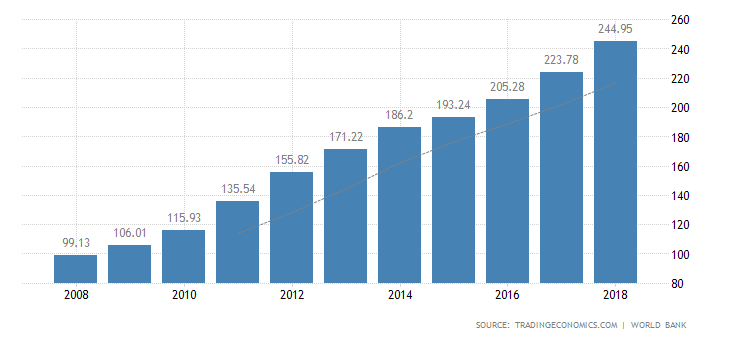
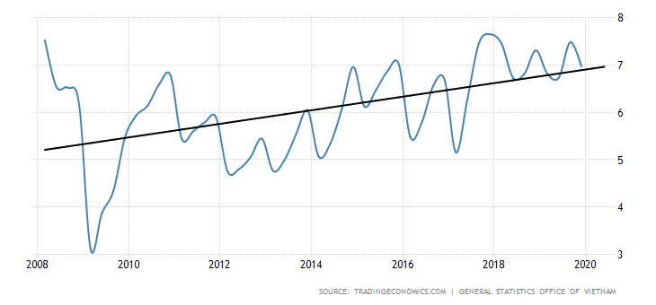
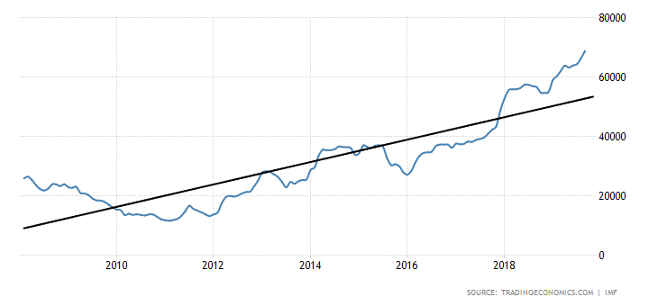
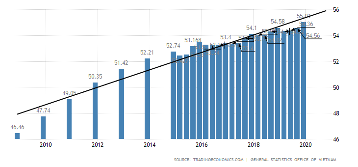
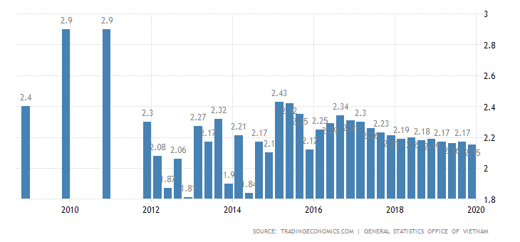
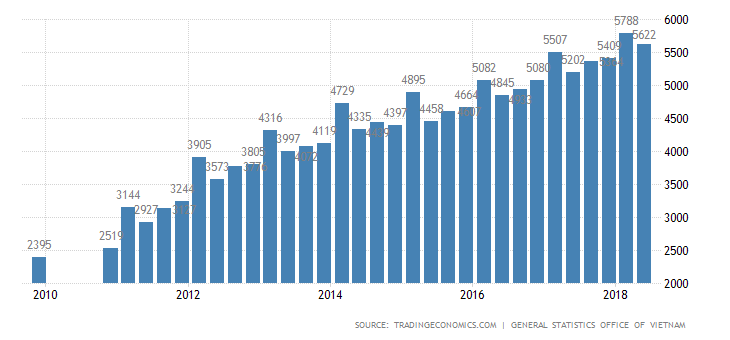
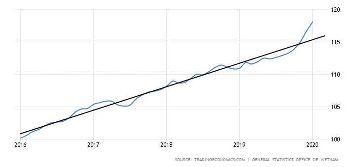
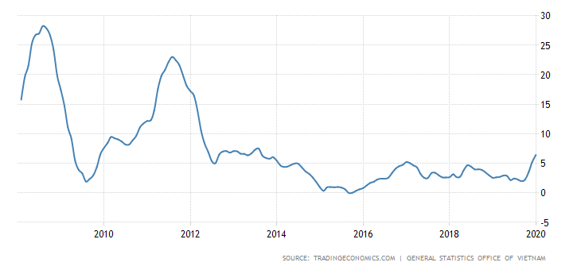
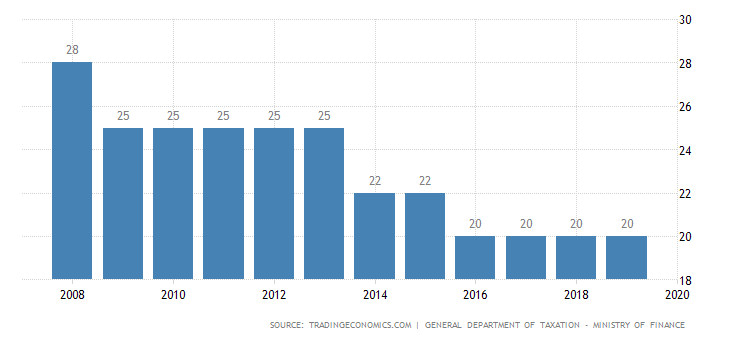
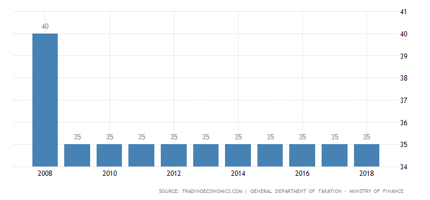

### GDP分析

#### GDP总体增长

越南2018年的国内生产总值（GDP）价值2449.5亿美元。越南的GDP价值占世界经济的0.40％。

从1985年到2018年，越南的GDP平均为739.6亿美元，在2018年达到2449.5亿美元的历史新高，
而在1989年则达到了创纪录的62.9亿美元的历史新低。

#### GDP增长率波动较大

2008年-2018年间，越南GDP增长率波动较大。总体呈上升趋势。

越南的国内生产总值在上一季度上调7.48％后，在2019年第四季度同比增长6.97％。 在2019年全年，经济增长了7.02％，
超过了国民议会的目标，从6.6％提高到6.8％。

从2000年到2019年，越南的GDP年均增长率为6.54％，在2007年第四季度创下历史新高8.48％，
在2009年第一季度创下历史新低3.12％。

|**实际**|**上季度**|**最高**|**最低**|**年度**|**单位**|
|:-----:|:----:|:----:|:----:|:----:|:----:|
|6.97|7.48|8.48|3.12|2000-2019|百分比|

### 外汇储备呈呈上升趋势

越南的外汇储备从2019年8月的66350.60百万美元增至9月的68812.10百万美元。

从1995年到2019年，越南的外汇储备平均为18295.94百万美元，在2019年9月达到历史
最高的68812.10百万美元，并在1995年1月创下历史新低的878.30百万美元。

|**实际**|**上季度**|**最高**|**最低**|**年度**|**单位**|
|:-----:|:----:|:----:|:----:|:----:|:----:|
|68812.10|66350.60|68812.10|878.30|1995 - 2019|百万美元|

### 就业人口上升

越南的就业人数从2019年第三季度的5456万增至2019年第四季度的5,503万。

从1982年到2019年，越南就业人数平均为4,327万，在2019年第四季度达到历史最高水平5,503万，
在1982年第四季度达到历史新低2,350万。

|**实际**|**上季度**|**最高**|**最低**|**年度**|**单位**|
|:-----:|:----:|:----:|:----:|:----:|:----:|
|55.03|54.56|55.03|23.50|1982 - 2019|百万|

越南的失业率从2019年第三季度的2.17％降至2019年第四季度的2.15％。

从1998年到2019年，越南的失业率平均为2.33％，在1998年第四季度创历史新高4.50％，
在2012年第四季度创下历史新低1.81％。

|**实际**|**上季度**|**最高**|**最低**|**年度**|**单位**|
|:-----:|:----:|:----:|:----:|:----:|:----:|
|2.15|2.17|4.50|1.81|1998 - 2019|百分比|

### 平均工资和物价呈上升趋势

越南的工资从2018年第一季度的5788越南盾/月，降至2018年第二季度的5622越南盾/月。

从2007年到2018年，越南的平均工资为4232.55越南盾/月，在2018年第一季度创下
历史新高5788越南盾/月，并在2007年第四季度创下历史新低1399越南盾/月。

|**实际**|**上季度**|**最高**|**最低**|**年度**|**单位**|
|:-----:|:----:|:----:|:----:|:----:|:----:|
|5622.00|5788.00|5788.00|1399.00|2007 - 2018|越南盾 千盾/月|

越南的居民消费价格指数从2019年12月的116.65点升至1月的118.09点。

从2016年到2020年，越南消费者物价指数CPI平均为108.10点，2020年1月创历
史新高118.09点，2016年1月创历史新低100.17点。

|**实际**|**上季度**|**最高**|**最低**|**年度**|**单位**|
|:-----:|:----:|:----:|:----:|:----:|:----:|
|118.09|116.65|118.09|100.17|2016 - 2020|点|

越南的年通胀率从前一个月的5.23％增至2020年1月的6.43％。 这是自2013年8月以来的最高通货膨胀率，
受农历新年节日对食品和饮料的需求增加以及猪瘟持续影响的推动，食品和餐饮服务价格上涨（10.93％比
12月的9.17％）。 住房和建筑材料的通货膨胀也加快了（6.29％比5.12％），原因是1月1日国内天然气价
格上涨。 运输和运输（7.50％对3.52％），这是由于2019年12月31日汽油价格调整的影响。同时，纺织品，
鞋类，帽子（1.43％对1.49％）和教育（4.11％对4.25％）的成本降低了 ）。 年度核心通胀率（不包括
波动性项目）从12月的2.78％上升至1月的3.25％，是自该系列于2015年4月开始以来的最高水平。按月计，
消费价格上涨了1.23％。

从1996年到2020年，越南的通货膨胀率平均为6.22％，在2008年8月达到历史最高的28.24％，
在2000年7月达到创纪录的低至-2.60％。

|**实际**|**上季度**|**最高**|**最低**|**年度**|**单位**|
|:-----:|:----:|:----:|:----:|:----:|:----:|
|6.43|5.23|28.24|-2.60|1996 - 2020|百分比|

### 企业所得税降低

2016年-2018年，越南的企业所得税为20%。

从1997年到2019年，越南的公司税率平均为27.07％，1998年达到历史最高水平35％，
2016年达到历史最低点20％。

### 个人所得税

2009年-2018年，越南的个人所得税税率为35％。

从2004年到2018年，越南的个人所得税税率平均为36.67％，在2005年达到历史最高水平40％，
在2009年达到历史最低水平35％。

（PS: 本文部分数据参考商务部、tradingeconomics等，由外跨研究中心综合整理，转载请务必标明出处。）