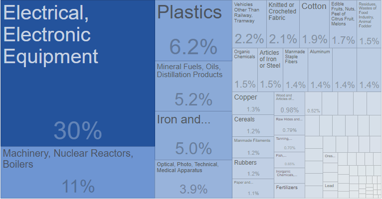

### 中国是越南最大的贸易伙伴

自1991年起，中越关系明显缓和，中越之间的贸易显著增加，双方在对彼此的经济发展中突飞猛进。这对中国和越南的经济贸易关系稳步发展
有着至关重要的作用。

中国和越南有着很长一段的共同边界线，可以说经贸合作也是历史的需要。双方都本着“尊重主权与自国的领土完整，互不侵犯，互不干涉内政，横向
写作与和平”的规则。

据越南海关总局数据显示，2018年中国与越南双边贸易额达1060亿美元，同比增长14%。中国也成为与越南双边贸易额达1000亿美元的首个贸易合作
伙伴。

其中，越南对中国的商品出口额达412.68亿美元，同比增长58.64亿美元，增幅为16.6%。越南从中国进口额约达654.38亿美元，同比增长68.46亿美元，
增幅为11.7%。

2019年中国仍然是越南最大的贸易伙伴。数据显示，2019年中越进出口总额达1168.7亿美元，两国间贸易额连续第二年突破1000亿美元。

其中，越南对中国出口额为414.1亿美元，同比仅增长1.5亿美元，增幅为0.36%，自中国进口额为754.52亿美元，同比增长100亿美元，增幅为15.3%。相比
起2018年前11个月超22%的增速，越南商品的对华出口增长正在急速放缓。

### 越南自中国进口产品以半成品和生产原料为主

2018年越南对中国进口额超10亿美元的商品有14个，同比增长4个。

其中，汽油进口额超10亿美元（2017年为5.18亿美元）；原料塑料11.1亿美元（2017年为9.18亿美元）；纤维、纱线为12.34亿美元（
2017年为8.78亿美元）；普通金属为13.31亿美元（2017年为9.85亿美元）

2019年，越南自华出口额为754.52亿美元，同比增长15.3%，约为100亿美元。部分数据如下：

中国是越南的第二大计算机、电子产品和组件进口市场，前11个月云娜自中国进口为110.9亿美元，同比增长49.25%。

中国是越南最大的机械设备、零件的进口来源国，前11个月越南自中国进口为133.6亿美元，同比增长26.4%。

中国是越南最大的塑料产品进口来源国，前11个月越南来自中国进口为35.8亿美元，同比增长22.7%。

中国是越南最大的钢铁产品进口来源国，前11个月越南自中国进口为489万吨，同比下降15%。

中国是越南最大的化工产品进口来源国，前11一个月越南自中国进口为29.2亿美元，同比增长7.7%。

中国是越南最大的纺织品、服装、皮革和鞋类材料进口来源国，前11个月越南自中国进口为105亿美元，同比增长8.8%。

### 越南对中国出口产品以农产品为主

2018年越南对中国出口商品额分别为：手机零件为93.75亿美元，同比增长22.23亿美元，增幅为31.1%；电脑、电子产品及零件约83.64亿
美元，增长15.04亿美元，增幅为21.9%；照相机、摄像机及零件约28.01亿美元；蔬果约27.84亿美元；纤维、纱线为22.16亿美元；
纺织品约15.41亿美元；鞋类约为14.92亿美元；木材及木制品约为10.72亿美元。

越南对中国出口产品机构朝着积极方向转移，工业产品、农业水产品比重增加，原料、燃料和矿产出口比重下降。

2019年越南对中国出口额为414.1亿美元，同比增长0.36%，约为1.5亿美元。

中国作为越南农产品的最大出口市场，前11个月中国自越南进口额为53.3亿美元，同比下降9.4%。由于中国提高了进口标准，2019年越南
对华出口的果蔬产品总额同比下降了13.2%。此外，越南大米、白虾等多种产品的对华出口也出现了下跌。

### 越南对中国是逆差，但中国依旧占据主动权

中国与越南的贸易情况，不能按传统的贸易顺差、逆差来进行分析。

由于中国对越南出口的产品，大部分是半成品，这些产品在越南加工后出口到美欧等国家，越南可以从中得到顺差。但是，越南向中国
出口的产品，确实农产品等。中国在这方面的选择比较多，既可以选择越南的，也可以选择其他国家的。

因此，中国对越南是顺差，越南对中国是逆差，但在经贸关系中，中国既然占据着主动权。

2019年越南向中国出口额为414.1亿美元，同比增长0.36%；从中国进口额为754.52亿美元，同比增长15.3%。

仅仅从数据商来看，越南对中国的贸易逆差已超过300亿美元。

然而这其实并不是关键，中国和越南之间贸易产品的差距，决定了这二者有着更深入的关联。

中国对越南出口的产品，有一个明显的特点比如机械设备、零件、金属、塑料这些产品，都是半成品，甚至可以说是生产原料。

越南拿到这些产品后，经过国内的生产，然后向欧美、全世界进行输出。在折衷情况下，中国对越南的出口，非但不能争抢越南国内的市场，反而会增加
越南的生产能力。

从越南的角度来说，显然不能限制从中国的进口，因为这是越南出口的根源。只有从中国进口了零件、生产原料，越南菜有向
美欧出口的根本。

从中国的角度来说，限制从越南进口却对中国经济不会造成什么重大损失，越南到中国出口的产品，是一些农产品，这些农产品中国向其他
地区或国家购买也是可以的。

### 越南经济发展与中国对比

#### 相似点

第一、越南政治体制和文化传统与中国相似，使得越南非常容易理解并模仿中国的各类经济政策。

第二、越南劳动力较为丰富。截至2018年底，越南人口已接近1亿人。

第三、越南国土狭长，海岸线长，便于参与国际贸易。

第四、越南国有企业较多，可以效仿中国在基础设施投资和建设领域发挥重要作用。

#### 优势

与中国相比，越南目前有两点优势。

首先，越南劳动力成本更低。越南最低平均工资一类地区；约合人民币1230元/月。二类地区：约合人民币1092元/月。三类地区：
约合人民币965元/月。四类地区：约合人民币859元/月。

#### 劣势

与中国相比，越南的劣势。

第一、虽然劳动力丰富，但是技术人员短缺，较多都是廉价劳动力，优质劳动力不足。

第二、越南资源匮乏，整个国家以农业生产为主，工业基础薄弱。

第三、基础设施建设落后，供应链不完整。公路建设不佳，铁路、港口等设施不够发达，运输和物流方面都不够完善，产业配套也不
完备。尚未达到许多国际公司的标准。

第四、品质保证不高。越南制造的产品虽然价格低廉，但是质量却有待考虑，还未做到真正的物美价廉。

### 未来趋势

当然中越贸易和投资势头良好，经贸合作迈上新台阶。中国和越南都支持自由贸易，通过双方共同努力，中越贸易规模快速扩大，
中国成为越南最重要的进出口市场之一。

一、完善双边经济发展的优惠政策。

二、做好协调与沟通，缩小非经济因素带来的影响。

三、严厉打击走私与贸易偷运等问题。

（PS:  本文部分数据参考商务部、tradingeconomics等，由外跨研究中心综合整理，转载请务必标明出处。）