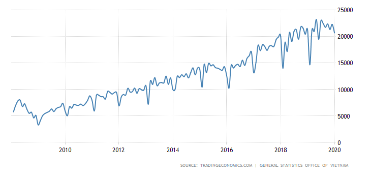
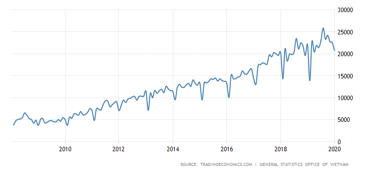
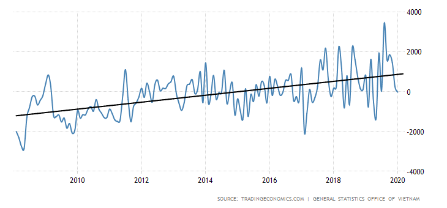
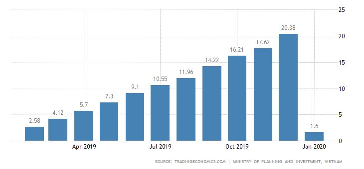
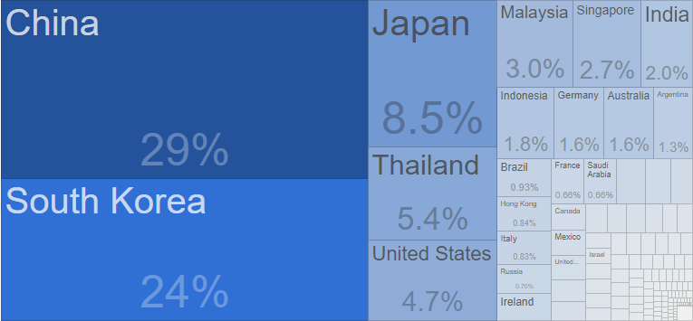
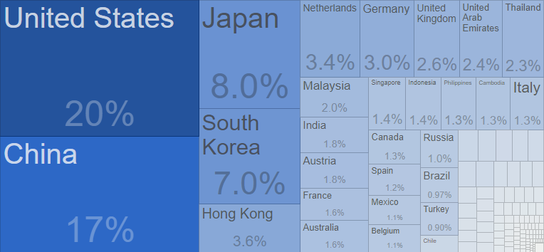

### 进出口总值突破5000亿美元

在世界和区域经济复杂波动得背景下，2019年越南经济仍保持令人深刻得增长势头。自2008年至2019年得12年间进出口额不断增长，
进出口商品总值增长了17倍。

据越南海关总局得统计数据显示，2008年进出口总值为1000亿美元。2011年，商品进出口总值增加了一倍，为2000亿美元；到2017年12月
中旬为4000亿美元；截至2019年12月，进出口总值突破5000亿美元。

据世界贸易组织排名显示，越南商品进出口排名明显提高。2018年，越南出口排名第26位，进口排名为第23位。

凭借上述成就，越南跻身全球商品进口总量最大得30个国家和地区行列。在东盟，越南进出口能力排名第三，仅次于
新加坡和泰国。

近20年来（2000年-2019年），云娜得商品进出口总值为3.995万亿美元。其中，最近5年（2015年-2019年）越南得商品进出口总值
为2.106万亿美元，高于之前15年（2000年-2014年）得进出口总值。

### 2019年贸易顺差最高

从1990年到2020年，越南的贸易平衡平均为-25.951亿美元，
在2019年8月创历史新高343.5亿美元，在1996年12月创下历史新低-388.8亿美元。

截至2019年12月15日，越南出口额为2516.62亿美元，同比增加7.78%。为改善越南总体结算平衡，增加外汇储备，降低
汇率压力做出贡献。

### 2019年吸引外资超2000亿美元

越南的外国直接投资较上年同期增长3.2％，至2020年1月达到16亿美元。此外，表明未来外国直接
投资支出规模的外国直接投资认捐在今年猛增179.5％，达到53亿美元。 天然气，水和电力分配部门
将获得最大的投资额（占总承诺额的89.7％），其次是制造和加工（7.9％）。 新加坡是外国直接投资
承诺的主要来源，其次是香港和中国。

### 主要进出口国家和地区

|**出口国家**|**出口额（亿美元）**|**年份**|
|:-----|:----|:----|
|美国|415.5|2017|
|中国|353.9|2017|
|日本|167.9|2017|
|韩国|148.1|2017|
|香港|75.7|2017|
|新西兰|71.0|2017|
|德国|63.5|2017|
|英国|54.2|2017|
|沙特|50.3|2017|
|泰国|48.0|2017|

|**进口国家**|**进口额（亿美元）**|**年份**|
|:-----|:----|:----|
|中国|585.3|2017|
|韩国|469.4|2017|
|日本|169.2|2017|
|美国|93.4|2017|
|马来西亚|59.5|2017|
|新加坡|53.2|2017|
|印度尼西亚|36.6|2017|
|德国|32.0|2017|
|澳大利亚|32.0|2017|
|阿根廷|25.5|2017|
