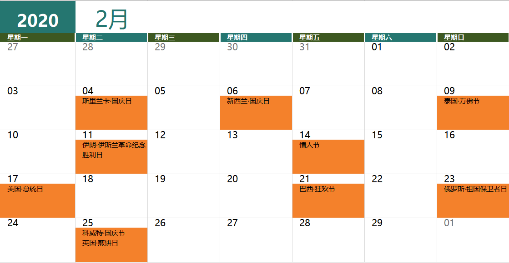

#### 2月4日  斯里兰卡·国庆日 Nationanl Day

1948年2月4日斯里兰卡民主社会主义共和国获得独立，也是该国的独立日

#### 2月6日  新西兰·国庆日 Waitangi Day

也称怀唐伊日，毛利人和英国政府与1840年2月6日签订《怀唐伊条约》该条约使新西兰成为英国殖民地。

#### 2月9日  泰国·万佛节 Makha Bucha Day

泰国传统佛教节日，在每年泰国历三月十五举行。如逢闰年，改为泰历四月十五。

#### 2月11日  伊朗·伊斯兰革命胜利纪念日 Annuversary of the Victoryy of the Islamic Revolution

1979年1月，统治伊朗37年之久的巴列维国王被迫离开伊朗，流亡国外15年之久宗教领袖霍梅尼从法国回到德黑兰，
2月11日宣布接管政权，随后成立伊朗伊斯兰共和国，这一天被定位国庆日，现已成为伊朗的法定假日。

#### 2月17日  美国·总统日 Presidents' Day

美国的10个法定节日之一，定在每年二月的第三个星期一，与阵亡将士纪念日，感恩节等享有同等地位。

#### 2月23日  俄罗斯·祖国保卫者日 Defence of the Fatherland

这一天被视为俄罗斯的男人节。

#### 2月25日  科威特·国庆节 National Day

2月25日是科威特的国庆日，2月26日是解放日（Liberation Day），科威特人会连休两天，参加盛大的庆祝活动。

#### 2月25日  英国·煎饼节 Pancake Tuesday

又称Shrove Tuesday（忏悔星期二）,基督教的传统节日之一。世界上有很多国家都会庆祝这个节日，不过当属在英国最为盛行。

#### 2月底~3月初  多国·狂欢节 Carnival

这个节日起源于中世纪的欧洲，曾于复活节密切相关：复活节前一个为期40天的大斋节，即为四旬斋。在斋期里，人们禁止娱乐、食肉，所以
在斋期开始前的3天里人们纵情欢乐，称之为“狂欢节”。

目前欧洲和南美洲都有庆祝狂欢节的习惯，一般在2月中下旬。

** 各国狂欢节时间**
德国玫瑰星期一狂欢节（2月24日）

威尼斯假面狂欢节（2月8日-2月25日）

法国尼斯狂欢节（2月15日-2月29日）

西班牙特内里费狂欢节（2月20日-3月1日）

巴西里约热内卢狂欢节（2月21日-2月26日）

（PS: 本文由外跨研究中心综合整理，转载请务必标明出处。）
