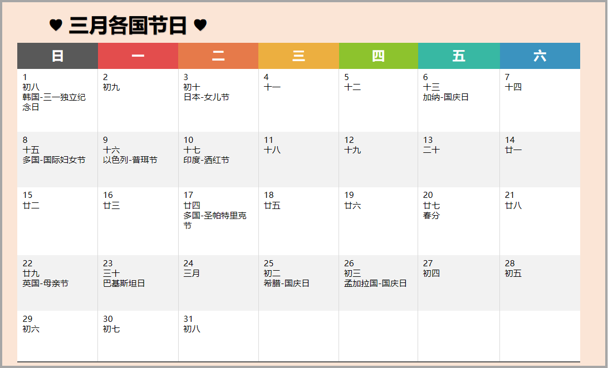

#### 3月1日  韩国·独立日

韩国三一节，又叫独立日，是韩国法定节假日。全国放假一天

#### 3月3日  日本·女儿节

也称偶人节、上巳、桃花节，是日本民间五大节日一直。原本在农历的三月初三，明治维新后为3月3日

**习俗** 家中有女儿者与当天装饰小偶人，供奉菱形黏糕、桃花，以示祝贺并祈求女儿幸福。这天女孩多穿和服，
邀请玩伴，在偶人坛前食糕饼、饮白色甜米酒。

#### 3月6日  加纳·国庆日

每年3月6日，为加纳国庆日，全国放假

#### 3月8日  多国·国际妇女节

在不同的地区，庆祝的重点有所不同，从普通的庆祝对女性的尊重、欣赏和爱意到庆祝女性在经济、政治及社会
领域的成就，这个节日众多国家的文化都有融合。

#### 3月9日  以色列·普珥节

普珥节又叫普林节，为纪念和庆祝古代流落波斯帝国的犹太人从灭族的毁灭中幸存的节日。

**习俗** 现代的以色列，这个节日就是犹太人的狂欢节，几大城市都会举办化妆游行活动，场面十分有趣

#### 3月10日  印度·洒红节

也称胡里节、色彩节，四印度传统节日，也是印度传统新年

象征春天的来临，主要分布于印度、尼泊尔及世界各地的印度移民社区中。

**习俗** 洒红节一般为两天；第一天主要为祈祷仪式；第二天为狂欢日。

#### 3月17日  多国·圣帕特里克节

为纪念爱尔兰守护神圣帕特里克的节日，5世纪末起源于爱尔兰，如今已成为爱尔兰的国庆节

**习俗** 随着爱尔兰后裔遍布世界各地。现在，圣帕特里克节已经渐渐在加拿大、英国、澳大利亚、美国和
新西兰等国家广为庆祝。

圣帕特里克节的传统颜色为绿色。

#### 3月22日  英国·母亲节

英国的母亲节，与中国和美国等其它国家的母亲节不同

英国的母亲节不在五月的第二个星期天，而是每年的四旬斋（西方复活节之前除去星期天的四十天）的
第四个星期天

**习俗** 对于现在英国人来说，现在最常见的母亲节庆祝方式，就是送妈妈一束花、一盒巧克力或者一张贺卡

#### 3月23日  巴基斯坦·国庆日

每年的3月23日，是巴基斯坦国庆日，全国放假

#### 3月25日  希腊·国庆日

这一天标志着希腊人民开始了成功击败奥斯曼帝国的斗争（1821至1830年），并最终建立了独立国家

#### 3月26日  孟加拉国·国庆日

1971年3月26日，驻扎在吉大港地区的第八东孟加拉联队领导人齐亚·拉赫曼率部占领吉大
港电台，宣布东孟加拉脱离巴基斯坦而独立，成立孟加拉国临时政府

独立后政府将此日定为国庆节及独立节。这天全国都举行隆重的庆祝活动

（PS: 本文由外跨研究中心综合整理，转载请务必标明出处。）

