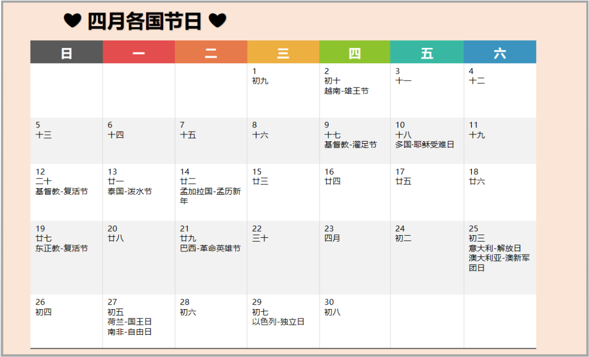

#### 4月2日  越南·雄王节

每年的农历三月初十是越南的雄王节。雄王建立的“文郎国”为越南的第一个王朝，其
后子孙后代不断繁衍，从而形成了今天的越南民族。越南有许许多多“雄王庙”，每年的
农历三月初十都会举行非常隆重庄严的祭祀活动。

**食物** 每逢春节或祭拜雄王节，越南人民都会做着两种食物（圆形的叫做Banh giay，
方形叫做Banh chung -粽子），以祭拜祖先，表示孝顺之心，以及饮水思源的传统。

#### 4月9日  基督教·濯足节 

濯足节是基督教纪念耶稣建立圣体圣血之圣餐礼的节日。根据耶稣在受难前夕最后晚餐上
为十二门徒洗脚所作出的榜样而定为节日。

**活动** 教会规定在该日举行濯足礼，以追随耶稣谦卑、仁爱之举来完成其授权的事业，实现其新约。

#### 4月9日  以色列·逾越节

逾越节是为了纪念犹太人在摩西的领导下离开埃及，脱离被奴役的生活，以犹太民族的身份
拥抱自由，被视为是古犹太传统中最重要的节日。

**活动** 所有政府部门、各级学校与大学均有七天假期，多数民营企业或休七天假，或只休其中几天。

#### 4月10日  耶稣·受难日  

Good Friday，又称基督受难日或耶稣受难节，是为了纪念耶稣基督被钉在十字架上受难的日子，是复活节前的星期五

#### 4月12日  基督教·复活节 

复活节是基督徒纪念耶稣被钉在十字架死后的第3天复活的节日。复活节象征着新生。

它在西方国家是仅次于圣诞节的第二大重要节日。凡是以天主教、新教、东正教为主要信仰的国家，都会过复活节。这些国家包括但不限于：欧洲诸国，美国、加拿大、巴西等美洲国家，澳大利亚、新西兰，尼日利亚；俄罗斯、希腊等国过东正教复活节。在中国香港，复活节也是法定假日。

**活动** 欧美民间有很多传统的庆祝活动和习俗，如游行，制作和寻找彩蛋，复活节兔子等等。

**特别提醒** 复活节的祝福不要发给不信仰基督教的印度客人、中东客人。

#### 4月13日  泰国·泼水节（宋干节）

泰国及东南亚地区最盛大的传统节日。人们会前往寺庙沐浴礼佛、堆沙造塔、听僧诵经。各地的泼水活动吸引各国游客前来。

#### 4月14日  孟加拉国·孟历新年

4月14日是孟加拉国的孟历新年。休假天数1天。在吃过一种新年特别早饭之后，孟加拉人会穿上传统服装去参加新年游行。

#### 4月21日  巴西·革命英雄节

这是巴西最重要的国民节日之一，也是一个全国性的节日。这个节日在巴西历史上具有重大意义。Tiradentes意为“拔牙者”，指的是巴西历史上鼎鼎大名的民族英雄若阿金•何塞•达•席尔瓦•泽维尔（Joaquim José da Silva Xavier），这是他在1792年为巴西独立而就义的日子。

#### 4月23日  穆斯林·入斋（斋月开始）

斋月，又译莱麦丹月，是伊斯兰历第九个月，该月名字意为“禁月”，是穆斯林封斋的一个月。斋月期间，穆斯林的工作时间一般为早上9点到下午2点，此时的工作效率会比较低，有些人会夜间工作，白天休息。今年将于5月23日开斋。

#### 4月25日  意大利·解放日

1945年4月25日，意大利北方人民举行起义，解放了米兰、都灵、热那亚等大城市，驱逐了纳粹德国占领军，结束了长达20年的法西斯统治。为纪念这一胜利，将这一天定为解放日，国家机关将举行庆祝活动，全国放假一天。

#### 4月25日  澳大利亚·澳新军团日

澳新军团日源于第一次世界大战中的加里波利战役。纪念第一次世界大战时期、于1915年4月25日在加里波利之战牺牲的澳大利亚和新西兰联合军团（简称澳新军团）军人的日子，在澳大利亚和新西兰均为公众假日，为两地最重要的节日之一。从这一天的拂晓开始，全国范围内各地的战争纪念馆都会举行纪念仪式。

#### 4月25日  埃及·西奈解放日

每年的4月25日是埃及人民庆祝西奈回归的日子，那时全国都会放假一天，举国欢腾。

#### 4月27日  荷兰·国王日

从2014年开始，荷兰不再在4月30日庆祝女王节，而是在4月27日庆祝国王日。数以百万的荷兰人汇聚会在街头巷尾，汇成一片片“橙色海洋”。

#### 4月27日  南非·自由日

自由日（国庆节）是为了庆祝南非1994年废除种族隔离制度之后，人民获得政治自由和进行了南非历史上第一次不分种族的选举而设立的节日。

#### 4月29日  以色列·独立日

独立日即以色列国庆节。1949年以色列议会通过决议，确定犹太民历以珥月5日为以色列国独立日。

独立日是以色列国政治生活中最重要的日子，每年的这一天都要举行大规模群众性庆典。庆典于太阳落山之后在耶路撒冷赫茨尔山上举行，总统、总理、各部部长、著名人士，国防军残废军人、烈军属、新移民代表和各界人士代表参加在赫茨尔墓地举行的庆典开始仪式。仪式由议会议长主持。仪式主要内容是鸣礼炮，礼炮的响数与建国的年数相等。
