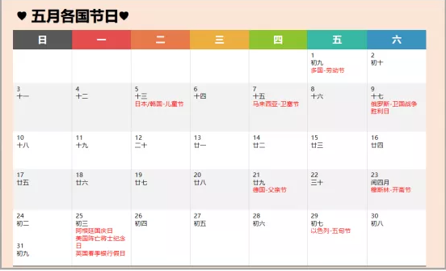

#### 5月5日  日本儿童节

日本的儿童节比较特殊，分男孩子的儿童节和女孩子的儿童节。男孩子的儿童节（こどもの日）就是原来日本的端午节（端午の節句），也就是5月5日，不过日本在明治维新之后废除了农历，采用公历，所以5月5日跟中国的不一样，日本的是公历，中国的是农历，这是需要注意的。日本在1948年战后通过立法的形式把5月5日定为公众节假日。

#### 5月5日  韩国儿童节

韩国的儿童节开始于1923年，是从“男孩节”演变过来的，这也是韩国的公众假日。在日本统治时期，韩国儿童节从1939年开始曾一度被取消，直到1946年才恢复，日期也被改为每年的5月5日。

#### 5月7日  马来西亚卫塞节

南传佛教传统纪念佛教创始人释迦牟尼佛诞生、成道、涅槃的节日。

东南亚和南亚国家如斯里兰卡、泰国、柬埔寨、缅甸、新加坡、马来西亚、印度尼西亚、尼泊尔等国的佛教徒，均在这一年一度的重要节日中举行盛大的庆典活动。

#### 5月9日  俄罗斯卫国战争胜利日

1945年5月9日，德国向苏、英、美签署了德国无条件投降书。由于时差原因，地处柏林以东的苏联当时已是5月9日凌晨，而在柏林以西的美、英、法等国还是5月8日的下午或晚上。因此，美、英、法等国把5月8日定为欧洲胜利日，苏联则确定5月9日为战胜德国法西斯纪念日。

#### 5月9日  德国父亲节

德国的父亲节是复活节后的第40天。

多数德国人会选择在家里庆祝父亲节，或者来一场短途郊游、户外烧烤之类的，当然这些都取决于那天的天气。许多父亲们会利用这样一个空闲的周四与家人一起度过一个长周末。

#### 5月23日  穆斯林开斋节

穆斯林在莱麦丹（伊斯兰历第九个月）全月斋戒，斋月最后一日寻看新月，见月次日开斋，即为开斋节；如未见新月，则继续封斋，节期顺延，一般不超过3天。

节日一般放假三天。人人互致问候：“尔德·穆巴拉克！（节日吉祥！）”。英文为Eid Mubarak。

#### 5月25日  阿根廷五月革命纪念日

1810年5月25日，阿根廷爆发五月革命，推翻了西班牙南美洲拉普拉塔总督区的殖民统治。每年的5月25日被定为阿根廷五月革命纪念日，这一天也是阿根廷的国庆日。

#### 5月25日  美国阵亡将士纪念日

是美国大多数州都要纪念的节日，时间原为5月30日，1971年以后，为保证联邦雇员都能享有这一休息日，许多州将它改在5月的最后一个星期一。悼念在各战争中阵亡的美军官兵，它不单是一个爱国纪念日，在民间更是代表夏季正式开始，不少海滩、游乐场、小岛的夏日渡轮等等，都会由该星期的周末开始营运。全国放假，孩子们不用上学。

#### 5月25日  英国春季银行假日

银行假日是英国的法定公众假日，于1871年被承认。英国的银行假日有两个，分别为5月最终周的周一春季银行假日(SpringBankHoliday)、8月最终周的周一夏季银行假日(SummerBankHoliday)。

许多商店在“银行假日”都会歇业，让员工和家人一起休息或出门度假。除银行之外，大多数商店在“银行假日”会照常营业，圣诞节除外。在“银行假日”工作的人工资会较平日增加，有时会是平日的双倍。

#### 5月29日  以色列五旬节

这是一个欢庆丰收的节日，常被人们称作：五旬节，七七节，收割节。

节日当天的传统之一是食用奶制品。这一天，以色列家庭会相聚在一起，共进晚餐或午餐，吃着馅饼、沙拉、水果，还有大人小孩都爱的奶酪蛋糕。

节日前一天，孩子们通常会身着穿白色衣服上学，带着装满水果，蔬菜与农作物的篮子庆祝丰收，在学校庆典上表演唱歌与跳舞。

