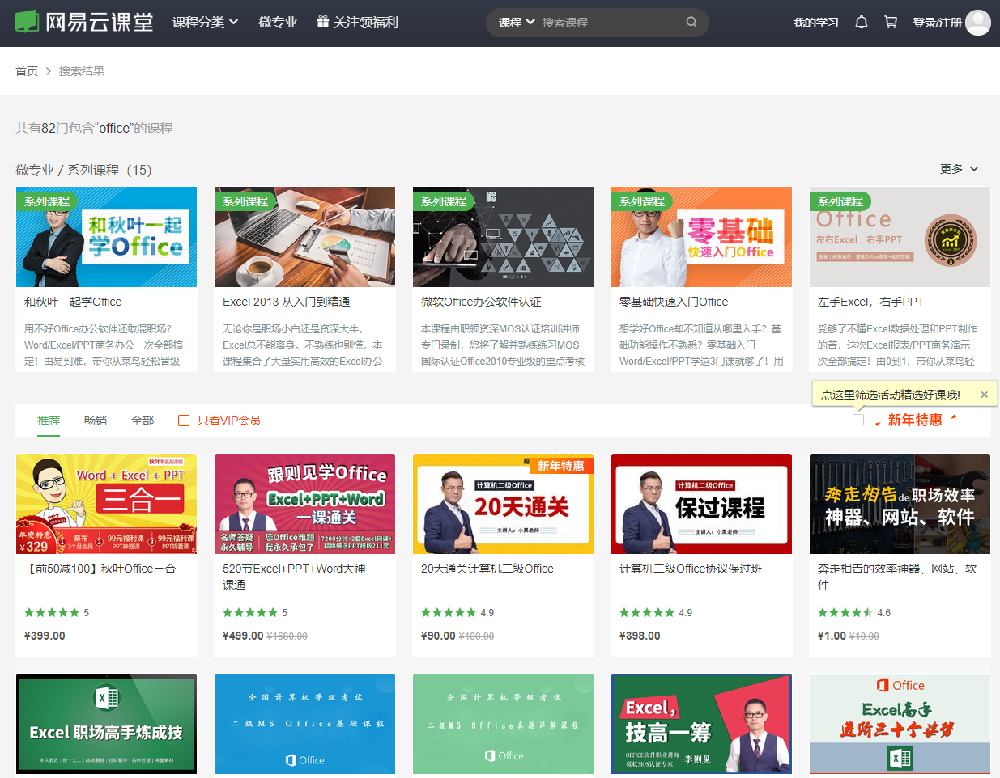

## 做外贸我需要掌握哪些技能

**1. 英语**

**2. 专业知识**

**3. 行业标准**

**4. 办公软件；office(wps)、图片处理软件(PS)**

**5. 生产工艺**

#### 英语

>英语作为一门语言，是我们沟通的桥梁。也是我们使用的一项工具。不管是语言，还是专业知识行业标准等。都是我们使用的工具。

如果仅仅是为了做外贸，英语不是我们必须要掌握的技能。在国外有很多的客户都可以说一些中文。我们仅仅是为了做生意，英语好或不好，对于我们做外贸影响的权重并不是很大。

我2019年12月在越南的时候，看到有一家我们国内的国外书刊。两个女的，根本就不会说英语。但是在当地市场发放书刊，拿着书刊去给店铺的推销。然后获得店铺的名片。就是这样，就把我们我信息发放完毕。

另外在展位上的时候，有一家公司在这个书刊上做着广告。跟着做书刊的一起在展会上，他们也是一点英语也不会，当时我看到他们找了一个翻译在展会上给客户交谈。那家公司的老板也不怎么和客户交流。做书刊的也不怎么和客户交流。当时我的想法是这家公司我肯定不会在他们的书刊上做广告。如果就是我付给他们广告费他们把我的广告以这种方式发放出去，还不如我自己去国外做。

#### 专业知识

我们作为一个业务员，相关行业内的专业知识一定要精通。有一次一个客户委托第三方来我们公司检验。当时检测是M6的螺母，其中有一项检测内容为螺纹直径。检测公司的人员用卡尺量出来的螺母直径为5.2mm。然后把报告发了客户，客户得到检测报告后告知我方说货物不合格。后来通过沟通我们告诉客户，检测公司当时测量的是内螺纹。测量方式和外螺纹是不同的。
    
因为检测公司的不当方式，导致我司发货延迟。这样的后果还算是影响比较小的。如果客户直接拒绝，那么导致的后果就相当严重。

#### 行业标准

>行业标准，不管做那个行业。所在的行业都有规范的标准来规范其产品。

我们在外贸的工作中，经常接触不同的国家和地区的客户。而不同国家或地区的客户对于产品的技术要求、行业标准与我们国家的标准有一定的差别。这个是我们需要了解和熟悉的。

>**我们常用的标准按照螺纹分，分为公制螺纹和英寸螺纹。**

我们常用的GB标准和DIN标准都是属于公制螺纹。公制螺纹常用的表示方法是M6-1.0P，M8-1.25P。

>**公制螺纹是指两个牙距的长度是一个毫米单位的数值，并且这个数值是精度是小数点后两位的。**

而英寸螺纹，常用的表示方法是1/2-12（1/2-13）、1/4-20。指的就是英寸螺纹。

>**英寸螺纹是指一英寸内有多少个牙。就像1/4-20指的是一英寸里有20个牙。这个数值是一个整数。**

#### 办公软件

**相对于办公软件，可能很多朋友会说。这个挺简单的，有必要拿出来讲吗**

那我问下，谁能告诉我谁是精通办公软件？

这个是一个学习平台上关于学习Office的课程。精通office，并不是说知道那个功能在那里弄就是精通了。

我个人建议，Office 对word, ppt可以不太懂。但是excel还是要深入了解，在这里我不谈精通，因为精通这个词很多人都不能精通。

excel处理数据的能力是非常强大的。数据处理、数据分析、图表、透视图、VBA。我个人都不敢说精通。

我们后期要处理的数据量虽然不大，但是很繁琐。报价单、箱单发票、报关单等一系列数据都需要处理。

#### 生产工艺

生产工艺是我们必须要了解的，或者说对于我们的主营业务必须要了解。

如果对于我们自己的产品我们都不知道怎么生产出来的，那么如何说服客户说我们自己是工厂呢?