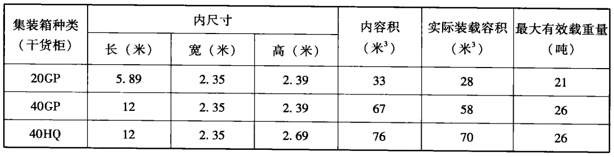
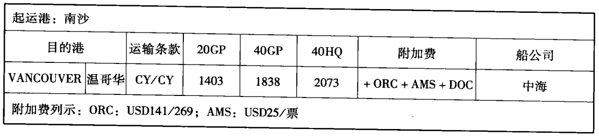
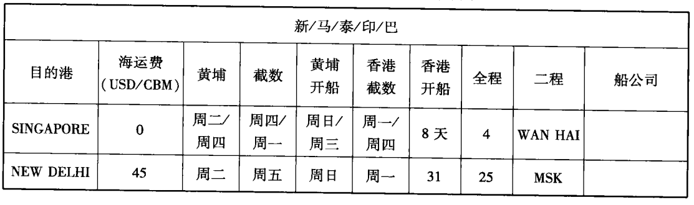

### 最常用的三种集装箱（干货柜）

以上数据来自于某国际物流公司，仅供参考。不同货运公司的数据会有所差别，而且因为出口的产品不同，外包装箱的尺寸也不同，
装法会有差别，因为集装箱的利用率也会不一样。建议在实际操作中，计算出口外包装的总容积时，一般不要超过上面的实际装载容积。

集装箱内最大有效承载重量以船公司根据实际情况确定。当一个集装箱的货物总重量超过上表中的最大有效承载重量时，就叫重柜，凡是重柜（常见于20GP），都要加选柜费和重柜费。

#### 集装箱运输条款

- CY/CY：指堆场到堆场方式，承运人在装货港集装箱堆场接收整箱货物，并负责运至卸货港集装箱堆场，整箱交付收货人。
- CY/FO：指承运人在装货港集装箱堆场接收整箱货物，并负责运至卸货港，但不负责卸货。
- CY/LO：指承运人在装货港集装箱堆场接收整箱货物，并负责运至卸货港卸货。
- CY/TRAKLE：指承运人在装货港集装箱堆场接收整箱货物并负责运至卸货港卸货支接货车上。
- CY/HOOK：指承运人在装货港集装箱堆场接收整箱货物并负责运至卸货港卸货。此处当吊臂掉下货物后服务终止。

#### 集装箱运输中货物的交接方式

- 门到门（Door to Door）：指运输经营人由发货人的工厂或仓库接收货物，负责将货物运至收货人的工厂或仓库交付。在这种交付方式下，
货物的交接形态都是整箱交接。
- 门到场（Door to CY）：指运输经营人在发货人的工厂或仓库接收货物，并负责将货物运至卸货港堆场或其内陆堆场，在堆场向收货人交付。在这种交接方式下，
货物也是整箱交接。
- 门到站（Door to CFS）：指运输经营人在发货人的工厂或仓库接收货物，并负责将货物运至卸货港码头的集装箱货运站，
或其在内陆地区的货运站，经拆箱后向各收货人交付。在这种交接方式下，运输经营人一般时以整箱形态接收货物，
以拼箱形态交付货物。
- 场到门（CY to Door）：指运输经营人在码头堆场或其内陆堆场接收发货人的货物（整箱货），并负责把货物运至收货人的工厂货仓库，向收货人交付。
- 场到场（CY to CY）：指运输经营人装货港的码头堆场或其内陆堆场接收货物（整箱货），并负责运至卸货港码头堆场或
其内陆堆场，在堆场向收货人交付（整箱货）。
- 场到货（CY to CFS）：指运输经营人在装货港的码头堆场货其内陆堆场接收货物（整箱），并负责运至卸货港码头集装箱
货运站，或其在内陆地区的集装箱货运站，一般经拆箱后向收货人交付。
- 站到门（CFS to Door）：指运输经营人在装货港码头的集装箱货运站或其内陆的集装箱货运站接收货物（经拼箱后），负责运至收货人的工厂或仓库交付。在这种交接方式下，运输经营人
一般时以拼箱形态接收货物，以整箱形态交付货物。
- 站到场（CFS to CY）：指运输经营人在装货港码头的集装箱货运站或其内陆的集装箱货运站接收货物（经拼箱后），负责运至卸货港码头或内陆地区的堆场交付。在这种方式下，货物的
交付形态同站到门交接方式。
- 站到站（CFS to CFS）：指运输经营人在装货港码头的集装箱货运站或其内陆的集装箱货运站接收货物（经拼箱后），负责运至卸货港码头集装箱货运站，或其内陆地区的集装箱货运站，经拆箱后向收货人交付。
在这种方式下，货物的交接形态一般都是拼箱交接。

货运公司的报价通常以美元为单位。上面的20英尺集装箱是1403美元，以此类推。

#### 附加费（surcharges)

不同的航线具有不同的附加费，此费用术语国内费用，不属于海运费，如果以FOB On board的价格条款成交，则附加费应该包含在此价格中。

**常见的附加费用**
- BAF = Bunker Adjustment Factor（燃油附加费）
- IFC = Inland Fuel Charge（内陆燃油附加费）
- PSS = Peak season surcharge（旺季附加费）
- ACC = Alameda Corridor Charge（绿色通道费）
- ISPS = International Ship Port Facility Security Code（《国际船舶和港口设施保安规则》，也称港口安全费）
- IPIR = Inland Point Intermodal Rate（内陆点转运费）
- AMS = America Manifest System（美国仓单费）
- DOC = Document Charges（文件费）

- 拼箱根据不同的出口货物，按其体积或重量来计算运费。本表只列出按照体积计算的运价表。
- 海运费中价格为“0”表示不必支付海运费，但是需支付附加费，进口商的目的港也需要支付费用。
- 凡是拼箱的货物，到达卸货港时，进口商需要根据其货量支付一定的卸货费给当地港口，拼箱货越多，支付的费用就越多。
