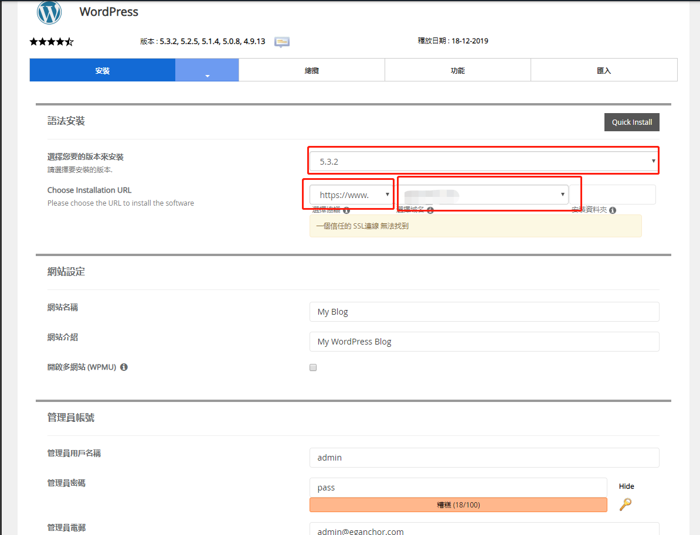
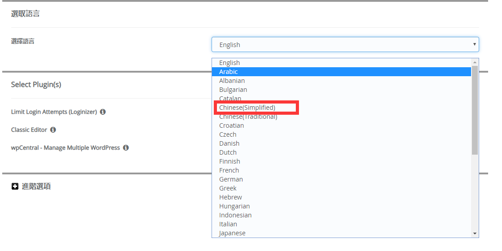

建立一个公司网站，需要哪些条件呢？

- 虚拟主机或者服务器VPS

- 域名

### 购买和配置空间

首先我们登录老薛主机官网<https://my.laoxuehost.com/aff.php?aff=10048>，打开界面如下

点击虚拟主机

点击海外主机

海外主机有香港空间、优质美国空间、美国空间

根据性价比推荐三个主机：美国2号、美国3号、美国4号。选择可以根据自己的实际情况。

- 网页空间：指的是空间的大小，一般1GB就够用了

- 月流量：指的是访问所消耗的流量。一般公司的网站60GB就已经够用了

- 数据库数量：一般我们都是用的1个数据库，一个网站用一个数据库就足够了

- 绑定域名：一般用一个域名。一个网站用一个域名

- 企业邮箱：可以设置自己公司的企业邮箱，更具专业性

- SSL 数字证书：打开网站的时候，会显示已经加过加密的网站访问。更显得公司的安全性

- DDOS防护：防止黑客利用DDOS攻击

选择好了以后就可以选择立即购买了，然后跳转下一界面

这里会提示你选择域名，如果你已经购买域名。直接选择第一个就可以，如果你没有购买域名。可以从老薛主机里购买域名

现在我这里有一个域名，就直接输入我的域名。然后跳转到下一界面

这里是确认订单，然后购买附加选项。一般我们可以选择不购买。默认即可。

**如果年付优惠那里输入XXFJ，会有75折扣优惠**

点击结账，跳转到下一界面

出现结算界面，结算方式可以选择支付宝、微信、PayPal。还不错，另外检查了下是SSL安全方式。还不错

如果没有账号，可以在这里直接填写表单。如果有账号，可以直接从这里登录。

最后，直接扫码付款就可以了

付款后会出现账单界面。账单可以下载下来。也可以不下载。然后点击左侧的返回用户中心。

返回后，进入的界面，找到圈的位置，就是我们已经购买的空间了。

我们点击管理，就进入管理界面了

在管理界面，我们找到登录cPanel面板这个按钮，点击跳转

这个是cPanel的管理界面，右侧有域名信息和IP地址等重要信息

而左侧是空间管理，我们可以直接拉到最下面。

点击wordpress，等待跳转

这个是跳转后的界面

点击现在安装，继续下一步

这几个可以进行选择

这个是后台语言选择

按照以上设置好以后，点击安装

等待安装中

现在整个过程中就安装结束了。下面我们要做两件事

- **第一、配置域名**

- **第二、安装主题**

### 配置域名

点击左上角位置，我们可以回到主控制面板

在主控制面板右侧，我们可以看到Share IP Address。这个就是给我们分配的空间IP地址。记下来

然后登录自己的域名服务商后台，域名管理中。为域名添加A记录

|**记录类型**|**主机记录**|**记录值**|
|:-----|:----|:----|
|A记录|*|IP地址|
|A记录|m|IP地址|
|A记录|www|IP地址|

添加这三项后，就算配置成功了。

**特别注意：解析时间不是立即生效的，最长时间是72小时。如果遇到所有的设置都没有问题。但是打不开**
**网站的情况下。请耐心等待一段时间。如果72小时还是无法生效。就需要检查以上三个填写情况**

### 安装主题

如果解析已经生效的话，我们就可以通过在浏览器输入我们的域名进行测试，来测试是否已经生效。

如果生效的话，会出现如上的界面。

如果我们的域名是www.sample.com。那么我们登录的后台就是www.sample.com/wp-admin。通过我们域名
后面直接输入/wp-admin，回车就可以直接登录到后台。

后台登录页面

这是我们的后台管理界面，我们可以看到浏览器有个小锁的状态。证明网站已经加密过了

下面我们详细说下后台管理的各项功能

首先我们切回主管理页面。找到圈到的这个，点击进去

选择版本的时候，
**千万记得要选择ea-php70，不要选择alt-php70**

然后刷新管理后台页面就可以了。

刷新后警告已经没有了。

更改后的页面

我这里有现成的主题，就直接选择上传

安装成功后，就会出现如下页面

点击启用。就可以了，我们可以通过访问我们的域名来查看效果，效果如下

页面可以写about us，contact us等页面

文章可以写一些软文，可以包括视频、图片、音乐之类的

分类目录可以写公司动态、客户来访等

标签根据自己公司特点也可以命名来分类

媒体，是我们上传的图片，视频等文件

到此我们的网站算是搭建成功了。剩下就是我们进行修饰内容。SEO优化.

### 其他

商业主题本身具有SEO优化方面的内容，可以根据设置进行优化。我现在用的这个主题属于娱乐博客类的。所以缺少这些

另外可能会遇到上传主题的时候会报错。刚才我也遇到了这种情况。如何设置我写在下面

进入主控制面板

找到多PHP INI 编辑器，点击进入，选择自己的域名

把upload_max_filesize 调大，我刚才调整到50

然后点击应用。就没有问题了。

如果再遇到其他问题，请通过微信联系我

