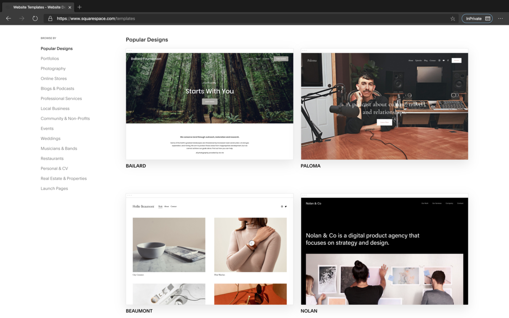
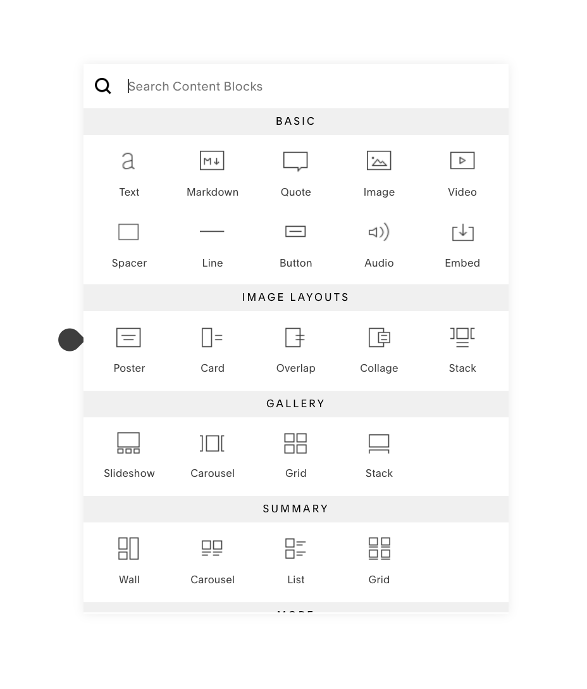
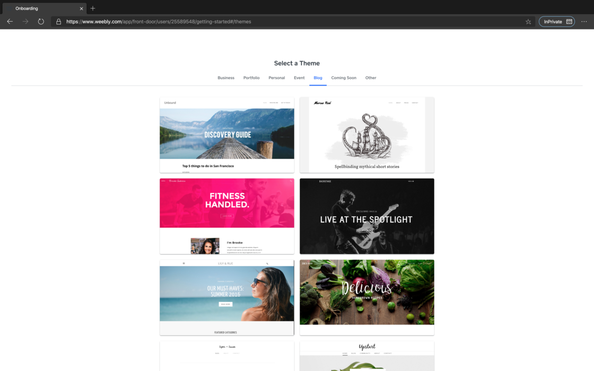
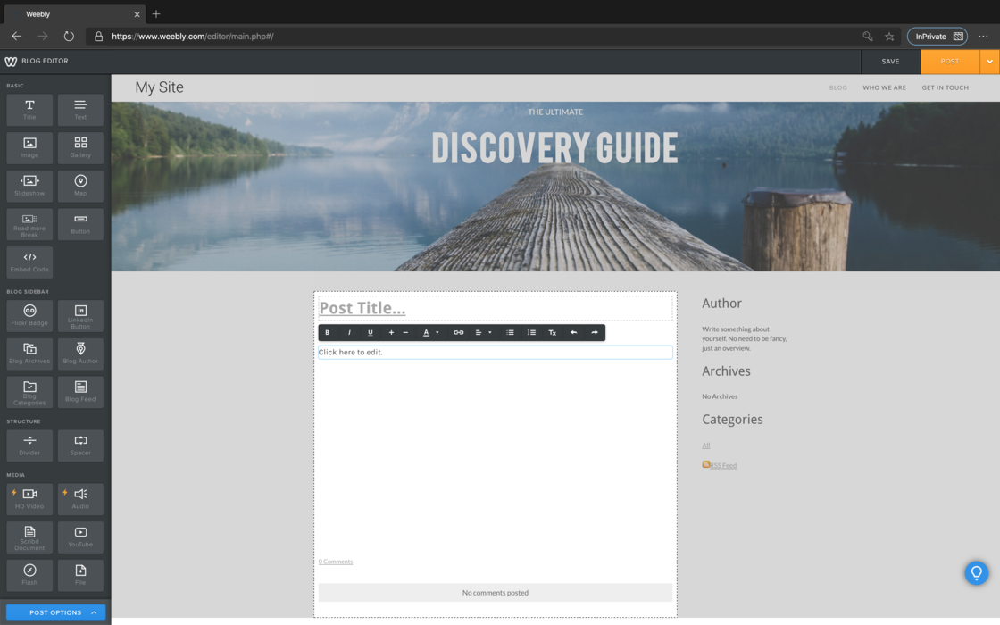
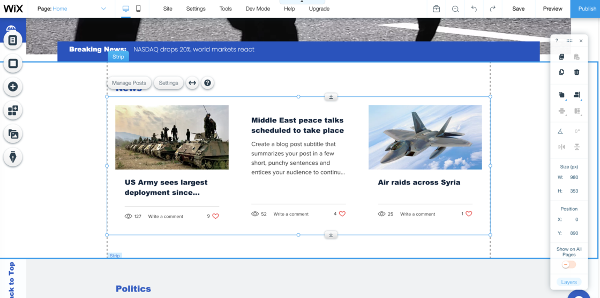

建站可能对于大多数人来说感觉很神秘，另外对于建站费用。建站公司报价差别很大。下面我列举出来一些我知道
的一些建站方案和大概预算费用。

### Level 1: 上手即用类

**适合人群：没有任何技术基础，只想要一个方便的界面和美观的网站，能让我能把自己的内容发布出来就行**

如果你对于web技术并不了解，单纯想有一个网站可以发布自己的内容的话，一些自主建站服务会是你的好选择。他们的共同点是，
你部需要接触任何代码，只需要简单的在后台选择你喜欢的模板，然后用拖拽或者可视化编辑器添加文章，你的网站就能上线了。
自主建站服务商提供的模板通常都相当精美，而且可以适用于博客、作品集、企业网站以及线上商店等多样的需求。

#### [Squarespace](https://www.squarespace.com/)

- 上手难度（等级越高越难）*
- 价格指数（等级越高价格越高）****
- 数据掌握度（等级越高，你对个人数据的把控程度越高）**
- 页面掌控都（等级越高，你对页面设计的把控程度越高）**

如果你是英文博客的听众，哪你可能已经听说过Squarespace了。 Squaurespace是目前口碑最好、服务最精良的
自主建站服务商之一，它提供了大量丰富精美的模板和模块化的文章编辑器，你可以简单地通过拖拽来完成整个
网站的设计和发布，并且完美适配移动端和客户端的浏览。如果你想购买域名，或者配置域名邮箱等服务，也都
可以在Squarespace内完成。

Squarespace采用了几乎百分百的模块化拼接，你既可以直接照搬已经预置好的模板，也可以在一个空白页面
上根据自己的需要塞入不同模块，最终拼接成自己想要的功能和效果。对于不懂代码的新手而言，这种
傻瓜式才做非常容易上手。

不过，Squarespace的价格比较昂贵，它不提供免费的方案，最便宜的套餐每个月也需要支付12美元（而且
是年付）。当然，在付款之前你可以随意制作并预览你的观点。此外，由于Squarespace的核心用户群是餐厅、
酒店、艺术家等商业展示站点，如果你仅仅是需要一个展示纯文字的个人博客的话，它提供的模板可能会显得
有些过于花俏和复杂。

因此，如果你手头的预算较为充足，想要方便的作出一个令人经验的网站，尤其是当你有展示一些设计、摄影等
图像的需求时，Squarespace会是一个很不错的选择。

#### [Weeby](https://www.weebly.com/)

- 上手难度*
- 价格指数***
- 数据掌握度**
- 页面掌控都**

和Squarespace类似，Weebly也是一个老牌的自助建站服务商了。相较于Squarespace清淡、偏向商务的风格，
Weebly无论是网站后台还是模板都更加朴素和人性化一些。但是在功能上，Weebly一点也不差，同样提供了
从域名注册到电商整合的一条龙服务，而且它的文章编辑器更加简单易用。

相比于 Squarespace，Weebly 从价格到风格都是更加亲民的选择——它提供完全能够满足普通使用的免费方案（免费方案的限制是只能使用 .weebly.com 的二级域名，以及网站底部会显示 Weebly 的宣传条），能够绑定自己域名的付费方案也只需要最低 5 美元一个月。

如果你暂时不想为了个人网站给自己增加太多的经济负担，或者你就是喜欢 Weebly 的某个模板，那么 Weebly 是一个很好的开始。

#### [Wix](https://www.wix.com/)

- 上手难度 &hearts &hearts
- 价格指数 &hearts &hearts &hearts &hearts
- 数据掌握度 &hearts&hearts&hearts
- 页面掌控都 &hearts&hearts&hearts

Wix 是和 Squarespace 齐名的自助建站服务平台。如果你是 YouTube 重度用户，一定在某个时期见过 Wix 大面积投放的片头广告。相比于前
文提到的 Squarespace 和 Weebly，Wix 在建站思路上并无特别大的不同，都是由用户选择固定模板，然后自定义其中细节。但在具体的操作
上，Wix 多了一个「ADI（Artificial Design Intelligence）」的设计模式，当你新建站点时，人工智能助手会问你一些诸如用途、风格偏好
之类的问题，然后用算法生成一套网站视觉。此外，Wix 在模块化和自定义程度上达到了事无巨细的程度，支持插入大量网页元素，并且每个
模块的大小都能实现像素级调节。因此，如果你愿意花时间慢慢调试，可以让自己的网站内容非常丰富，甚至达到门户网站的效果。

Wix 的价格从每月 4 美元起步，不过最低套餐提供的支持和带宽都很少，最实用的套餐价格为每月 12.5 美元，和 Squrespace 
同等级别。Wix 适合没有代码基础但对自己的网站设计要求更高用户，其网站编辑器相对比较复杂，需要你上手一段时间后才能
适应它的操作逻辑。

#### [Typlog](https://typlog.com/)

- 上手难度*
- 价格指数***
- 数据掌握度***
- 页面掌控都*

Typlog 是一个更加年轻的建站服务商，相对于 Squarespace 或者 Weebly 的「大而全」，它更倾向于做一个「小而精」的平台。与前二者的
拖拽式、「所见即所得」的编辑方式不同，Typlog 的建站逻辑更偏向传统的博客服务，你可以在一个控制台内发布文章、修改站点的模板和属性。
某种程度上，这是一种让人可以更加专注于内容的极简模式，你甚至不需要考虑页面的设计，只需要选一个模板，上传网站的 logo 和简介，编辑文章发布即可。

此外，如果你熟悉 Markdown，Typlog 是完全支持 Markdown 写作的。因为 Typlog 的创始人是在日华人，它对于中文介面的支持也更完善。
同时，Typlog 还有非常实惠的播客托管服务，目前在国内的独立播客中也相当流行.

Typlog 针对不同的访问量和上传的多媒体内容大小（图片、音频等）有着不同层级的定价方案，对于文字为主的博客写作者来说，
最便宜的 4 美元一个月（如果按年支付，则是 40 美元一年）的套餐完全可以满足需求。如果你想要一个更加简单、清爽的写作体验，那么 Typlog 是一个经济便捷的选择。

### Level 2: 精益求精类

**适合人群：我具备一定的计算机基础知识，希望对自己的网站有一些把控，但对于网络技术研究不深**

上一节中介绍的自助建站服务虽然方便，但缺点也很明显——它们有点像样板房，虽然功能完备，
制作也很精美，但可供你自定义的空间也相对较小。如果你对于网站的版式、设计或者功能有一些更加细致的
需求，或者在模板建站的基础上想预留一些插入脚本和代码的空间，那这个章节提及的几家服务可能会更适合你。

#### [WordPress](https://wordpress.com/)

- 上手难度*
- 价格指数***
- 数据掌握度***
- 页面掌控都*

