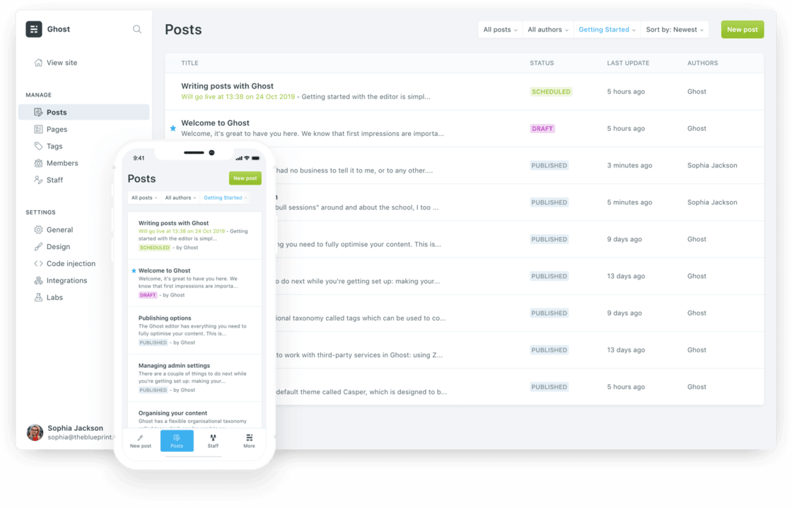

建站可能对于大多数人来说感觉很神秘，另外对于建站费用。建站公司报价差别很大。下面我列举出来一些我知道
的一些建站方案和大概预算费用。

### Level 1: 上手即用类

**适合人群：没有任何技术基础，只想要一个方便的界面和美观的网站，能让我能把自己的内容发布出来就行**

如果你对于web技术并不了解，单纯想有一个网站可以发布自己的内容的话，一些自主建站服务会是你的好选择。他们的共同点是，
你部需要接触任何代码，只需要简单的在后台选择你喜欢的模板，然后用拖拽或者可视化编辑器添加文章，你的网站就能上线了。
自主建站服务商提供的模板通常都相当精美，而且可以适用于博客、作品集、企业网站以及线上商店等多样的需求。

#### [<u>Squarespace</u>](https://www.squarespace.com/)

- 上手难度（等级越高越难）&hearts;
- 价格指数（等级越高价格越高）&hearts;&hearts;&hearts;&hearts;
- 数据掌握度（等级越高，你对个人数据的把控程度越高）&hearts;&hearts;
- 页面掌控都（等级越高，你对页面设计的把控程度越高）&hearts;&hearts;

如果你是英文博客的听众，哪你可能已经听说过Squarespace了。 Squaurespace是目前口碑最好、服务最精良的
自主建站服务商之一，它提供了大量丰富精美的模板和模块化的文章编辑器，你可以简单地通过拖拽来完成整个
网站的设计和发布，并且完美适配移动端和客户端的浏览。如果你想购买域名，或者配置域名邮箱等服务，也都
可以在Squarespace内完成。

Squarespace采用了几乎百分百的模块化拼接，你既可以直接照搬已经预置好的模板，也可以在一个空白页面
上根据自己的需要塞入不同模块，最终拼接成自己想要的功能和效果。对于不懂代码的新手而言，这种
傻瓜式才做非常容易上手。

不过，Squarespace的价格比较昂贵，它不提供免费的方案，最便宜的套餐每个月也需要支付12美元（而且
是年付）。当然，在付款之前你可以随意制作并预览你的观点。此外，由于Squarespace的核心用户群是餐厅、
酒店、艺术家等商业展示站点，如果你仅仅是需要一个展示纯文字的个人博客的话，它提供的模板可能会显得
有些过于花俏和复杂。

因此，如果你手头的预算较为充足，想要方便的作出一个令人经验的网站，尤其是当你有展示一些设计、摄影等
图像的需求时，Squarespace会是一个很不错的选择。

#### [<u>Weeby</u>](https://www.weebly.com/)

- 上手难度 &hearts;
- 价格指数 &hearts;&hearts;&hearts;
- 数据掌握度 &hearts;&hearts;
- 页面掌控都 &hearts;&hearts;

和Squarespace类似，Weebly也是一个老牌的自助建站服务商了。相较于Squarespace清淡、偏向商务的风格，
Weebly无论是网站后台还是模板都更加朴素和人性化一些。但是在功能上，Weebly一点也不差，同样提供了
从域名注册到电商整合的一条龙服务，而且它的文章编辑器更加简单易用。

相比于 Squarespace，Weebly 从价格到风格都是更加亲民的选择——它提供完全能够满足普通使用的免费方案（免费方案的限制是只能使用 .weebly.com 
的二级域名，以及网站底部会显示 Weebly 的宣传条），能够绑定自己域名的付费方案也只需要最低 5 美元一个月。

如果你暂时不想为了个人网站给自己增加太多的经济负担，或者你就是喜欢 Weebly 的某个模板，那么 Weebly 是一个很好的开始。

#### [<u>Wix</u>](https://www.wix.com/)

- 上手难度 &hearts;&hearts;
- 价格指数 &hearts;&hearts;&hearts;&hearts;
- 数据掌握度 &hearts;&hearts;&hearts;
- 页面掌控都 &hearts;&hearts;&hearts;

Wix 是和 Squarespace 齐名的自助建站服务平台。如果你是 YouTube 重度用户，一定在某个时期见过 Wix 大面积投放的片头广告。相比于前
文提到的 Squarespace 和 Weebly，Wix 在建站思路上并无特别大的不同，都是由用户选择固定模板，然后自定义其中细节。但在具体的操作
上，Wix 多了一个「ADI（Artificial Design Intelligence）」的设计模式，当你新建站点时，人工智能助手会问你一些诸如用途、风格偏好
之类的问题，然后用算法生成一套网站视觉。此外，Wix 在模块化和自定义程度上达到了事无巨细的程度，支持插入大量网页元素，并且每个
模块的大小都能实现像素级调节。因此，如果你愿意花时间慢慢调试，可以让自己的网站内容非常丰富，甚至达到门户网站的效果。

Wix 的价格从每月 4 美元起步，不过最低套餐提供的支持和带宽都很少，最实用的套餐价格为每月 12.5 美元，和 Squrespace 
同等级别。Wix 适合没有代码基础但对自己的网站设计要求更高用户，其网站编辑器相对比较复杂，需要你上手一段时间后才能
适应它的操作逻辑。

#### [<u>Typlog</u>](https://typlog.com/)

- 上手难度 &hearts;
- 价格指数 &hearts;&hearts;&hearts;
- 数据掌握度 &hearts;&hearts;&hearts;
- 页面掌控都 &hearts;

Typlog 是一个更加年轻的建站服务商，相对于 Squarespace 或者 Weebly 的「大而全」，它更倾向于做一个「小而精」的平台。与前二者的
拖拽式、「所见即所得」的编辑方式不同，Typlog 的建站逻辑更偏向传统的博客服务，你可以在一个控制台内发布文章、修改站点的模板和属性。
某种程度上，这是一种让人可以更加专注于内容的极简模式，你甚至不需要考虑页面的设计，只需要选一个模板，上传网站的 logo 和简介，编辑文章发布即可。

此外，如果你熟悉 Markdown，Typlog 是完全支持 Markdown 写作的。因为 Typlog 的创始人是在日华人，它对于中文介面的支持也更完善。
同时，Typlog 还有非常实惠的播客托管服务，目前在国内的独立播客中也相当流行.

Typlog 针对不同的访问量和上传的多媒体内容大小（图片、音频等）有着不同层级的定价方案，对于文字为主的博客写作者来说，
最便宜的 4 美元一个月（如果按年支付，则是 40 美元一年）的套餐完全可以满足需求。如果你想要一个更加简单、清爽的写作体验，那么 Typlog 是一个经济便捷的选择。

### Level 2: 精益求精类

**适合人群：我具备一定的计算机基础知识，希望对自己的网站有一些把控，但对于网络技术研究不深**

上一节中介绍的自助建站服务虽然方便，但缺点也很明显——它们有点像样板房，虽然功能完备，
制作也很精美，但可供你自定义的空间也相对较小。如果你对于网站的版式、设计或者功能有一些更加细致的
需求，或者在模板建站的基础上想预留一些插入脚本和代码的空间，那这个章节提及的几家服务可能会更适合你。

#### [<u>WordPress</u>](https://wordpress.com/)

- 上手难度 &hearts;
- 价格指数 &hearts;&hearts;&hearts;
- 数据掌握度 &hearts;&hearts;&hearts;
- 页面掌控都 &hearts;

作为一个有着 17 年历史的开源博客程序，WordPress 可以算得上是最著名的博客方案，没有之一。
WordPress 有着异常庞大的用户社群，你可以在网上找到无数的主题和插件，可以说，其他博客服务有
的任何功能，WordPress 几乎都能做到。根据维基百科，截至 2019 年，世界上排名前 1000 万的网站
中，超过 30% 都使用 WordPress 搭建。WordPress 官方的建站服务 wordpress.com 可以让你不需
要自己购买服务器，只要注册一个帐号，就能够简单地创建自己的博客站点。

关于 WordPress 的教程和使用说明，网上已经有很多，官网上也提供了简体中文的文档，在这里我
暂且简单的罗列一下它的优势：

1. **容易上手** 即使你不需要任何进阶的功能，WordPress 本身就是一个完善的博客程序，只需要注
册帐号，你就可以得到一个易用的博客后台，选择模板和发布文章的流程一点也不比上一节中的建站服
务复杂，同时 WordPress 也提供完整的简体中文支持。

2. **功能完善** 从基础的 tag、分类、文章加密，到进阶的音频视频展示、多个帐号共同编辑、评论，
乃至和其他博客的社交互动，WordPress 都可以做到。

3. **便于维护** 由于 WordPress 是世界上最流行的博客程序，即使你想要迁移到其他的博客服务，它
也是支持最完善的。通过插件和第三方服务，你可以通过各种方式来迁移、备份你的内容，而不用担心兼
容问题。

4. **支持广泛** 除了 wordpress.com，你可以把你的 WordPress 站点部署在任何服务器上。事实上，
许多常见的服务器供应商，例如 [<u>Digital Ocean</u>](https://www.digitalocean.com/) 或者 
[<u>Siteground</u>](https://www.siteground.com/)，都提供一键部署 WordPress 的功能，这意
味着在自己的服务器上建立一个 Wordpress 网站就像在 wordpress.com 上注册一个帐号那样简单，而
且如果你想要将你的网站迁移到自己的服务器上，也只需要做一些简单的复制粘贴就可以了。

因此，如果你想要快速的建立自己的网站，但又不想失去一些「折腾」的空间，WordPress 
无疑是你最好的选择。对于没有任何代码基础的用户，WordPress 可以当成一个「所见即所得」的傻
瓜式平台；对于愿意折腾插件和代码的玩家来说，WordPress 也有着充分的折腾空间，可以任你
随意「魔改」。此外，即使你一分钱不花，仅采用 wordpress.com 的免费方案，依然能获
得 30GB 的存储空间，这个容量对于以文字内容为主的个人博客来说已近无限，十分划算。

#### [<u>Cargo</u>](https://cargo.site/)

- 上手难度 &hearts;&hearts;&hearts;
- 价格指数 &hearts;&hearts;&hearts;&hearts;&hearts;
- 数据掌握度 &hearts;&hearts;&hearts;
- 页面掌控都 &hearts;&hearts;&hearts;&hearts;&hearts;

如果你需要一个自己的网站来展示自己的图像作品，或者你对于网站的设计有着很高的要求，那么你不
应该错过 Cargo。一直以来，Cargo 专注于为视觉艺术家、设计师等群体提供建站服务，你从它的官网
到网站编辑的界面都可以体会到它的与众不同。

其他的建站工具通常都还是保留着传统的从上到下，从左到右的流式网页布局，而 Cargo 的编辑器给
了你异常大的自由度——你可以在页面上随便堆叠、摆放任何元素，可以将一段文字旋转 45 度，或者直
接上传一个视频作为网页的背景。Cargo 的编辑方式很难用语言描述，但只要你看过用它做出的网站，
一定会让你印象深刻。事实上，利用 Cargo 建立的网站屡屡被视为网页设计的典范，如果你订阅了 
Cargo 的 newsletter，也会定期收到一些优秀网站案例。只要你花一些时间熟悉它的编辑器（Cargo 
的官网上提供了我见过的所有建站服务商中最丰富、最详细的视频教程资源），Cargo 会是发挥你的创
造力的最有力的工具。

不仅如此，[<u>Cargo 和独立字体商店 Type Network 有深度合作</u>](https://cargo.site/Fonts)，
提供了数百种精心挑选的正版字体，所有用户都可以在自己的网站里随意使用。如果你对网站的字体排印有
自己的想法，这些字体能帮你更好地展示个性，提升网站的视觉表现力。

Cargo 的价格并不便宜，它的价格是 13 美元每月，或 99 美元每年，同样提供付费之前的全功能试用。
如果你想做的是一个传统的博客，它不是最佳之选——Cargo 没有像其他博客平台一样提供独立的文章管理，
这意味着你每发布一篇文章就需要创建一个新的「页面」，或者反复编辑一长串的文字。但如果你想要
在自己的个人网站上展示多样的作品，充分发挥你的创造力，那么 Cargo 值得一试。

一些使用 Cargo 制作的网站：

- [https://de-form.hu/](https://de-form.hu/)
- [https://designdoesntmatter.com/](https://designdoesntmatter.com/)
- [https://comradeanimal.com/](https://comradeanimal.com/)

#### [<u>Ghost</u>](https://ghost.org/)

- 上手难度 &hearts;&hearts;&hearts;
- 价格指数 &hearts;&hearts;
- 数据掌握度 &hearts;&hearts;&hearts;
- 页面掌控都 &hearts;&hearts;&hearts;

同为全功能的开源博客程序，Ghost 是 WordPress 的直接竞争者（实际上，Ghost 本身就是一些不满
于 WordPress 的臃肿而选择单飞的 WordPress 员工所开发的）。作为后起之秀，Ghost 虽然没
有 WordPress 那样庞大的用户社群和资源积累，但是优势也是很明显的——它的程序本身更加小巧、
加载速度更快、介面更现代、原生支持 Markdown、Mailchimp、Slack 等常见服务、支持响应式布局，
更重要的是，它是一个专注于写作和发表的平台，对于富文本的编辑支持非常好。

和 WordPress 类似，Ghost 也提供官方托管服务，因此你只需要在 Ghost 的 官网 
注册一个帐号，就可以得到一个自己的 Ghost 博客了。不得不说，Ghost 的后台介面非
常精致，文章编辑器令人想到排版广受好评的写作平台 [<u>Medium</u>](https://medium.com/)，如果你懒得自己折腾各种
纯文本或者 Markdown 编辑器，而希望在浏览器中获得更好的写作体验，那么 Ghost 无疑是做
得最好的之一。

不过，Ghost 官方提供的托管服务价格不菲，最便宜的方案也要 29 美元一个月。但是如果你喜欢 Ghost，
也愿意学习一些服务器、Docker 等知识，那么在自己的服务器上安装 Ghost 也并不困
难。整体来说，Ghost 在使用自由度上和 WordPress 类似，既可以零基础一键建站，也可以为老玩家提供服务器部署。
如果你想要获得一个更加现代的博客体验，或是对于邮件订阅、各类服务整合有需求，那么 Ghost 会
让你感到得心应手。

### Leval 3: 自建部署类

**适合人群：我不介意学习网络知识，或者我已经具备了一定的代码能力，想要自由地打造我的网站，并尽可能把数据掌握在自己手里**

如果你对于学习一些计算机技术抱持着开放的态度，或者想要从底层到前端完全掌控自己的网站，那么
你可以找到一些更加经济、自定义程度更高的方法来建立你的博客。关于此类方案的具体配置办法，
我在此处只简单提及建站要点，供你按图索骥，下面会出对应的教程。

#### 静态网站生成器，以 Hexo 为例

- 上手难度 &hearts;&hearts;&hearts;&hearts;
- 价格指数 &hearts;
- 数据掌握度 &hearts;&hearts;&hearts;&hearts;&hearts;
- 页面掌控都 &hearts;&hearts;&hearts;

所谓[<u>「静态网站」</u>](https://en.wikipedia.org/wiki/Static_web_page)，所谓的「静态网站」，指的是网站的所有页面与服务器上的 HTML 等格式的
网页文件一一对应，而不根据数据库、访问者信息等动态生成内容的网站模式。利用 [<u>Github Pages</u>](https://pages.github.com/) 和静
态网站生成器，只要你的网站不涉及盈利，你可以完全免费的建立一个五脏俱全的博客。在介绍这个建站
方案之前，你需要先了解一些概念：

- **Github:** [<u>Github</u>](https://github.com/)是一个代码托管平台，你可以将你的代码（在这个
例子里，也就是你的网站源码）免费上传到 Github 上，你既可以在上面管理你的项目，也可以与其他
Github 用户进行交流、互相帮助。

- **Github Pages:** Github Pages 是 Github 提供的一种免费服务，可以
将你托管在 Github 上的网站源码自动发布成可以被公众访问的网站。

- **静态网站生成器:** 静态网站生成器是一种格式渲染和转换器，可以将你用 Markdown 写好的文章
转换为制定主题的 html 格式页面。

- **Hexo:** [<u>Hexo</u>](https://hexo.io/) 是一个静态网站生成器，它可以帮助你将写好的文章转换成网站源码。

- **Markdown:** Markdown 是一种标记语言，可以用任何文本编辑软件编辑（例如，最简单的，「记事本」）。简单
地说，Markdown 是一种标记你的写作内容的方式，它可以让计算计理解你的文章的格式，例如，哪些是标题，哪些文
字需要加粗强调等。

- **终端（Terminal）:** 终端是你电脑中的一个程序，在终端里，你可以用输入命令的方式来操纵你的电脑。
和普通的软件不同，你可以理解为，终端是一种直接向你的电脑下命令的方式。

通过这些工具，你只需要用 Markdown 撰写你的博文，设置好 Hexo，它就可以帮你生成整个网站的源码；接着，将源码
上传到 Github 之后，大家就可以访问你的博客了。如果你想要用 Hexo，或者其他类似的工具来制做你
的个人网站，以上这些只是都是最为基础的，了解它们对于以后进一步的完善你的网站很有必要。很显然，
Hexo 也并非唯一的静态网站生成器，本文只是用它作为一个例子，如果你愿意，你也可以使用 [<u>Jekyll</u>](https://jekyllrb.com/)、
[<u>Hugo</u>](https://gohugo.io/) 等
其他类似的生成器来制作你的网站，而它们的使用方法虽然各有不同，但是背后的逻辑都是类似的。作为参照，
用 Hexo + Github Pages 建立一个网站的步骤大致如下：

1. 注册一个 Github 帐号，然后创建一个代码仓库，用来存放你的博客的源码。通常，你可以用 username.github.io 作为你的仓库名，username 是你的 Github 用户名，这样，Github 会自动把你的博客地址设为 username.github.io。

2. 在你的电脑上安装 Hexo（如果你是 Windows 用户，你可能需要先安装 [<u>Git</u>](https://gitforwindows.org/)，后续的操作都可以在 Git Bash 中完成）。

3. 生成一个新的 Hexo 站点，并设置你的站点名称、作者等基本信息。你可以在 [<u>这里</u>](https://hexo.io/themes/index.html) 挑选你喜欢的主题并下载安装到你的站点中。

4. 用 Markdown 进行写作，并保存在站点的 /source 文件夹中。

5. 在你的写作告一段落之后，通过 hexo deploy 命令将你的站点上传到 Github 仓库中。此时，你的博文原稿储存在你的电脑上，而 Hexo 所生成的网站源码会被上传到 Github 上，之后每次撰写新文章，只需要重复 5、6 两步即可。

由于现在已经有许多优秀的作者撰写了简单易懂的相关教程，本文在这里并不打算将这个方案的具体操作流程一一写出，而是理顺「创建→更新」你的站点的方法和逻辑。

#### [<u>Typecho</u>](http://typecho.org/)

- 上手难度 &hearts;&hearts;&hearts;
- 价格指数 &hearts;&hearts;
- 数据掌握度 &hearts;&hearts;&hearts;&hearts;&hearts;
- 页面掌控都 &hearts;&hearts;

和 WordPress 类似，Typecho 也是一个运行在服务器上的博客程序，但与 WordPress 不同的是，Typecho 不提供官方的托管服务，如果你想使用 Typecho 就必须拥有自己的服务器，并把它托管在你的个人服务器上。Typecho 同样完全开源，并且比 WordPress 更加轻巧简单。Typecho 由华人开发，目前也已经积累了一定的用户社群，也可以找到模板和插件。因此，如果你想拥有一个自己的服务器，对自己的网站数据有着完全的把控的话，Typecho 是一个不错的开始。

Typecho 的配置颇为简单，如果你已经有了一些关于服务器的相关知识，那么你在阅读官方的 [<u>安装教程</u>](http://docs.typecho.org/install) 之后应该就已经知道怎么做了。如果你是第一次接触这些，那么这是你需要了解的几个步骤：

1. 你需要购买一个域名及一个服务器，国内的 [<u>阿里云</u>](https://www.aliyun.com/)、[<u>腾讯云</u>](https://cloud.tencent.com/)，国外
的 [<u>老薛主机</u>](https://my.laoxuehost.com/aff.php?aff=10048)、[<u>Siteground</u>](https://www.siteground.com/)、[<u>Smallweb</u>](https://smallweb.net/)、
[<u>Bluehost</u>](https://www.bluehost.com/) 等服务商都提供
适合建立个人网站的服务器方案，你可以根据自己的预算和具体情况进行选购。对于 Typecho，请确保你购买的服务器支持运行 5.1 以上
版本的 PHP。

2.  将官方提供的最新版本的 [<u>Typecho</u>](http://typecho.org/download) 下载、解压并上传到服务器上。

3. 用浏览器访问你的域名 yourdomain.com/install.php，你就可以看到 Typecho 的配置向导了。你需要在这里设置你的管理员帐户和密码，以
及关于数据库的一些信息。如果你要安装插件或者更改主题，你只需要将相关的文件放到 
/usr/plugins 或 /usr/themes 目录中，并到后台启用即可。你可以在 [<u>这里</u>](https://typecho.me/) 或者 [<u>官方论坛</u>](http://forum.typecho.org/)
中找到一些 Typecho 的主题和插件。

4. 这时，你的 Typecho 站点就已经配置完成了，只要有浏览器，你就可以随时通过访问网站后台（yourdomain.com/admin）来更新你的网站。

相比于最低成本为零的 Hexo 等静态网站生成器，Typecho 多少会花费你一些服务器的开支，但是好处也是显而易见的——作为动态站点，在配置好之后，你只要能够连上互联网，打开浏览器就可以随时撰写文章、管理网站，而不再需要每次更新都必需打开终端进行操作。而相对于 Squarespace 等自助建站商，购买个人服务器价格也非常低廉。

#### 服务器、域名及其他

如果你想要完全掌控你的网站——自己设计、自己决定服务器里可以储存的内容，那么自建网站总是一个终极的解决方案。当然，能做到的事情越多，需要学习的也越多，如果你想要完全靠自己建立一个个人网站，那么你至少需要了解这些。

1. 首先，你需要一个服务器。服务器是一台远程的计算机（即使很多时候是一台虚拟的计算机），它和你的电脑一样拥有存储空间、处理器、内存和联网机能，这样你就可以把你的网站存储在里面，
并且 24 小时上线。可以用于建站的服务器有很多种（VPS、虚拟主机等等），价格也各不相同，你可以根据需要进行选购。

2. 其次，你需要一个域名。域名相当于你的网站的地址。只有有了公开的域名，别人才能找到你的网站。域名的购买就很简单了，如果
你在意你的网站在中国大陆的合法性，那么你可以去 [<u>万网</u>](https://wanwang.aliyun.com/) 或者 [<u>腾讯云</u>](https://dnspod.cloud.tencent.com/) 购买域名，不过这也意味着你需要将你的网站在中国大陆备案。你也可以
在一些国际域名经销商购买域名，[<u>domcomp</u>](https://www.domcomp.com/) 会告诉你你喜欢的域名在哪个网站比较便宜。

3. 接着，你需要制做你的网站源码。前面几节中提到的知识对你来说仍然是有用的，你可以将你的 WordPress 站点部署在你自己的服务器上，或者利用 Hexo 等静态网站生成器制做网站源码并上传到你的服务器，这些都是很方便的办法。

4. 如果你想要完全靠自己建立一个网站，你至少需要学习 HTML、CSS 和 Javascript，这是三种编写一个
网站最基本的语言，你可以在  [<u>W3Schools</u>](https://www.w3schools.com/)上学到几乎所有相关的知识。通过这几种基础的语言（当然，还有更多），你可以从学会
看懂一个网站开始，进而学会如何修改它，直至最终具备制作一个独立的网站的能力。
