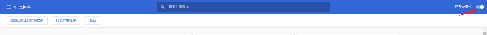
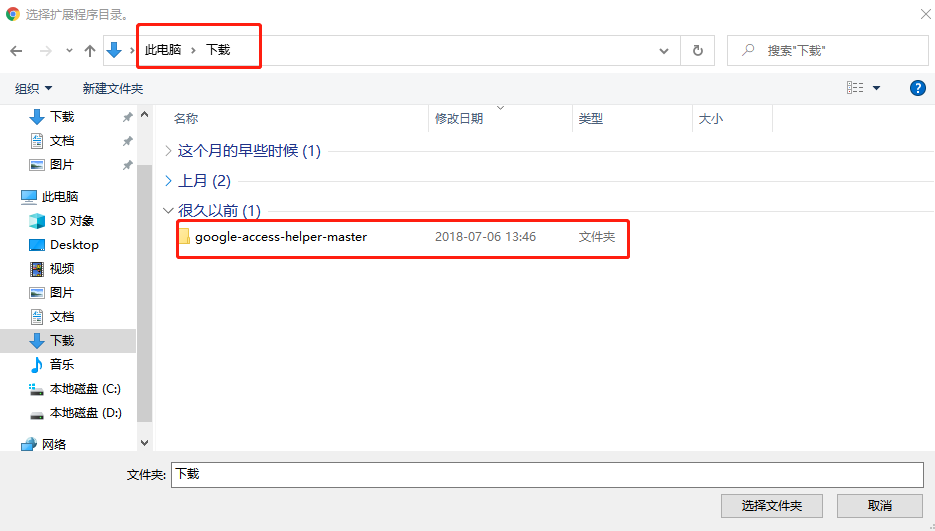

做外贸经常要去外网上搜索一些资料，但是限于政策影响。很多人都无法访问外网。或者有的外贸人通过FQ软件访问。

鉴于此，在此分享几个谷歌插件，可以提高我们外贸人的工作效率。

-------
先来介绍一下谷歌浏览器。如果说谷歌浏览器和其他浏览器有什么不同的地方。我个人形容它的话：用上插件，可以带你飞！

### 谷歌访问助手

下载地址[<u>点击下载</u>](https://www.lanzous.com/i6glmje)

顾名思义，就是帮助我们访问谷歌。具体安装教程。请看图示：

我把这个文件夹放到了我的文档-下载这个文件夹里了。大家可以自行选择存放位置。

打开谷歌浏览器，点击右上角的三个点。然后点击设置

找到扩展程序

我们需要打开开发者选项

然后点击加载已解压的扩展程序。

找到google-access-helper-master这个文件夹，点击选择文件夹。

我们就会发现已经安装好了。然后我们点击开启按钮。就可以正常访问谷歌了。

### 谷歌访问小插件（二）
下载地址[<u>点击下载</u>](http://googlehelper.net/)
当我们安装谷歌访问助手的时候，每次打开谷歌浏览器的时候，会提醒我们是否停用插件。这个会很烦人。所以推荐第二个插件。

直接点击下载。套路还是按照上面的套路。下载好了以后。解压出来，存放在一个不容易移动的位置。

然后加载已解压的扩展程序。

但是这个插件是需要我们用邮箱注册的。如果大家喜欢用自己的真实邮箱注册也可以。我这里用的是临时邮箱注册的。

具体临时邮箱的链接我把地址放在这里。[<u>小工具网站链接</u>](https://wangxfei.com/archives/2020-02-08-03/)。

直接复制，就可以得到一个临时邮箱。进行注册。这个临时邮箱界面先不要关闭。注册后会有一封激活邮件。激活后。就可以关闭了。

** 当我们以上两个插件安装任一一个的时候，我们就可以正常访问谷歌了。下面的插件就可以直接在谷歌应用商店下载了。**

下载地址：[<u>https://chrome.google.com/webstore/category/extensions</u>](https://chrome.google.com/webstore/category/extensions)

### 谷歌翻译

其实很多人一开始的时候用的还不是谷歌翻译，而是有道翻译。后来，随着工作经验的积累，有道翻译出现瓶颈，很多人开始逐渐转向谷歌翻译，从此一发不可收拾。

说说谷歌翻译Chrome 浏览器插件的优势吧：当你浏览某个网页的时候，鼠标右键可以直接翻译这个页面成为你Chrome浏览器默认的语言，假如Chrome浏览器默认语言是中文，那么浏览英文或者西班牙文网页的时候，你点右键，谷歌翻译会自动把这个网页翻译成中文。

### Grammarly（语法工具）

Grammarly 是一个语法工具，它可以把编辑中的网页内容的文案语法错误纠正过来。比如说你在LinkedIn上面发帖子，帖子里面有语法错误，它会给你提示出来，微信公众号编辑器里面也一样。

第二个优点：它可以和Office办公软件里面的Word文档结合，前提是你的Word版本是正版的，WPS是不支持的。这个功能就很逆天了，比如说你要修改邮件的语法错误，直接在Word里面修改，修改好了上传就OK了。比如说公司要和客户签订商业合同，也可以在Word文档里面编辑这个合同。

据了解，有些人习惯在Fiverr, Upwork 这样的外包平台找老外修改语法错误，其实他们也会先用Grammarly这个工具先过滤一遍，后面再进行人工修改。

### Hunter

当我们访问某个网站，想找到这个网站的联系邮箱和电话的时候，Hunter就会发挥他强大的爬取功能。比如说外贸业务员想要开发LED Display这个行业的客户，假设找到 www.abc.com 这家公司，那么abc就是他的潜在客户。如果他想开发这个客户，就必须先找到联系的邮箱，才能进行下一步的动作。此时只需要轻击左键，Hunter就会自己获得这个网站所有人的联系方式，包括姓名，电话，邮箱等。

这同样也适用于SEO从业者去做外链。首先用关键词搜索一波 guest post 网站，然后把这些网站域名一个个整理到Excel表格，再用Hunter把对方站长的姓名电话邮箱等复制到Excel表格中，进行营销漏斗的第一回合。

### Similarweb

Similarweb 可以分析域名的整体流量情况，包括对方的主要市场，主要流量渠道，用了哪些关键词等。

#### 1. 查看竞争对手总体流量和排名

我们可以分析竞争对手的1-3的总流量，包括它的全球排名，所在国家排名，所在目录排名，以及每个月的大概流量，网站跳出率，网站停留时间，网站浏览页面数量等，以此来快速了解一个公司网站的情况。

比如Russia Today这个网站，它们的网址是：www.rt.com，我们可以发现这个网站每个月流量是150M，也就是1.5亿，平均每天5M，也就是日流量500万，算是很客观了。

此外，我们还能发现这个网站在Similarweb的全球流量排名是355名，在俄罗斯流量排名是83名，在新闻和媒体这个目录排名是64名。网站跳出率是67%，平均浏览2个页面，差不多两个新闻，停留2分钟。它的前五大访客分别来自俄罗斯，美国，德国，法国，乌克兰。主要流量渠道是直接流量和引荐流量。

#### 2. 查看竞争对手流量市场

我们可以分析竞争对手的前五大流量国家，大概猜出对方的主要市场，然后结合海关数据进一步确认。

#### 3. 分析竞争对手流量渠道

这里的流量包括Direct流量，Referral流量，Search流量来源，Social流量，Email流量，Display流量等。

### Wappalyzer

Wappalyzer是一款功能强大且非常实用的网站技术分析插件。通过这个插件我们能够分析目标网站所采取的平台架构，网站环境，服务器配置环境，编程语言等参数。

一般用来分析对方网站是用否用WordPress, Shopify, Wix, Magento等，是否安装了Google Analytics，Facebook Pixelbook，iMessenger等聊天插件，来判断对方网站是否有专门的技术或者运营打理，如果对方有安装这些，通常说明这个公司老板比较懂运营或者比较重视运营。

我们还是以Russia Today：www.rt.com为案例。我们发现这个网站装了很多插件，所以初步判断是个大站。首先位于左边分析就有四个，说明这个网站站长很注重网站的数据分析，网站还安装了YouTube视频播放功能，说明这个网站注重视频营销，其实今日俄罗斯视频做的确实挺不错的。

### Shopify Inspector

** 1. 第一个功能：它可以显示同行或者客户网站shopify安装了哪个主题，我们可以去shopify的主题商城免费体验。**

如果你不想同行或者客户知道你的主题，可以在后台修改主题名称。此外，我们也可以查看同行或客户安装了哪些插件，还可以追踪这个shopify网站，当对方更新New Items的时候，你的邮箱会第一时间收到提示，你就可以知道同行已经上线新的产品了。

**2. 第二个功能：它不仅可以查看同行或客户的网站产品上线时间、价格，还可以查看对方卖的最好的产品，最好产品上线时间，销售时间，生命周期，是否降价等。**

有点类似www.archive.org 时光机的功能。假如知道对方产品研发时间，研发周期是半年，那么就可以提前发布产品，做好各种营销活动，抢占登陆市场。

** 3. 第三个功能：我们可以考察竞争对手网站运营时间。**

比如以下这个案例：对手网站是17年9月份上线的，假设我们想做电动滑板鞋，相较于一个做了8年的网站，我们这个时候切入也还是还有机会的。这个网站最高价格是799美金，平均价格是157美金，平均产品是考虑了配件价格，滑板鞋价格大概在400-500美金之间，对于想入行的朋友，可以做很多参考了。

比如这个网站上次产品发布是在3个月前，说明新品研发至少3个月以上，等等，如果我们一直深挖shopify inspector这个工具，我们可以分析出很多东西，这里就不在一一赘述了。

### keywords everywhere

顾名思义这是个关键词调研工具，这个工具最大的优点是可以在浏览器搜索框显示你搜索的关键词在全球的月搜索量和CPC广告费用，你可以针对这个判断关键词值不值得做谷歌广告（比如说月搜索量20以下，就不太建议投放广告了），值不值得做SEO优化（比如说月搜索量5000以上，就不太建议做SEO排名了）。

这个关键词工具2019年10月开始收费，有多种货币计算方式，基础套餐搜索量10W次，可以满足绝大部分人的需求。此外建议用10美金支付，如果用RMB付款要75RMB，差不多多出了5RMB。

### 印象笔记-剪藏

它可以一键收藏各类网页图文，并永久保存进印象笔记，大家可以时不时翻翻2-3年前的笔记，看看那个时候的自己，做的一些笔记和图片，也许真的会有五柳先生的那种：每有会意便欣然忘形的感觉。

### Google Map

Google Map这个功能也是非常的强大，这个可以直接连接到谷歌地图上，上面也是有非常多的采购商资源。这种方式目前来说，还有很多人不习惯使用，感兴趣的可以试试，这上面的采购商信息是非常精准的，还有海关数据可以进行判断。

### Momemtun

Momentun这个工具刚开始使用的时候，是觉得可以让Chrome浏览器有个漂亮的壁纸，不用每天工作那么枯燥，看看美丽的风景，工作的心情会好一些。

这是一个待办清单(to-do list)器插件，你可以罗列你每天要做的事项，完成了就按enter键划掉。也是一个浏览器壁纸插件，每天给你一个漂亮的风景图片，还是一个心灵鸡汤插件，每天给你推荐一句短小精悍的英文鸡汤。