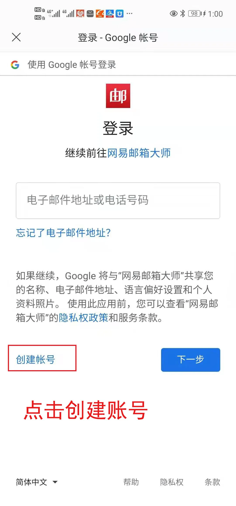

今天来说说注册Gmail的方法，很小的点，但我认为很实用。

当然你也可以在外面直接买，但是如果你的账号有特别重要的用途，那么我建议还是自己注册，这样运用在重要的地方，才会有安全感。

当然还是要看大家如何了。

下面介绍一下小的注册Gmail的Tips，希望大家喜欢~

其实注册Gmail的方法千千万，网上方法攻略一搜也是一大堆，同样一种方法有操作成功的，也有操作不成功的，感觉跟中彩票似的。

**注意：如果申请不下来，可以联系博主购买。价格不高。**

但是敢于实践，敢去尝试，总有成功的机会。

众所周知，Gmail是全球最受欢迎的免费邮箱，从2004年推出至今，活跃用户有15亿，稳居世界第一。

### 为什么要使用Gmail？

Gmail是开启谷歌全家桶的钥匙，如果没有的话，谷歌广告投放、谷歌站长工具、谷歌分析全都无法使用，对独立站而言，简直就是一场灾难，后续的谷歌推广优化根本没法顺利进行。

回归正题，开始我们的操作，手机一步，**重点是不用VV，不用科学工具，能上网就可以了。关键还可以跳过手机验证码，**真香！

首先下载好网易邮箱大师APP，按照截图，一步一步操作即可。

前面步骤只要输入任意词语选择Gmail 然后点击下一步就可以了。然后来到谷歌登陆页面，点击创建账号。

输入基本信息，输入你自己设置的邮箱命名，点击下一步，见证奇迹的时刻。电话号码，辅助邮箱是 可选，不用输入，直接跳过即可。

谷歌邮箱接收提醒

我目前就只注册了2个，先养号再说。后续有问题再另外补充。如果你批量注册，后续也许 触发手机号验证，前提你要有那么多的手机号可供认证。 建议谨慎操作。

额外也有许多注册的方法，也可以试试。

桌面端：通过 Chrome 注册谷歌账号，已验证有效。

#### 1.安装 Chrome 浏览器
选择登录账号；若已登录，需先退出登录。

#### 2.原生安卓手机专属：注册 Gmail/谷歌账号

在通过 GSM 认证的原生 Android 手机上注册谷歌账号十分简单。只需要在设置中添加账号，选择注册账号即可，可以轻松跳过验证手机号。

此方法不具有普适性。同时，此方法理论上同样适用于在Bluestack 等虚拟机中进行尝试。未验证是否有效。

**进入手机「设置」 – 「用户和账户」- 「添加账户」- 选择 Google账户**

分享到此，若有更好的方法，欢迎一起分享讨论。 

此方法有效期不定。如果有需要的尽快申请。

