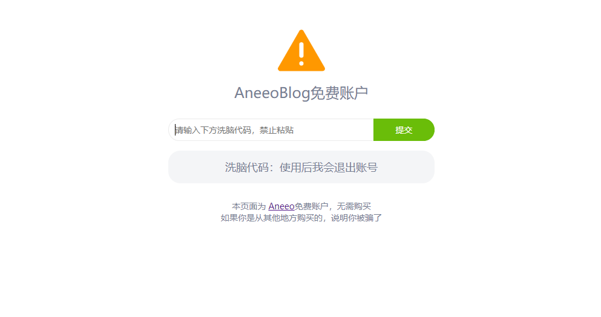

>苹果手机推荐使用Shadowrocket

因为政策原因，Shadowrocket已经无法在国区进行下载。如果需要下载Shadowrocket，需要使用美区账号下载

获取美区账号地址[请点击链接](https://app.aneeo.com/id/ihnkog3tngg.php)

请输入使用后我会退出账号

请注意提示部分。

**操作规范：退出自己的iTunes Store与App Store账号，登录提供的美区账号。然后搜索Shadowrocket，下载安装。安装完毕后，请退出美区账号。重新登录自己的icloud账号。**

### 下载方法

1. 打开 设置 > iTunes Store与App Store (注意不是icloud!!!否则后果自负) > 登录上面的账号

2. 去App Store 搜索下载 shadowrocket

3. 下载完之后注销账号，就可以登录回自己的账号了

注意：下载安装好就不要删除APP，以后也不需要升级APP，能用就行

4. 建议购买付费节点，相对来说比较稳定。一般付费节点会有订阅链接，如下图

复制订阅链接

5. 打开shadowrocket这个软件，点击右上角的+，然后类型选择Subscribe，填入刚才复制的订阅链接，点完成，更新完后，首页就出现了一些服务器节点，选一个，然后连接就行了。

**说明：**

- 全局路由：配置和代理的区别
- 配置模式，自动判断需不需要走科学上网线路。
- 代理模式，所有连接均走代理。

一般是推荐使用配置模式，既不会影响访问国内网站速度，也省SS流量。

**配置添加规则方法：**

点击 配置 > 右上角+

然后粘贴下面的地址进去，然后下载

https://raw.githubusercontent.com/h2y/Shadowrocket-ADBlock-Rules/master/sr_top500_whitelist_ad.conf
